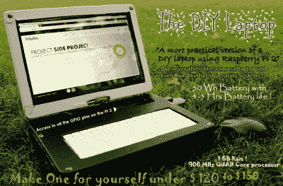
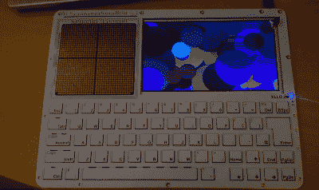
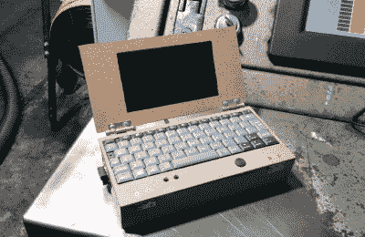

# hack let 125–DIY 笔记本电脑

> 原文：<https://hackaday.com/2016/09/17/hacklet-125-diy-laptops/>

在 20 世纪 70 年代，拥有自己的电脑的唯一方法是从头开始组装。多亏了像[沃兹]这样的黑客大军，PC 不再是花几百美元就能买到的商品。尽管如此，构建自己的机器的魔力仍然存在——尤其是当我们谈论便携式机器的时候。笔记本电脑、笔记本、上网本的组装需要相当多的技巧。将键盘、屏幕和电池塞进一个小翻盖盒子里需要一点规划。我们上一次看 DIY 笔记本电脑是在前 [100 年，所以是时候更新了。本周我们将在](http://hackaday.com/2014/06/27/hacklet-5/) [Hackaday.io](https://hackaday.io) 上盘点一些最好的 DIY 笔记本电脑和便携式电脑！

 我们从【Sahas Dinesh Chitlange】和 [Pi-Berry 笔记本电脑](https://hackaday.io/project/9583)开始。[Sahas]找到了简单与优雅的完美结合。一个树莓派 2 是运作的大脑。码头坐落在一个由中密度纤维板和普通木材混合而成的箱子里。显示器是一个 10.1 英寸的 HDMI 液晶显示器。键盘是从平板电脑的盒子里拿出来的。电源很容易——一个 USB 电源组足以提供 4-5 小时的运行时间。[Sahas]用意大利皮革包裹他的笔记本电脑，打造抛光外观。他很好地规划了他的部件布局，使得耗电的 Pi 在没有风扇的情况下也能保持凉爽。

 接下来是【蒂姆】和[皮韦纳](https://hackaday.io/project/2405)。[Tim]从[Bunnie Huang]的[Novena](https://www.crowdsupply.com/kosagi/novena-open-laptop)打开的笔记本电脑中获取灵感。[蒂姆]没有自己推冲浪板，而是带了一个覆盆子馅饼。他最初的设计是为 Raspberry Pi model B. [上次我们看 PIvena](http://hackaday.com/2014/11/28/hacklet-24-raspberry-pi-projects/) 的时候，model B+还是挺新的。正如我们所希望的，[Tim]修改了他的设计以接受新的 Pi 布局。这意味着它将在物理上与 B+、Pi 2 和 Pi 3 板一起工作。[Tim]但并没有就此止步。他还将 800 x 480 的液晶显示器升级为 1200 x 800 的液晶显示器。他设法做到了这一点，同时在旅行封面上保持相同的螺栓图案。干得好[Tim]！

 接下来我们有【KnivD】跟 [ELLO 2M](https://hackaday.io/project/9692) 。ELLO 2M 最引人注目的是它的建筑。整个笔记本电脑由 6 块印刷电路板组成，将所有其他部件夹在中间。键盘是 PCB 材料，按键是按路线排列的。处理器是微芯片 PIC32MX470-120。软件从 3 个 microSD 卡中的一个加载。7 英寸触摸屏 LCD 和 4500 mAh LiPo 电池位于 PCB 层之间。一个真正的黑客，[KnivD]包括一个慷慨的引脚网格，用于调试附加电路。整个装置用白色丝网印刷看起来很棒。正如[马克·谢尔曼]在评论中提到的，这台机器让我们想起了现代的 TRS-80 100 型。

 终于有了【pdrif配[迷你 rpi2 笔记本电脑](https://hackaday.io/project/9082)。掌上电脑可能是一个更好的名字。[pdrift86]的灵感(和他的键盘)来自旧的惠普 Jornada 个人数字助理(PDA)。外壳是从剪贴板上切割下来的石膏粉。里面藏着一个 Raspberry Pi 2，还有一个 4 芯 18650 锂离子电池。屏幕是一个 5 英寸的 LCD，带有复合输入。显示器不是触摸屏，所以 Playstation 便携式模拟棒是板上的，最终将连接鼠标控制。[pdrift86]甚至设法在他的机器后面偷偷安装了 Pi 摄像头，这样它就可以像手机一样拍照了。

如果你想看到更多的 DIY 笔记本电脑项目，请查看我们新的 [DIY 笔记本电脑和笔记本列表](https://hackaday.io/list/14807)。注意到我可能错过的一个项目吗？不要害羞，[在 Hackaday.io 上给我留言就行了](https://hackaday.io/adam)。这就是本周的 Hacklet，一如既往，下周见。同样的黑客时间，同样的黑客频道，带给你最好的 [Hackaday.io](https://hackaday.io/) ！