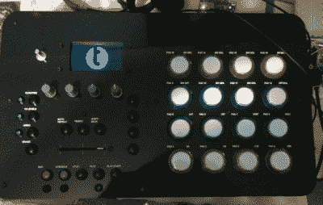
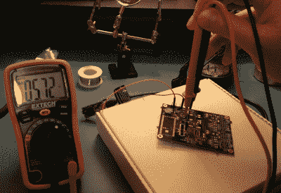
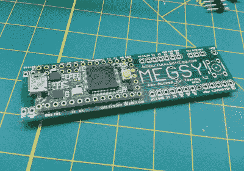

# hack let 126–小项目

> 原文：<https://hackaday.com/2016/09/24/hacklet-126-teensy-projects/>

事实证明，Arduino 是电子项目的绝佳平台。覆盆子酱也是一样。然而，有一些项目介于这两种选择之间。需要比 ATmega 微控制器提供更多内存或处理能力的项目，但不需要完全的 Linux/ARM 动力。对于那些项目，有 Teensy 系列。[Paul Stoffregen]创造了这些小人国的板子，从那以后他一直在添加功能。数以千计的小项目证明了这些小电路板已经被黑客社区所接受。本周的 Hacklet 是关于 [Hackaday.io](https://hackaday.io) 上一些最好的小项目！

 我们从【乔纳森·佩恩】和[开始，由 Teensy](https://hackaday.io/project/4179) 节拍。Beats 是一个多合一的音乐机器。采样器、音序器和 MIDI 控制表面；全部由 Teensy 3.1 和 Teensy 音频板驱动。音频板使 Beats 能够以高达 44.1 kHz 的采样率录制和回放 16 位音频。[Jonathan]灵感来自 Akai MPC 和 MIDI Fighter 等设备。他在软件方面利用了令人难以置信的 Teensy 音频库。像这样的项目需要一个严肃的案例。[Jonathan]利用 arcade 按钮和 Adafruit 的 128×64 LCD 设计并制造了完美的面板和外壳。

 接下来我们有【RF 威廉·霍伦德】和 [Teensy 超级音频板](https://hackaday.io/project/5912)。对 CD 质量 44.1 kHz 音频不满意，[William]决定在 Teensy 的锦囊妙计中添加一个高质量的音频编解码器。他选择了 Cirrus Logic 的 CS4272 编解码器。这款编解码器的采样速率最高可达 192 kHz，THD+N 为-100 db，除了最挑剔的音响发烧友之外，其他人都会喜欢。高抗噪设计并没有就此止步。[William 的]设计将 Teensy 和其他接口与编解码器隔离，以防止接地环路。音频流通过标准 I2S 连接，控制流通过 I2C 连接。这意味着超级音频板可以和树莓派之类的一起使用。

 接下来是【斯宾诺】与[斯宾诺](https://hackaday.io/project/12674)。Teensy 板可以做的不仅仅是音频。Spino 是一个 POV 显示器，带有 32 个旋转的 RGB LEDs。尽管 Spino 不仅仅可以展示漂亮的图片。spino 团队使用 Teensy 3.2 和蓝牙无线电，可以在他们的显示器上玩游戏。尽管发光二极管的工作方式不完全像阴极射线管和液晶显示器，所以一些颜色的改变是必要的。该团队利用 sobel 滤镜进行细胞着色，使 Doom 看起来比以往任何时候都更好。Teensy 甚至强大到可以处理通过 USB 发送的实时网络摄像头视频。视频被渲染并显示在旋转的 led 上。

 最后我们有【蒂姆·特尔泽帕兹】和[梅格西？一个自制的 Teensy 3 ++ T4。[Tim]正在研究 Megsy，这是他在供应框架设计实验室实习的一部分。Teensy 有许多边缘安装的 IO 引脚。虽然没有足够的空间来放置所有的引脚，但是一些引脚被布线到底部的焊盘上。Megsy 是一个很小的载板，它将这些焊盘分解成引脚。这个想法是焊接青少年直接做 Megsy。正如[蒂姆]所说，“一个穷人的 BGA”。问题是夹在两块绝缘印刷电路板之间的焊料要热到足以熔化。[蒂姆的]第一次尝试为他赢得了一块相当烧焦的 Megsy 板。尽管已经黑了，但板子确实起作用了！](https://hackaday.io/project/11367)

如果你想看更多的小项目，看看我们新的[小项目列表](https://hackaday.io/list/15054-teensy-projects)。注意到我可能错过的一个项目吗？不要害羞，[在 Hackaday.io 上给我留言就行了](https://hackaday.io/adam)。这就是本周的 Hacklet，一如既往，下周见。同样的黑客时间，同样的黑客频道，带给你最好的 [Hackaday.io](https://hackaday.io/) ！

如果你想看到更多的小项目，请查看我们新的[小项目列表](https://hackaday.io/list/15054-teensy-projects)。注意到我可能错过的一个项目吗？不要害羞，[在 Hackaday.io 上给我留言就行了](https://hackaday.io/adam)。这就是本周的 Hacklet，一如既往，下周见。同样的黑客时间，同样的黑客频道，带给你最好的 [Hackaday.io](https://hackaday.io/) ！