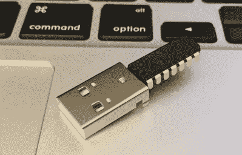
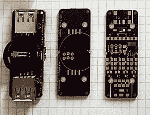
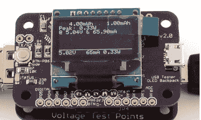
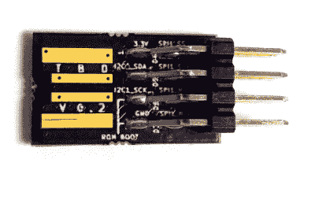

# hack let 79–USB 项目

> 原文：<https://hackaday.com/2015/10/09/hacklet-79-usb-projects/>

创建通用串行总线是为了简化计算机和外围设备的互连。这个奇怪的新协议于 1996 年首次发布，但黑客和制造商们很难接受。并行和串行端口更简单，效果很好，而且有几十年的黑客经验，背后有数千个项目。随着新标准成为主流，RS-232 和并行端口开始消失。“传统免费”电脑成为了常态。黑客、制造商和工程师别无选择，只能随波逐流，他们兴致勃勃地这么做了。今天一切都有一个 USB 端口。从 8 位微控制器到手机再到儿童玩具。本周的 Hacklet 是关于 [Hackaday.io](https://hackaday.io) 上一些最好的 USB 项目！

 我们从【迈克尔·莫根森】和[两个组件 USB 温度数据记录器](https://hackaday.io/project/6258)开始，这可能是有史以来最简单的 USB 设备。[迈克尔]不是开玩笑。该数据记录器仅由一个微芯片 PIC16F1455 微控制器和一个 USB 连接器组成。微芯片的数据表需要一个电容器来平滑电力，但[迈克尔]在没有额外部件的情况下使它工作。他使用 M-Stack by Signal 11 来实现 USB 堆栈。一旦连接到 PC，PIC 将作为串行端口设备进行枚举。然后每秒发送一次 PIC 的芯片温度。它可以做得更多，但那可能需要添加更多的组件！

 接下来是【davedarko】带 USB 线测试仪。戴夫最近花了一些时间安装 USB RFID 阅读器。这些设备离控制它们的计算机只有几米远。即便如此，电源和 USB 数据线必须穿过管道，在某些情况下还要在水下。对设备进行故障诊断时，发现是 USB 电缆短路导致了问题，这并不好玩。[Dave 的]解决方案是一个微型硬币电池供电板，它可以测试标准 USB 2.0 电缆中的 4 条导线。该板运行在 ATtiny45 微控制器上。[Dave 的]当前迭代包含迷你和微型 USB 连接器，以及标准 USB-A。

【mobile will】自己有一个 [USB 测试仪](https://hackaday.io/project/6595)。该 USB 测试仪检查电流消耗和轨道电压。它通过与被测设备串联来实现这一点。它非常适合于诊断为什么每次插入设备时，电脑的 USB 端口都会进入过流保护状态。测试仪是模块化的——你可以使用你自己的万用表基板，或者拿起[威尔的]测试仪背包，在内置的有机发光二极管显示器上看到结果。USB Tester 是 2015 年 Hackaday 奖的[Will]参赛作品。

 最后，我们还有【阿吉特】与[小不点丁格斯](https://hackaday.io/project/4826) (TBD)。TBD 是一个 6 线 USB 接口。把它想象成一个迷你版的巴士海盗。这个小小的电路板上有一个 Freescale KL27Z ARM 处理器，它有足够的能力来处理 I2C、SPI、PWM 或任何其他发送数据或摆动导线的方式。[Ajlitt]开始这个项目是为了学习 KiCAD 并获得一些表面贴装焊接模板的经验。其结果是一个绝对微小的板，几乎失去了 USB 插座。编程由 mbed 库处理，尽管您可以随时使用 Freescale 的本地工具。使用 chrome 浏览器插件 kut，在 TBD 上闪烁代码很容易。

如果你想看更多的 USB 项目，请查看我们新的 [USB 项目列表](https://hackaday.io/list/8006-usb-projects)。我错过你的项目了吗？不要害羞，[在 Hackaday.io 上给我留言就行了](https://hackaday.io/adam)。这就是本周的 Hacklet，一如既往，下周见。同样的黑客时间，同样的黑客频道，带给你最好的 [Hackaday.io](https://hackaday.io/) ！