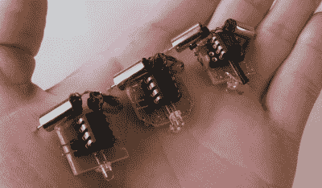
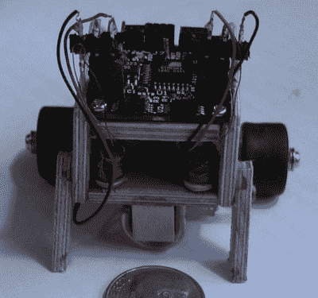

# hack let 83–微型机器人项目

> 原文：<https://hackaday.com/2015/11/07/hacklet-83-tiny-robot-projects/>

自钟表机械时代以来，黑客、制造商和工程师就一直在入侵机器人项目。任何机器人都是一个很酷的项目，但小型机器人有一些特别吸引人的地方。也许是组装它们所需的技能，或者是低成本。不管怎样，Hackaday.io 上有很多手掌大小的机器人项目。本周在 Hacklet 上，我们将重点介绍其中的几个！

 我们先从他们所有人的祖师爷【史隆金】和[微型机器人家族](https://hackaday.io/project/581)说起。[史隆金]制造了可以藏在一枚半美元硬币下的循线机器人。机器人是简单的电路——一个 ATtiny85，带有一个 LED 和一对光电晶体管。代码在 Arduino 的连线和 C++中都有提供。通常用于手机振动器或四轴飞行器的两个无芯电机提供运动。这些机器人只知道一件事——向前移动，沿着一条线前进。尽管他们做得很好！我们非常喜欢这个项目，以至于在 2014 年十周年纪念时，我们举办了一个小型机器人研讨会。

 说到微型行走机器人，【拉多米尔·多皮耶拉斯基】堪称王者。他的许多项目都是小型两足、四足甚至六足机器人。他用 9 克纳米伺服系统做了我们认为不可能的事情。[托特，一个负担得起的蜘蛛机器人，](https://hackaday.io/project/6050)是他的最新创作。托特是一个利用 12 9 克伺服系统的四足机器人。[Radomir]为 Tote 创建了一个定制的 PCB，作为其 Arduino Pro 迷你大脑的载体。这个机器人很容易扩展——[ rado mir]也在 Teensy 3 系列上进行了实验。控制机器人可以是从 ESP8266 到红外遥控器的任何东西。

 【艾伦·基利安】很可能有一个终极戏弄项目，用[手动缠绕感应器制造一个微型机器人](https://hackaday.io/project/563)。[艾伦]在他的微型机器人上使用一些微型 GM-10 发动机。电机没有用于锁定反相驱动控制器的电感。他的解决方案是缠绕一些线圈来提供一点额外的电感。mod 工作了，电流消耗从 116 毫安下降到大约 6 毫安。但是我们想知道更多关于那个机器人的事情！它是由 2003 年左右的一个兆比特(Monty Goodson 的)ATmega8 控制板控制的。小人国的棋盘很受纳米相扑人群的欢迎。除了控制器、马达和胶合板框架，[艾伦]让我们猜测他的机器人。如果你看到他，告诉[艾伦]给我们更多关于他的微型机器人的设计和构造的信息！

带着微型无线机器人跳上了微型机器人的潮流。[Ccates]没有使用 Arduino 进行控制，而是使用了流行的 ESP-8266 WiFi 模块。这个机器人的建造灵感来自上面的[史隆金的]微型机器人家族。这个机器人由嵌入在 ESP-8266 中的 Xtensa 处理器控制。由于它只向前驱动，所以只需要两个 GPIO 引脚来控制驱动电机的晶体管。即使是小巧的 ESP-01 模块也有足够的输入输出。我们希望在这个微型动物身上看到一些传感器和全 H 桥！

如果你想看到更多手掌大小的机器人项目，请查看我们新的微型机器人项目列表！这些机器人很小，所以我可能错过了你的。如果是这样，不要害羞，就[在 Hackaday.io](https://hackaday.io/adam) 上给我留言。这就是本周的 Hacklet。一如既往，下周见。同样的黑客时间，同样的黑客频道，带给你最好的 [Hackaday.io](https://hackaday.io/) ！

如果你想看到更多手掌大小的机器人项目，请查看我们新的微型机器人项目列表！这些机器人很小，所以我可能错过了你的。如果是这样，不要害羞，就[在 Hackaday.io](https://hackaday.io/adam) 上给我留言。这就是本周的 Hacklet。一如既往，下周见。同样的黑客时间，同样的黑客频道，带给你最好的 [Hackaday.io](https://hackaday.io/) ！