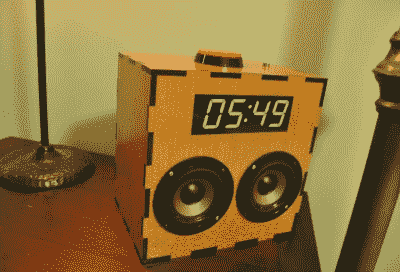
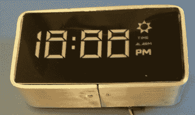
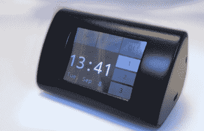
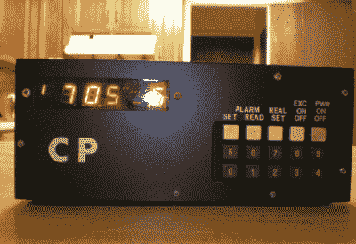

# hacklet 84–闹钟

> 原文：<https://hackaday.com/2015/11/13/hacklet-84-alarm-clocks/>

典型的硬件黑客是夜间的生物。我们中的一些人在凌晨时分工作得最好。这样做的不幸副作用是，我们早上很难起床。不过，有时候生活要求黑客在中午之前就起床。在这些情况下，唯一的解决办法就是闹钟。本周的 Hacklet 展示了一些在 [Hackaday.io](https://hackaday.io/myFeed) 上最好的闹钟项目！

 我们先从【hberg32】和[毫不留情的 Pi 闹钟](https://hackaday.io/project/4922)说起。冷酷无情是这款基于树莓派的时钟的好名字。我们不得不说，它的激光切割外壳和大七段 LED 面非常时髦。当警报响起时，这个 Pi 会反咬一口。

由 20 瓦放大器供电的钛驱动器甚至可以唤醒最沉的睡眠者。如果这还不够的话，[hberg32]还增加了一个床震器，让你从睡梦中醒来。贪睡按钮只工作 3 次，之后你可以按所有你想要的，音乐仍然会播放。如果这还不够，这个时钟甚至有一个压力传感器。如果你回到床上，闹钟又开始响了。“冷酷无情”这个名字实至名归。

【ce ady】用[集成房间日出模拟器](https://hackaday.io/project/2291)走了更善良温和的路线。这个闹钟模拟黎明，轻轻地叫醒用户。一个 Lutron Maestro 系列无线调光器可以让日出模拟器在 10 分钟内慢慢增加房间的亮度，让[Ceady]安静地醒来。

时钟本身使用 ATmega168 进行控制。[Ceady]花了相当多的时间测试创建七段 LED 显示屏的不同方法。当用玉米淀粉和树脂铸造不成功时，他就去找 Inventables 的商用 LED 扩散膜。这部电影证明正是他所期待的。

 接下来是【斯皮罗斯·帕帕迪米特里奥】和 [DIY Chumby-lite](https://hackaday.io/project/7611) 。从[Bunnie Huang]和 Chumby 项目中获得灵感，[Spiros]创造了一个带有触摸屏 LCD 的友好闹钟。就像 Chumby 一样，这个时钟包含一个 WiFi 模块。

不过，在这种情况下，WiFi 模块是一个 ESP8266，其板载 Xtensa 微控制器运行整个节目。[Spiros]用 C++编写了他的 Sparkfun ESP8266。为了降低成本，[斯皮罗斯]省去了任何不必要的东西——比如实时时钟模块。Chumby-lite 使用 NTP 来保持正常。价格的降低得到了回报——这款钟的造价约为 13 美元，还不包括非常漂亮的 3D 打印表壳。

 【流浪金属头】[用他的 7 天闹钟](https://hackaday.io/project/8005-7-day-alarm-clock-ancient)把我们一路带回到 1983 年。32 年前，这是[wanderingmetalhead]的第一个嵌入式系统项目。顾名思义，这个时钟为一周中的每一天存储不同的醒来时间。实际的数字输入肯定胜过旧的“按住两个按钮，看数字旋转”系统。

这是一首老歌。该系统基于摩托罗拉(后来成为飞思卡尔，现在是恩智浦)6802 微处理器。代码是用汇编语言编写的，并在 Apple II 上交叉汇编。分频至 60 Hz 的 3.58MHz 彩色脉冲晶体提供时基。这种设置并不完美，但是一个月一分钟就足够了。整个项目生活和工作在一个旧的放大器盒中，17 年来它每天忠实地唤醒[wanderingmetahead]。

如果你想看更多的闹钟项目，请查看我们新的[闹钟列表](https://hackaday.io/list/8401-alarm-clocks)！如果我没有早起赶上你的项目，不要害羞，只要[在 Hackaday.io](https://hackaday.io/adam) 上给我留言。这就是本周的 Hacklet。一如既往，下周见。同样的黑客时间，同样的黑客频道，带给你最好的 [Hackaday.io](https://hackaday.io/) ！