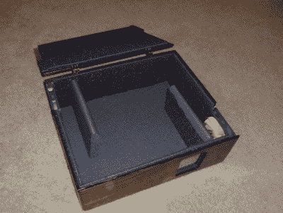
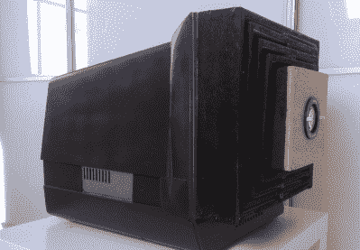

# hacklet 88–投影仪项目

> 原文：<https://hackaday.com/2015/12/11/hacklet-88-projector-projects/>

每个人都喜欢大屏幕电视。在过去，任何超过 27 英寸的东西都被认为是大的。这些天来，如果你没有运动至少 50 英寸，你会以展示嫉妒而告终。但有一点没有改变，那些想做大的人进入了投影机市场。黑客和投影仪似乎是齐头并进的。还有人记得那些老的 DIY 投影设置吗？用户会把他们的电视倒过来放在一个盒子里。本周的 Hacklet 是关于投影仪黑客的！

 我们先从【Chaz】用[投影仪静音盒](https://hackaday.io/project/2427)开始。[Chaz]有一个很好的投影仪，但仍然发现自己有一个问题。投影仪会产生大量热量，这些热量通过风扇散发。不管出于什么原因，投影仪公司似乎选择了最响亮的风扇。[Chaz]的解决方案是将投影仪放在一个盒子里。做得好，这是一个安静的投影仪。做错了，就成了烤箱。投影仪还没有着火，所以我们认为他做得对。两个安静高效的 PC 风扇引导空气通过盒子，并绕过挡板以降低噪音。防反射涂层玻璃窗让光线透过，但让噪音进入。隔音泡沫有助于进一步降低声音。

 接下来是【ric866】与 [100w LED 投影仪的转换](https://hackaday.io/project/357)。如今投影仪的杀手是灯泡。在某些情况下，买一个新的投影仪比更换一个老化的灯泡更划算。这就是为什么[ric866]最后会有一对旧的 NEC 投影仪——一个有灯泡，一个没有。这种型号的灯泡 100 英镑也不便宜。[ric866]找到了 100 瓦 LED 的廉价替代品。问题中的 LED 在每个人最喜欢的拍卖网站上只花了 8.99 英镑。发光二极管可能是高效的，但任何玩过大功率发光二极管的人都会告诉你，它们仍然会发热。[ric866]不得不将投影仪的外壳切割一点，以便安装散热器和风扇。他还必须花一些时间绕过各种机箱互锁开关。最终的产品颜色校准看起来有点差，但对于一个快速的模型来说还不算太差！

【Tom _ VdE】对回收很认真。他不会让一台可以变成投影仪的旧笔记本电脑白白浪费掉！还记得我们在标题中提到的“电视盒子”套件吗？这是同一个想法的现代版本。[Tom]拆下笔记本电脑的 LCD，并将其放入配有适当镜头的 CRT 显示器盒中。像这样的装置需要调节长度和焦距。[Tom]用胶合板做了一个可折叠的挡板。像这样的建筑需要大量的光线，所以[汤姆]使用一个 100 瓦的 LED(或两个)。水冷系统将防止 LED 熔化。[Tom]仍处于原型阶段，但我们迫不及待地想用这台升级的笔记本电脑看他的第一个电影之夜。

 最后，我们有【亚历克斯】，他建造了[自动投影仪校准](https://hackaday.io/project/161)，Hackaday.io 上的项目#161【亚历克斯】从【约翰尼·李中】那里获得灵感，建造了一个可以将投影仪映射到任何角度、大小或位置的系统。秘密在于光电晶体管嵌在一块矩形泡沫板的角落里。当投影仪运行校准程序时，Arduino 读取光电晶体管。[亚历克斯]从[约翰尼的]原始二进制模式切换到扫描线。扫描速度没有二进制那么快，但看起来确实很酷。一旦知道了传感器的位置，就只需要将整个屏幕映射到一个更小的区域。加入一些简洁的过渡，你就有了一个很棒的演示。

如果你想看更多的投影仪项目，请查看我们新的[投影仪项目列表](https://hackaday.io/list/8745)！如果我错过了你的项目，不要害羞，只要[在 Hackaday.io](https://hackaday.io/adam) 上给我留言。这就是本周的 Hacklet。一如既往，下周见。同样的黑客时间，同样的黑客频道，带给你最好的 [Hackaday.io](https://hackaday.io/) ！