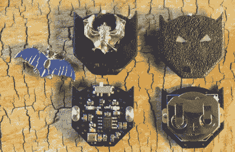
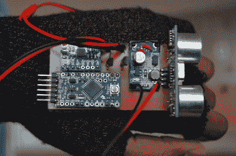
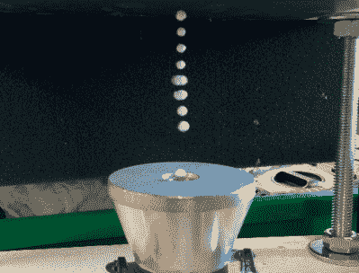
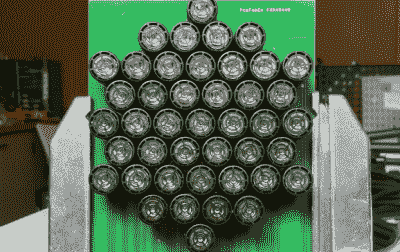

# Hacklet 91:超声波项目

> 原文：<https://hackaday.com/2016/01/16/hacklet-91-ultrasonic-projects/>

超声波是指任何超出人类听觉范围的音频信号。一般来说，20 kHz 及以上是可以接受的。与电磁信号不同，超声波仍然在介质中工作，通常是我们周围的空气。许多动物每天都在利用超声波。黑客、制造商和工程师也是如此，他们已经基于这些高频信号构建了数千个项目。本周的 Hacklet 是关于 [Hackaday.io](https://hackaday.io) 上最好的超声波项目！

 我们先从【spam bake】[世界上最小的蝙蝠探测器](https://hackaday.io/project/8353)说起。[Spambake]对蝙蝠感兴趣。这些神奇的生物视力很差，但这并没有减缓它们的速度。蝙蝠利用回声定位来确定它们的周围环境。超声波啁啾反弹障碍。蝙蝠听回声，并相应地改变飞行路线。虽然我们听不到蝙蝠发出的大部分声音，但电子设备可以。[Spambake]从 MEMs 麦克风开始设计这个电路。这些麦克风采集人类的声音，但与我们的耳朵不同，它们可以听到 20 千赫以上的大量声音。音频信号通过一个放大器，该放大器将其放大约 10，000 倍。该信号被过滤，然后用于触发指示蝙蝠存在的发光二极管。最终电路工作得相当好！看看[spambake 的]视频，看看蝙蝠探测器在行动！

 接下来是【尼尔·莫夫瓦】带[探路者——触觉导航](https://hackaday.io/project/2372)。探路者使用超声波传感器进行类似蝙蝠的回声定位。然后将接收到的数据传递给人类佩戴者。[尼尔]的想法是使用探路者来帮助视力障碍者和盲人导航他们周围的世界。探路者是 2015 年 Hackaday 奖的决赛选手。探路者的超声波部分使用无处不在的 HC-SR04 距离传感器，在易贝和阿里巴巴上只需 2 美元就可以找到。这些传感器发出 60 千赫的信号，并监听回声。然后，微控制器可以测量时间延迟，并确定传感器到障碍物的距离。最后，数据通过振动的寻呼机电机传递给用户。[Neal]在 2015 hack aday super conc 上发表了关于探路者的演讲。

【hobomunch】喜欢他的超声波装置超级强大，这正是他用[超声波悬浮钻机](https://hackaday.io/project/2120)得到的。受到 Mike 的类似项目[的启发，【HoboMunching】不得不建造自己的悬浮装置。超声波悬浮过去只是在实验室里研究的一种现象。为工业世界设计的廉价传感器使得这个实验对家庭黑客来说很实用。[HoboMunching]能够使用他的装置在他的换能器产生的 28.5 kHz 声波之间的空白上悬浮多达 8 个小球。声速可以通过测量球与球之间的距离来验证。纯粹主义者会很高兴听到[HoboMunching]的电路都是基于经典的 555 定时器。](http://hackaday.com/2013/09/20/diy-ultrasonic-acoustic-levitation/)

 最后我们有【艾伦·格林】与[超声波定向扬声器 V1](https://hackaday.io/project/9085) 。由于波长和扬声器尺寸的实际限制，大多数音频信号都没有很强的方向性。超声波没有这个限制。再加上超声波信号可以在空气中解调，你就有了高指向性扬声器设置的基础。基于这一系统的“声音激光”已经存在多年，用于从定向广告到防御性武器的各种领域。[艾伦]刚刚开始这个项目。他的大部分研究是基于(乔·庞贝)在麻省理工学院媒体实验室的工作。[Alan]计划使用一组超声波传感器产生一个方向信号，然后解调并被人类听到。这个项目有一个严格的截止日期:[Alan]计划帮助他的儿子[Mitchell]在 2016 年 5 月进行一场音乐表演。这两个人希望在三月份之前有一个原型。

如果你想看更多的超声波项目，请查看我们新的[超声波项目列表](https://hackaday.io/list/9199-ultrasonic-projects)！如果我错过了你的项目，不要害羞！就[在 Hackaday.io 上给我留言](https://hackaday.io/adam)。这就是本周的 Hacklet。一如既往，下周见。同样的黑客时间，同样的黑客频道，带给你最好的 [Hackaday.io](https://hackaday.io/) ！