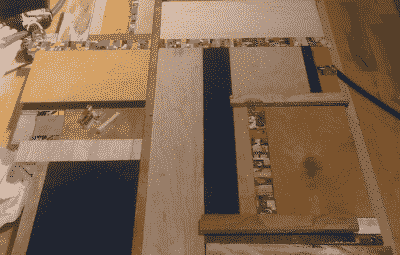
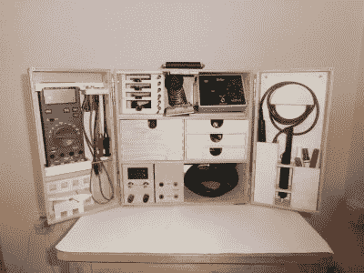
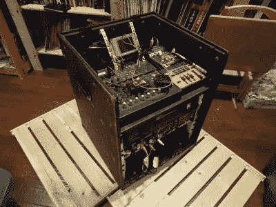
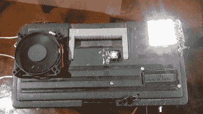

# hack let 92–工作台和工具箱

> 原文：<https://hackaday.com/2016/01/23/hacklet-92-workbenches-and-toolboxes/>

每个人都需要一个工作的地方。虽然我们中的一些人拥有装备精良的实验室，配有焊台、示波器和无数其他工具，但其他人却在厨房的桌子上进行黑客攻击。尽管如此，一些黑客不得不在旅途中——随身携带他们的工具和工作空间。本周的 Hacklet 是关于 [Hackaday.io](https://hackaday.io) 上最好的工具箱和工作台项目！

 我们从顶部开始——在这个例子中，是一个长凳顶部。[KickSucker]创造了[蒙德里安启发的工作台](https://hackaday.io/project/6666)作为各种项目的多用途桌面。[KickSucker]没有敲下一块胶合板，而是走了一条更艺术化的路线。皮耶特·蒙德里安是一位荷兰艺术家，以画黑白线条的不规则网格而闻名。他会用原色填充一些矩形，但让大部分都是白色。在不同的木头边角料和五颜六色的滑板甲板之间,[KickSucker]构成了一个令人敬畏的工作台面。长凳框架是宜家快速搁板单元。框架由中密度纤维板制成，边角料放在上面。有趣的部分是把所有的碎片排列成线条和颜色。结果是一个很棒的定制工作台，而且店里的木屑也少了很多。在我们看来这是双赢！

 接下来是【M.Hehr】带着[便携式工作台&迷你实验室](https://hackaday.io/project/9098)。多年来，他一直想要一台便携式电子工作站。我们打赌他已经在博客上看到了其中的一些[。圣诞节前清理实验室时，[M.Hehr]发现了几个宜家木盒子。每个盒子里都有一些抽屉。一个想法在他脑海中形成。是实施计划的时候了！这些箱子装在一起，用铰链连接起来。在 Shapeoko 2 路由器上切割定制支架。所有东西——甚至螺丝都被回收了。[M.Hehr]为每个工具创造了一个完美的空间，确保当盒子被四处搬运时，东西不会变得杂乱无章。我们真的很喜欢可伸缩电源插座和定制电源！](http://hackaday.com/2014/09/03/soundwave-tunes-up-your-portable-workbench/)

 接下来我们有【蒂姆·特尔泽帕克斯】和[带 9 个空间架的音乐家之路盒子](https://hackaday.io/project/2989)。[Tim]的妹妹[Tina]在路上放了很多音乐，需要一种方法来整理她的设备。这方面有很多商业解决方案，但[蒂姆]决定推出完美的解决方案。他设计了一个 9U 机架的胶合板箱。[Tina 的]混音器和背景音源位于顶部，而效果和其他模块位于机架中。[Tim]花了很多时间设计这个盒子。他能够把切割清单压缩到一张胶合板上，还有多余的空间。这对于像 ShopBot 这样的 4’x8’路由器来说是完美的。当上路的时候，箱子被密封成一个坚固的包裹。标准的旅行箱角落和扭转锁完成这一可怕的作品。

 最后我们有【盖洛】带 [protoBox](https://hackaday.io/project/2561) 。[Géllo]对感应加热感兴趣，这需要一个零电压开关(ZVS)反激式驱动器。ProtoBox 最初是[盖洛]存放他的 ZVS 的地方。它已经发展成为一个小型便携式电子实验室。[Géllo]用一组来自旧笔记本电脑的锂离子电池为盒子供电。这种特殊的 ZVS 设计足够强大，可以将金属烧红，或者产生一些漂亮的电弧。[Géllo]添加了一个 Arduino Mega、一个蓝牙收音机和一个 2×16 字符 LCD。该系统由继电器控制。支持蓝牙的智能手机可用于启用或禁用任何功能。[Géllo 的]组装技术有点吓人，尤其是考虑到这是一个高功率设计的事实。但是，这是一个很好的概念证明！

如果你想看到更多的工作台和工具箱项目，请查看我们新的[工作台和工具箱列表](https://hackaday.io/list/9292-workbenches-and-toolboxes)！如果我错过了你的项目，不要害羞！就[在 Hackaday.io 上给我留言](https://hackaday.io/adam)。这就是本周的 Hacklet。一如既往，下周见。同样的黑客时间，同样的黑客频道，带给你最好的 [Hackaday.io](https://hackaday.io/) ！