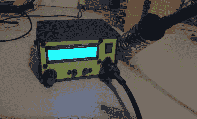
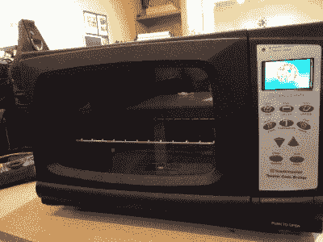
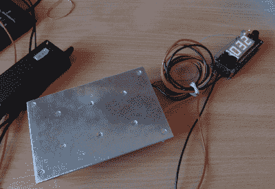
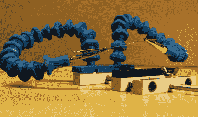

# hack let 99–焊接工具

> 原文：<https://hackaday.com/2016/03/12/hacklet-99-soldering-tools/>

如果有一个工具是每个硬件黑客都需要的，那它就是一个很好的焊接设置。烙铁、热枪、回流炉等构成了制造电子电路的工具。花足够的时间使用一个工具，你会找到改进它的方法。几十年来，黑客、制造商和工程师一直在黑他们的焊接工具，这并不奇怪。本周的 Hacklet 展示了一些最好的焊接工具项目。

我们从【李书行】一个[基于 Hakko 907 的焊接站](https://hackaday.io/project/3417)开始。来自远东的 Hakko 907 和 936 焊台克隆产品在互联网上随处可见。虽然加热器可以工作，但是它们都没有很好的温度控制器。[李书行]通过建造自己的焊接站，把一个问题变成了一个项目。这些熨斗的额定电压为 24v。24v 电源并不常见，但很容易从废弃的笔记本电脑中找到旧的 19v 电源。[李书行]发现低电压工作得很好。Arduino nano 控制显示，用户输出显示在 2 行 LCD 上。完成的控制器比原来的更好，可能会给真正的 Hakko 模型一个机会。

 接下来是【Sukasa】与[回流焊炉](https://hackaday.io/project/8543)。当 MakerSpace Nanaimo 需要回流炉时，[Sukasa]采用了这种设计。我们的想法是创造一个看起来未经改造的烤箱——就把它想象成未来的烤面包机烤箱，或者今天的回流烤箱。一个 Netduino plus 2 是主控制器。用户信息显示在彩色 TFT LCD 上。这个烤箱甚至连上了互联网，有一个内部托管的网页和 JSON 数据源。Netduino 控制着两个结实的固态继电器。固态继电器处理切换烤箱加热元件的脏活。两个风扇保持空气流动，以避免热点。精密温度检测通过一对读取热电偶的 Adafruit MAX31855 分线板实现。

 接下来我们有【雅罗米尔苏库巴】和[焊接预热板](https://hackaday.io/project/1571)。当焊接表面贴装元件，如 QFN 或 BGA 器件时，预热整个电路板很有帮助。有商业产品使用热空气和其他技术来做到这一点，但它实际上是制作一个热板。[Jaromir]认为他可以在这方面做得很好，所以他用 3 毫米的铝板自己做了一个。热量来自 TO-220 外壳中的 6 个电阻。微型芯片 PIC18 监控热电偶，防止物体过热。对于电源，[雅罗米尔]和[李书行]有着相同的想法，并使用了一台旧笔记本电脑的 19V 电源。

 最后我们有了【Alex Rich】带[锁定球窝鹅颈系统](https://hackaday.io/project/5739)。[Alex]发明了[stick vise](https://hackaday.io/project/3287)，所以他为它提出一个令人敬畏的升级是合适的。我们都曾在焊接时与“援助之手”战斗过。你永远无法从正确的角度拍摄它们。这个系统通过一个简单的球和鹅颈管设置解决了这个问题。[Alex]看到一个类似的设计并打印出来。当它工作的时候，碎片很容易裂开。[亚历克斯]重新设计了系统，增加了一个螺纹锁环。这些新的鹅颈管固定不动，将您的工作准确地保持在您想要的位置。

如果你想看到更多的焊接工具项目，请查看我们全新的[焊接工具列表](https://hackaday.io/list/10092-soldering-tools)！如果我错过了你的项目，不要害羞！[在 Hackaday.io 上给我留言就行](https://hackaday.io/adam)。这就是本周的 Hacklet。一如既往，下周见。同样的黑客时间，同样的黑客频道，带给你最好的 [Hackaday.io](https://hackaday.io/) ！