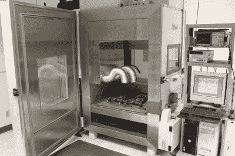
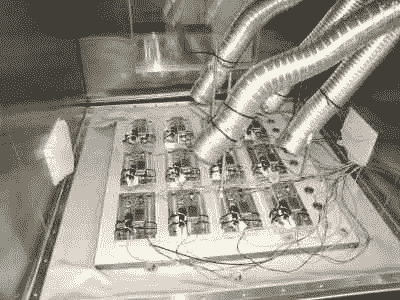
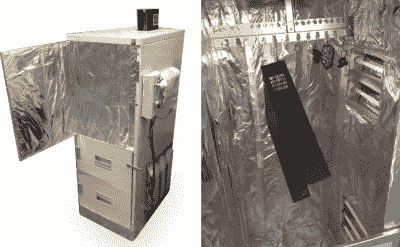

# 以测试的名义停止

> 原文：<https://hackaday.com/2016/07/01/halt-in-the-name-of-testing/>

“我是不是忘了什么？”这是每个工程师在他们的项目即将部署时都会有的一种困扰的感觉——它可能是一个即将投入生产的产品，一个小批量的产品，甚至是一个像微型卫星一样的产品。如果你有时间和一些多余的原型，有一些方法可以减轻这些担忧。关键是一种已经在航空航天、军事和其他行业使用多年的测试方法——高加速寿命测试(HALT)。

### 如何停止

HALT 测试背后的思想可以用几句话来概括:

*   把你的产品打死。
*   找出是什么坏了。
*   修正它，修正设计。
*   重复一遍。

听起来很野蛮，在很多情况下确实如此。HALT 测试通常与巨大的试验箱联系在一起，这些试验箱实际上是用来折磨里面的任何东西的。液氮冲击将试验箱冷却至-100°c。被测设备(DUT)可以在该温度下浸泡数小时。然后，强大的加热器对室进行鼓风，使温度每分钟升高 90°C，最高可达 200°C。气动锤敲打室台，引起高达 90 Grms 和 10 KHz 的振动。腐蚀性喷雾模拟多年的雨水和潮湿。对于任何不幸被放入其中的装置来说，这些房间简直就是人间地狱。很容易理解为什么这种测试经常被称为“摇动和烘烤”。

A typical HALT chamber

适当的停止不仅仅是把容器转到 11 度，看看有什么融化或破裂。任何称职的可靠性工程师都会告诉你疯狂是有方法的。航空航天和军事设备使用统计数据并应用诸如艾林模型
等方法来获得测试的起点。国家标准研究所(NIST) [有一个网站](http://www.itl.nist.gov/div898/handbook/apr/section1/apr153.htm)概述了这些模型和它们的方程式。

然而，从黑客的角度来看，常识和粗略的计算通常会让你大致了解情况。如果你的设备是由 ABS 塑料制成的，把温度调到 250 摄氏度就足以让它变成一堆畸形的熔化物。在这种情况下，最好将最高温度限制在材料熔点以下。

对于我们项目中的电子产品，半导体制造商通常会给我们足够的数据来开始。这是平均无故障时间(MTBF)或寿命估计值，您有时会在数据手册末尾的图表中发现。Atmel 为他们的 AVR 系列微控制器提供了一个 [FAQ 条目](http://atmel.force.com/support/articles/en_US/FAQ/Mean-Time-Between-Failure-MTBF-data)。在 65°C 时，AVR 可以运行 1929 年。在 85 摄氏度时，这一数字下降到 509 年。把温度升到 105 摄氏度，你的 AVR 只能用 153 年。
这些都是巨大的数字，但你可以很容易地看到温度在减少电子产品寿命方面发挥了多大的作用。

当涉及 ARM 微处理器时，事情变得更加复杂。~~摩托罗拉~~ ~~飞思卡尔~~恩智浦有一份[应用笔记](http://www.nxp.com/files/32bit/doc/app_note/AN4724.pdf)，专门用于确定 i.MX6 双核和四核 ARM 设备的预期寿命。温度也很重要，但在这种情况下，时钟速度也起着很大的作用。

在许多情况下，很难在合理的时间内将半导体加热到足以失效的程度，以进行停机测试。然而，你测试的不仅仅是芯片。这是整个系统——每个电阻、电容、二极管和电路板本身。我见过一些项目在室温下运行良好，但在 60°C 时由于时钟偏差而惨遭失败。

### 它破了吗？

Instrumented boards inside a HALT chamber

HALT 测试的一个问题是确定 DUT 是否还在工作。当你的项目处于-100 摄氏度的氮气环境中时，你不可能准确地打开试验箱的门并打开一些示波器探头。

商用试验箱通常配有多通道数据采集系统，可持续监控 DUT 的各种输出。热电偶监控试验箱本身以及您的项目的准确温度。如果(什么时候)出了问题，时间、温度和数据都会被记录下来。

### 在预算紧张的情况下止步

拥有一个 HALT 测试室可能超出了大多数黑客的预算。有很多测试公司会收费在他们的房间里运行你的设备。足智多谋黑客可以在家复制相当多的测试设备。

加热很容易——只要找一个旧的厨房烤箱就可以了。典型的厨房烤箱可以轻松达到 200 摄氏度。自清洁烤箱可以接近 500 摄氏度。对于小房间，烤面包机烤箱也可以。我们多年来报道的许多[回流焊炉项目显示了将一个典型的回流焊炉转换成计算机控制是多么容易。](http://hackaday.com/2015/11/28/the-internet-of-reflow-ovens/)

A hacked oven used for baking powder coated parts

降温有点难，但也不是不可能。最简单的冷藏室是一个泡沫聚苯乙烯啤酒冷却器和一些冰袋。干冰会让你把事情变得更酷。这种冷却的敌人是冷凝。商用室用氮气代替潮湿空气来防止这种情况发生。大多数焊接供应站都有氮气瓶。

振动测试是大型工具的用武之地，也就是电动工具。电源驱动的钻机转速约为 2800 转/分。给钻轴增加一个配重可以产生一个强大的振动引擎。HALT 室的气动锤可以使用低成本气动工具复制。

对于记录数据，没有限制。数据记录器可以像 Arduino 向本地 PC 发送数字 IO 和热电偶数据一样简单，也可以像 Raspberry Pi 驱动 GPIOs 通过各种测试运行项目一样复杂。

排除仅在高温或低温下发生的问题至少可以说是令人沮丧的。黑客武器库中最好的工具是一把热风枪和一罐冷冻喷雾。可以加热或冷却电路板的某些部分，以在工作台上重现问题。一旦可疑部分被隔离，就应该开始观察信号，看看到底发生了什么。

下次当你处于一个项目的设计和早期测试阶段时，尝试一下 HALT。它可以从你的设计中去掉一些错误。