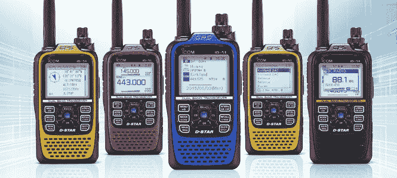
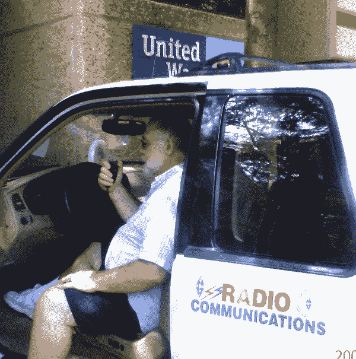

# 业余无线电公共服务活动——有益且有用

> 原文：<https://hackaday.com/2016/01/15/ham-radio-public-service-activities-rewarding-and-useful/>

*“嗨！我是鲁德，基洛五罗密欧制服三角洲。”*那是我在一次业余聚会上介绍自己。业余无线电操作员开玩笑说，我们没有姓，我们有呼号。

成为一名业余无线电操作员(ARO)，我们更正式的名字，[并不困难](http://hackaday.com/2016/01/05/get-your-amateur-radio-license-already/)，并开启了一个有趣活动的世界，包括黑客活动。与任何新事物一样，积极参与现有俱乐部的活动可能会令人望而生畏。会议中的其他火腿正在赶上他们的伙伴，并且似乎对站在旁边的新人不感兴趣。一些小组会邀请新成员在会议开始时站起来介绍自己，这有助于打破僵局。

不管其他人在会上如何表现，有一位业余无线电爱好者总是在寻找新的人——他管理公共服务活动，业余无线电爱好者帮助大型公共聚会建立通信。这些可以是骑自行车、散步或跑步；我甚至见过哈姆在艺术展上工作。在自 9/11 以来采用的术语中，这些是“计划内事件”,而不是“计划外事件”,如飓风、龙卷风、森林火灾、暴风雪和其他自然或人为灾难。处理计划内事件是在需要时针对计划外事件的培训。aro 的基本活动是相同的。

休斯顿这里有两个非常大的活动，吸引了数百只火腿。一月份最大的一次是休斯顿马拉松。另一个大型活动是 4 月份的休斯顿至奥斯汀多发性硬化症 150 英里(MS 150)自行车赛。这项活动从周六早上开始，周六晚上中途休息，最后在周日晚上结束。从秋季开始，马拉松会有热身活动，冬末会有自行车骑行活动，让骑行者为 MS-150 做好准备。全年还有其他马拉松、铁人赛、竞走、跑步、赛跑。无论你在哪里，[附近很可能有活动](http://www.arrl.org/public-service)，他们总能利用你的无线电能力。

公共服务活动对于拥有技术人员执照的新 ham 来说是一个很好的机会。这类[通常使用 2m VHF 和 70 cm UHF 波段的频率](http://www.arrl.org/files/file/Regulatory/Band%20Chart/Hambands_bw.pdf),因为无线电最容易获得和学习使用。虽然技术人员可以使用 6m 和 10m 波段，但在较低波段具有有限的连续波(CW 或莫尔斯电码)权限，开始使用这些波段需要 Elmer 的帮助-这是一个长期存在的术语，指帮助他人开始的 ham。

VHF 和 UHF 频率是视距内的，除非在极端大气条件下，所以使用[中继器](http://hackaday.com/2015/10/11/could-you-repeat-that/)来扩大覆盖范围。公共服务活动通常使用中继器来覆盖活动区域。他们也在紧急行动中使用。或者，一些小事件可能只使用单工，即直接无线电到无线电的连接，如果中继器不工作，这对于意外事件是很好的训练。

一场典型的比赛或骑行有许多英里长。沿途会有休息站或休息点，参与者可以在那里获得饮料和食物——实际上是在跑马拉松或铁人三项赛事。每个断点都需要一个 ham，以防区域设置出现问题或参与者发生意外。如果参与者出现健康问题，需要通知赛事组织机构提供的紧急服务。

业余开发的[自动数据包报告系统](http://hackaday.com/2015/11/25/aprs-repeaters-get-the-signal-out-of-mammoth-cave/) (APRS)经常被用于[跟踪沿路线行驶的车辆](http://aprs.fi/#!lat=30.31190&lng=-95.45610)。由于 ARPS 使用 2 米或 70 厘米的频率，技术人员可以操作 APRS 站。你甚至可以获得智能手机应用程序，使用手机的 GPS 通过手机网络提供 APRS 跟踪。你仍然需要一个业余无线电操作员来使用这些应用程序，因为 APRS 的信息最终可能会通过一个称为数字转发器的分组无线电数字转发器来发送。创建一个 APRS 或分组无线电台是一个很好的黑客机会，提供经验与微型，数字信号处理和射频设计。aro 是美国唯一能够建造无线电发射机并使用它们而无需获得联邦通信委员会认证的个人。

在像 MS-150 这样的活动中，有火腿乘坐急救车、救护车、救援车(一个来历不明的术语，有些人认为是指特别援助小组，但其他人认为这只是表明他们接走“下垂”的参与者)和供应卡车。如果天气变得恶劣，公共汽车可能被征用来运送无法继续的大量与会者。大多数车辆都配备了一辆火腿车，这样他们就可以被指引到需要的地方，并在适当的时候报告问题的严重性。

在公共服务活动中，新的业余爱好者学习在定向网络上工作的纪律。几十个火腿都使用相同的频率，如果他们都同时说话，那将是一片混乱。在有向网络中，一个操作员负责网络控制和协调通信。典型的交换可能是:

这是第三个断点。

这是网。前进到第三个断点。

我们有三个骑手需要被拖到下一个断点。

*断点三，SAG 4 刚给你位置留下断点二。到达那里还需要一段时间，但是已经在路上了。*

明白了，Net。我是 K5RUD，安全。

*网控，【给出呼号】，清楚。*

对于大型活动，如马拉松或 MS-150，有不同频率的网络，每个网络都有特定的用途。例如，一个事件可能有一个医疗网络，并有自己的网络控制操作，独立于断点的物流网络。

警告–前方有大量缩写区域；新加入业余无线电的人面临的另一个挑战。

我之前提到过，这些事件被称为“有计划的事件”,使用的术语是自 9/11 以来采用的。这将所有事故纳入国家事故管理系统(NIMS)。在对导致 NIMS 发展的纽约市悲剧作出反应的过程中出现了一些问题。你可能已经注意到在我上面举例说明的交流中没有使用代码字。之前，Q 码，QSL——“你能确认收到吗？”可能被用过。9/11 事件中出现的问题是第一反应者——警察和其他急救人员——使用了具有不同含义的代码，这导致了巨大的混乱。在 NIMS 的统治下，所有的交流都应该用简单的英语。

NIMS 还介绍了事故指挥系统(ICS ),它起源于加利福尼亚州，用于扑救森林火灾。ICS 的主要重点是确定谁是负责人和指挥链。有一名事故指挥官及其下属负责事故管理的具体方面。通过跟踪 NIMS 和 ICS，应对事故(尤其是意外事故)的每个人都知道他们在运营中的位置。今天，火腿也是如此，它们现在被包括在许多当地事故计划中。公共服务活动可以也应该按照 ICS 的思路来组织。在批准一项活动之前，当地的第一反应者甚至可能需要 NIMS 之后的正式文件。

针对计划外事件的正式 ARO 组织是美国业余无线电中继联盟(ARRL) [业余无线电紧急服务(ARES)。](http://www.arrl.org/ares)ARES 小组通常由郡组织，并在需要时与地方当局互动以做出响应。作为 2008 年艾克飓风后 ARES 项目的参与者，我与我们县的 United Way 一起工作，检查通过食物银行分发物资的情况。

全县的火腿，甚至那些不隶属于 ARES 的火腿，都提供了供应信息——比如公开加油站的位置。ARES 的其他成员在县紧急行动中心。ARES 郡与当地一家俱乐部联合举办的训练活动之一是铁人赛，其自行车骑行部分将穿过一片手机信号微弱的国家森林。

早在 1997 年，我就开始参加休斯顿的 MS-150 比赛。这让我认识了很多火腿，尽管我已经搬到了 40 英里以外的地方，他们今天仍然彼此认识。我们仍然会在公共服务或其他活动中见面。例如，我在最近的休斯顿小型制造商博览会上遇到了组织 1997 年 MS-150 的 ham。我们聊了一会儿，然后继续前进，知道我们会在另一个活动中见到对方，可能是几年后。公共服务活动非常适合使用我们的收音机，帮助他人，以及会见一群了不起的火腿。