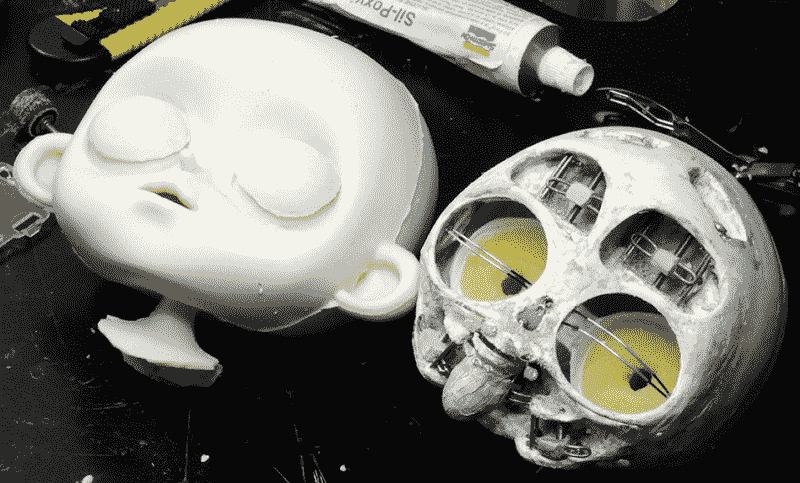

# 手工机器人给生活带来定格

> 原文：<https://hackaday.com/2018/06/29/handmade-robot-brings-stop-motion-to-life/>

定格动画通常被称为失传的艺术，因为做它(或者至少做好它)是非常困难和耗时的。屏幕上的每一个细节，无论多么微小，都要经过人手上百次的处理，这样在正常速度下回放时才显得流畅。定格的独特外观足够令人向往，因此它仍然被制作出来，但它远没有手绘甚至电脑动画那么普遍。

 如果你曾经想知道制作几分钟的定格动画需要多少工作，[看看【特殊克里欧】](http://www.specialkrio.com/portfolio/cerotti-e-fil-di-ferro/)的精彩作品就知道了。他不仅记录了用这种方法制作高质量动画所需的对细节的惊人关注，还记录了他定制的机器人角色的创作。

定格动画中的角色通常有多个可互换的头部，以实现不同表情之间的切换。但是有了他的机器人角色，[特殊克里欧]只需要担心环境，让他的机械化明星做“表演”。这节省了时间，可以用于制作 45 个单独的树脂“滴”来制作倒茶的动画(说真的，去看看吧)。

为了塑造他的角色，[特殊克里欧]首先用赤土塑造了她，以获得他想要的确切外观。然后，他使用 DIY 3D 激光扫描仪创建了一个数字模型，反过来，他用来帮助设计内部结构和组件，他在 Ultimaker 上 3D 打印。当制作角色皮肤[的模具时，陶土原件再次被使用，这是用 RTV 橡胶](https://hackaday.com/2017/04/26/replicating-a-victorian-era-console/)完成的。然后就是画所有的细节和做她的衣服这些小事了。总的来说，休息后的几分钟视频花了几年时间制作。

这不是我们第一次看到 3D 打印被用来制作定格动画，但是最终的产品确实是独一无二的。

感谢安东尼奥的提示。]

[https://player.vimeo.com/video/276972841](https://player.vimeo.com/video/276972841)