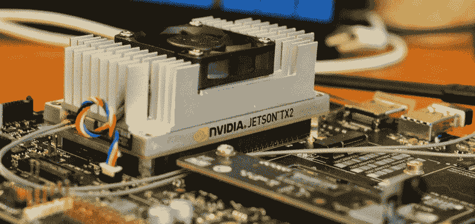
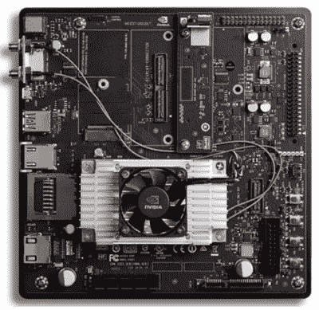
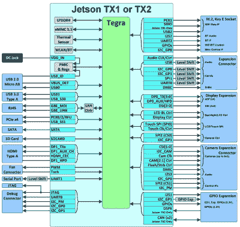
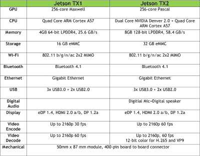
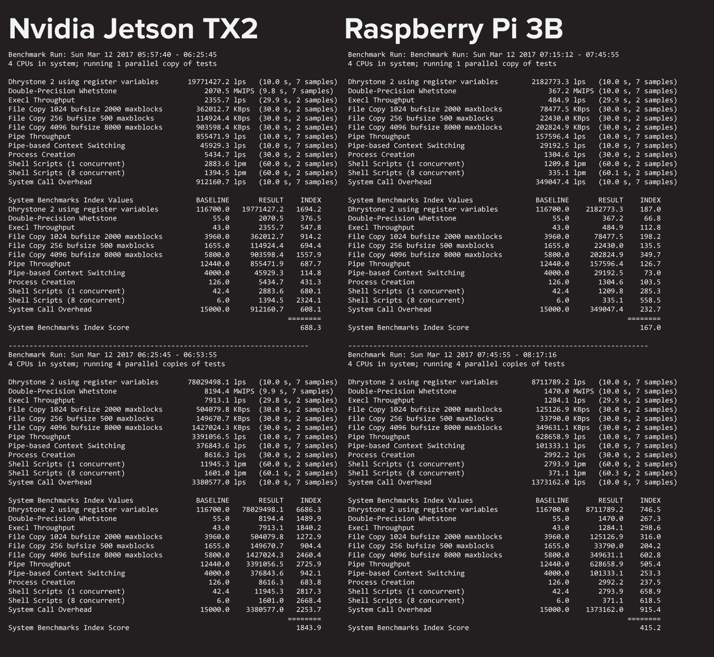
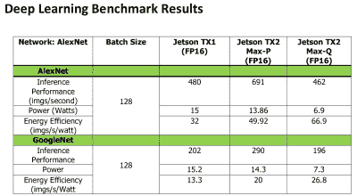
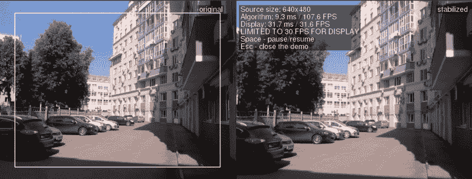
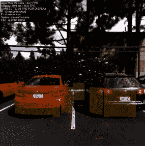

# 动手操作 Nvidia Jetson TX2:嵌入式设备的快速处理

> 原文：<https://hackaday.com/2017/03/14/hands-on-nvidia-jetson-tx2-fast-processing-for-embedded-devices/>

审查禁令终于结束了，我们可以分享我们在 Nvidia Jetson TX2 中的发现。它很快。它非常快。虽然 TX2 的预期用途对于构建一次性原型的人来说可能有点小众，但对于一些非常有趣的应用来说，它有很大的前景。

上周， [Nvidia 发布了 Jetson TX2](http://hackaday.com/2017/03/07/nvidia-announces-jetson-tx2-high-performance-embedded-module/) ，这是一款高性能单板计算机，旨在成为无人驾驶汽车、自拍无人机、为注重隐私的人设计的类似 Alexa 的机器人以及其他需要大量处理且功耗预算可观的应用的大脑。

这是 [Nvidia Jetson TX1](http://hackaday.com/2015/11/24/the-nvidia-jetson-tx1-its-not-for-everybody-but-it-is-very-cool/) 的后续。自从 TX1 发布以来，Nvidia 已经取得了一些长足的进步。现在我们有了 Pascal GPUs，这是购买显卡的最佳时机。深度学习是每个新 CS 毕业生都想进入的热门话题，这意味着装满 GPU 和 CUDA 核心的机架。Jetson TX1 和 TX2 是 Nvidia 在*嵌入式*深度学习*、*或需要大量处理能力而不会吸干电池的设备上的一击。

### 涉足高端单板电脑

在开始这篇评论之前，最好将 Nvidia 的嵌入式产品放在一个历史背景中。Nvidia TK1 是第一款产品，于 2014 年 4 月推出。虽然这仍然是一个有能力的单板计算机，现在有更便宜的选择，几乎一样好。如果您不需要 TK1 中的开普勒 GPU，只需获取 Pi 或 Beaglebone。

【2015 年 11 月推出的 Nvidia TX1 。该委员会与 TK1 明显不同。TX1 是一个绑在散热片上的信用卡大小的模块。当时，TX1 是你能买到的最好的高性能嵌入式 Linux 设备。凭借强大的四核 ARM Cortex-A57 CPU 和 Maxwell GPU，性能非常出色。即使在今天，与竞争对手相比，Nvidia TX1 的性能仍然可以接受。

在 TX1 推出后不久，pine 64——“世界上第一台 64 位单板计算机”——在 Kickstarter 上发布。发布是一场灾难，T2，我不能推荐一个 pine 64 T3。Pine64 发布几个月后，树莓派 3B 发布了，搭载四核 ARM Cortex A53。圆周率 3B 是第一个感觉像一个适当的桌面计算机的圆周率。它对于一般的计算来说足够快，对于(轻的)重物来说也足够好。

2016 年 3 月， [Odroid C2 登场](http://hackaday.com/2016/03/16/hands-on-with-the-odroid-c2-the-raspberry-pi-3-challenger/)。像 Pi 3B 一样，它展示了一个四轴 A53。再说一次，它是一台还过得去的台式电脑，对于一般计算来说足够快。去年年底，Orange Pi 发布了他们的[catty wanpus PC2](http://hackaday.com/2016/11/07/orange-pi-releases-two-boards/)，另一款四核 A53 单板计算机。所有这些都是可以接受的单板计算机，其性能在 2000 年时会让人们感到惊讶。

在大约 18 个月的时间里，全球发布了数十款基于 ARM 的单板电脑。现在，我们几乎已经达到了小型低功耗 ARM Linux 主板的极限。在一次罕见的讨论 Raspberry Pi 未来的采访中，[Eben Upton]说我们暂时还停留在 40 纳米芯片上。在更新、更快、采用新架构的芯片出现之前(并且更便宜)，这些是你能买到的最快的 ARM/Linux 单板计算机。

如果你需要的是一台能够处理一些脚本、提供一些网页或播放一些 YouTube 视频的计算机，那么这些单板计算机是非常棒的。如果您的用例涉及视频游戏、渲染视频或机器学习，您将需要更强大的东西。这也是 Nvidia Jetson TX1 和 TX2 存在的原因。它的速度是否和装有 i7 和 GTX 1080 的台式机一样快？不，但这不是重点——一台基于 i7 6700K 和 GTX 1080 的台式机至少要消耗 300 瓦，而 Jetson TX2 全速运行时只消耗 15 瓦。

## 杰特森 TX2

### 硬件

TX2 是一个用螺栓固定在信用卡大小的散热器上的小板子。这是 TX2 的核心，但我怀疑很少有人会使用一个裸露的 TX2 模块。我甚至不知道你是否可以购买一个单位数量的 TX2 模块。我将从 TX2 开发工具包开始，而不是从模块本身和其中的基准开始。

Jetson TX2 开发工具包基本上是一个迷你 ITX 主板。对于开发套件来说，这是一个很好的外形，而[紧随 Jetson TX1](http://hackaday.com/2015/11/24/the-nvidia-jetson-tx1-its-not-for-everybody-but-it-is-very-cool/) 的脚步。TX1 和 TX2 开发工具包之间几乎没有什么变化。

对于任何已经在使用 Jetson TX1 的人来说，TX2 将是一个现成的替代品。此外，Nvidia 将继续支持 TX1，他们不会停产 TX1，*和*TX1 的价格将会降低。根据我们看到的降价幅度，我会向任何需要快速、低功耗 Linux 系统的人强烈推荐 TX1。显然，Nvidia 致力于 Jetson 生态系统，如果你需要更快的东西，TX2 的“替代”承诺正在等待。

至于你能从载板上得到什么，这是你的要点列表

*    **储存**
    *   全尺寸 SD 卡，SATA 连接器
*   **USB**
    *   USB 3.0 型，USB 2.0 微型 AB
*   **网络/连接**
    *   千兆以太网
    *   802.11ac WiFi 2×2 MIMO
    *   蓝牙 4.1
*   **标题**
    *   PCIe x4
    *   DSI (2×4 通道)，eDP x4 通道
    *   6 个 CSI 连接器
    *   M.2 键 E 连接器
        *   PCIE x1，SDIO，USB 2.0
    *   I2C、I2S、SPI、UART、D-MIC
    *   JTAG

自 Jetson TX1 以来，载板没有太大变化。由于这是一个迷你 ITX 主板，我会赞赏除了桶连接器和砖电源以外的东西。一个真正的 20 或 24 针 ATX 电源连接器可能会有点大材小用，但 6 或 8 针 PCIe 连接器已经足够小了，而且在电路板上的某个地方还有一个空间*。也许几年后。*

 *尽管这是一个迷你 ITX 大小的主板，但对于 Jetson 有意义的任何应用来说，它仍然是巨大的。你不能把这个板安装在汽车的头部单元后面，它对无人机来说太大了。自从 Jetson TX1 发布以来，至少有一家公司推出了一套用于该模块的载板。Connecttech 的 [Jetsons 主题电路板](http://www.connecttech.com/sub/Products/graphics-processing-solutions.asp?l1=GPU)为嵌入式解决方案提供了最重要的部分，尽管我还没有在野外看到它们。

在 TX2 的底部是一个巨大的，令人困惑的，*实际上来源于*连接器。如果你想为 TX1 或 TX2 制作自己的分线板，你需要做的就是去 [Samtec](https://www.samtec.com/) ，给他们零件号 *SEAM-50-02.0-S-08-2-A-K-TR。*该零件的第一批价格不应超过 5.50 美元。你需要一个四层板来使用它，你可以手工焊接它。我急切地等待一个 Nvidia Jetson 的圆头适配器。

### 模块和软件

 那是开发者套件，但实际的杰特森 TX2 呢？

与 Jetson TX1 相比，TX2 拥有两倍的内存和更高的带宽，两倍的 eMMC 闪存，编码 2k 视频的速度也是两倍。CPU 是双核 Nvidia Denver 2.0 *和*四核 ARM Cortex A57。

Jetson TX1 的芯片上有一个 ARM Cortex A57 *和一个 A53 四核。没有为 Jetson 启用 A53 内核。另一方面，TX2 是一个真正的多核 CPU，据报道，四核 A57 适用于多线程应用程序，双核 Denver 2 适用于高性能单线程应用程序。*

去年，Nvidia 发布了他们最新的 GPU 系列。我们不应该惊讶 TX2 是围绕 Pascal 架构构建的。这很棒——如果你想构建一个 GPU 集群或以每秒 8000 帧的速度玩反恐精英，最好的选择是基于 Pascal 的 GPU。

Jetson TX2 有两种动力模式。“最大 Q”设置是最大能效，当用电表测量时，大约为 7.5 瓦。“最大功率”设置是为了获得最佳性能，功率大约为 15 瓦。据报道，在 Max P 模式下，性能是 Jetson TX1 的两倍。我可以在终端中用一个命令在这些模式之间切换。

关于 TX2 模块上的巨大散热器的一个词:当运行基准测试时，风扇从不打开。散热器摸上去只是勉强有点热。我假设 TX2 被设计成八月份在佛罗里达州的汽车发动机舱里。

### 表演

终于到了你们期待已久的时刻了。TX2 比竞争对手快多少？它非常快。

TX2 上的 CPU 是双核 Nvidia Denver 2.0 加上四核 ARM Cortex A57。如上所述，Denver 旨在实现快速单核性能，而 A57 旨在实现并行处理，但并不*如此*并行，以至于 GPU 将是更好的解决方案。这就是 256 个 CUDA 核心的 Pascal GPU 的用途。与 TX1 相比，内存大小和带宽翻了一番。

我使用 Unixbench 对 TX2 和 Raspberry Pi 3 Model B 上的 CPU 进行了表征，结果如下:

[UnixBench benchmarks](https://github.com/kdlucas/byte-unixbench)

这有什么好处呢？在测试 CPU 的综合基准测试中，Nvidia Jetson TX2 的速度大约是 Raspberry Pi 3 的四倍。快得要命。我真的迫不及待地想找人为这个东西 3D 打印一个游戏魔方外壳。

 将 TX2 的性能与其他单板计算机进行比较有点困难。我不会信任一辆由树莓派控制的自动驾驶汽车；表演根本不在那里。测试由 Jetson TX2 驱动的自动驾驶汽车也是不可能的。

让你了解 TX2 在执行大量图像任务时的性能实际上是相当困难的。幸运的是，Nvidia 在审查包中包含了一些 VisionWorks 的例子。

  Image stabalization  A self-driving car, rolling over the Golden Gate  Feature detection

通过 VisionWorks，Jetson 能够识别与驶过金门大桥相关的特征。它能够利用视差建立一个停车场的点云。Jetson TX2 实时稳定视频。笔记本电脑可以做到这一点，但私家侦探做不到。

但并不是所有的深度学习都是在玩相机；在 Nvidia 发布的基准测试中，TX2 在 GoogleNet 推理性能上几乎是 TX1 的两倍。对于 AlexNet 推理性能，TX2 性能更好，功耗更低。

### 艾在边缘

Nvidia 对 Jetson TX2 的营销口号是，“边缘的深度学习”。那是什么意思？未来将充满运行 OpenCV 的机器人，自动躲避人群的汽车，以及在本地完成所有自然语言处理的类似 Alexa 的语音人工智能。这些应用统称为深度学习。这个比喻中的“边缘”是网络延迟和带宽成为问题的环境。对于自动驾驶汽车来说，甚至可能没有网络将数据发送回服务器进行处理。如果出于隐私原因，你不希望你的 Alexa 机器人将音频记录发送回服务器，你需要在本地进行处理。

Jetson 旨在将大量处理能力放在“边缘”,用于有功耗预算的应用。这就是嵌入式深度学习。在深度学习任务上，台式机 CPU 比 Jetson 快吗？当然，但是一个台式 CPU 要消耗 60 瓦的能量 Jetson TX2 只消耗 15 瓦。如果您的项目或产品围绕着将笔记本电脑藏在某个地方，那么您现在有了一个更小、可能更快、功耗更低的替代品。

### 外卖

如果你想建立一个游戏方块模拟器，TX2 不适合你。如果你的创新理念是 3D 打印 RetroPi 外壳，TX2 不适合你。这不是玩具。这是一个工程工具。这是一个将为自动驾驶汽车或自拍四轴飞行器提供动力的模块。这些都是工程难题，需要在低功耗预算下快速处理。

TX2 开发者套件如此昂贵是有原因的。与 Microcenter 的大量π0 相比，这种设备的市场很小。然而，没有其他工具像这样。如果你需要一个只消耗 15 瓦的高速 CPU，我不知道还有什么更好的选择。*