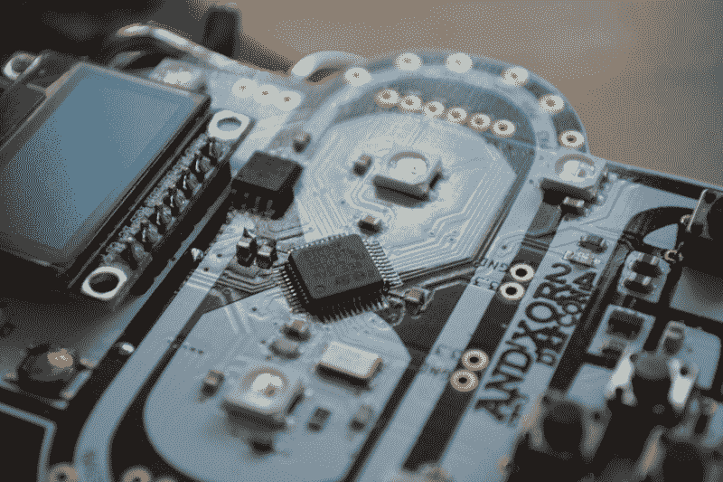
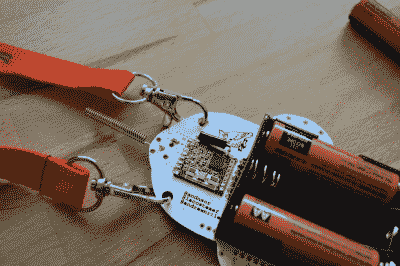

# 动手操作和！XOR 非官方 DEF CON 徽章

> 原文：<https://hackaday.com/2016/07/25/hands-on-the-andxor-unofficial-def-con-badge/>

DEF CON 24 还有大约两周的时间，但我们设法提前拿到了硬件徽章。这不是官方的硬件——他们不可能让我们这么早就泄露出去。虽然这可能是非正式的，因为它不会让你陷入骗局，但我还是要宣布这个结果！XOR 徽章要正式牛逼。我会带你走一遍。下面还有一个视频。

在过去的几年里，建立自己的电子徽章已经成为一个即兴事件。在 DEF CON 上认识的人，年复一年地回来，花时间想出好主意，并在活动开始前尽可能多地制作徽章。我就是这样认识了制作这个徽章的三人组——[和！XOR](https://twitter.com/Andnxor) 、 [Andrew Riley](https://twitter.com/andrewnriley) 和[Jorge Lacoste](https://twitter.com/lacosteaef)——去年他们邀请我去他们的房间，在那里他们正在组装最后的加密徽章。去看看我的指南 [2015 年非官方 DEF CON 徽章](http://hackaday.com/2015/08/10/all-the-unofficial-electronic-badges-of-def-con/)了解更多关于这个故事(和一个视频的调幅传输，徽章能够)。

概要是今年的徽章当然是来自 *Futurama* 的 Bender。两只眼睛都是 RGB LEDs，另外半打位于他头部的不同位置。微控制器是一个 STM 32 f 103 ARM~~Cortex-M0~~Cortex-M3，位于他双眼之间的菱形图案中。在眼睛上方，你会发现一个 16 兆比特的闪光灯，一个 128×64 有机发光二极管屏幕和一个重置按钮。用户输入是五个开关，徽章由背面的三节 AA 电池供电。

这本身就是一个有趣的硬件，但 RFM69W 模块使所有的徽章都是交互式的。从 Bender 圆顶顶部出来的弹簧是一个用于 433 MHz 通信的线圈天线。我手头只有一个徽章，所以我不能太深入地研究一大堆徽章将执行什么样的交互技巧，但菜单暗示了一些非常有趣的应用程序的结构。

 菜单中包含的是聊天和同行的条目，显然是连接系统的一部分。但徽章上的一个游戏是忍者，当你进入游戏时，你得到的只是一个同伴列表(对我来说是空的)。也有单人游戏，游戏菜单有一个进度条目，给你 0-100 分。我不确定忍者游戏包含了什么，但是我很想知道。

菜单的其余部分立刻让人明白这个固件有多好。有一个自我测试和一个飞行模式(一个很好的接触，特别是如果你想确保没有隐藏的射频触发器在你的徽章上执行)。但也有一个射频调试屏幕和一个“关于”屏幕，列出了软件版本，闪存数据版本和创作者的信用。还有一个 GitHub repo 的链接，目前是空的，因为他们不想泄露所有的秘密和使用的软件库。这两者都表明开发人员确实付出了额外的努力。

在徽章的底部有一个公 USB 插头。这个东西可能有点难以插入笔记本电脑的侧面，所以如果你打算尝试获得这些徽章中的一个，请随身携带 USB 延长线。目标是生产和销售 120 个完整的徽章(每个 40 美元)和 50 个只有发光二极管和微控制器的徽章(每个 20 美元)。关注他们的推特，但暂定计划是周四开始在冷藏室附近的某个地方出售。

这个 USB 端口是我认为很多谜题会出现的地方。这是我拿到徽章后尝试的第一件事。

  GPIO Breakouts  More GPIO Breakouts  RX/TX and Power  USB connector

下面你可以看到一个我制作的串行模式的快速视频。徽章附加到/dev/ttyACM0，枚举为`1eaf:0004` (dmesg 说产品:Maple，制造商:LeafLabs)。115200/8/N/1 印在背面的丝网上，因此不会有任何意外，当您连接时，有机发光二极管会告诉您按“c”进入终端模式(徽章会不断发出“就绪”的回声，直到您这样做)。

至于硬件黑客攻击的可能性，有 11 个 GPIO 引脚以及 RX/TX、DIO、RST 和一些电源和接地引脚。这是一个等待探索的令人兴奋的包。我很高兴我得到了一个早期的外观，我不能去 DEF CON 的走廊给这个宝贝一个尝试。几周后见！

 [https://www.youtube.com/embed/OgD4Es2KB5g?version=3&rel=1&showsearch=0&showinfo=1&iv_load_policy=1&fs=1&hl=en-US&autohide=2&wmode=transparent](https://www.youtube.com/embed/OgD4Es2KB5g?version=3&rel=1&showsearch=0&showinfo=1&iv_load_policy=1&fs=1&hl=en-US&autohide=2&wmode=transparent)

