# 实践牛头刨床原点:改变我们构建方式的工具

> 原文：<https://hackaday.com/2016/08/25/hands-on-the-shaper-origin-a-tool-that-changes-how-we-build/>

我打赌手锯真的改变了一些事情。有一天，你正在用斧头砍一根木头。这是一项费力又糟糕的工作，而且结果永远不会如你所愿。第二天，铁匠店聪明的新学徒正在演示他的新锯子发明的测试版，并寻找测试者、投资者和女朋友。从那天起，这工作就再也不一样了。不是增量变化，是变化。纯粹而简单。

这是其中的一个时刻。工具世界正在经历一场新的变革，我认为这是将改变我们构建方式的众多工具中的第一个。

像大多数重大改变一样，构建它们的组件已经存在一段时间了。事实上，在大多数情况下，所讨论的实际对象已经以某种形式存在多年了。就像大坝上的裂缝一样，最终有人会想出这个想法的变体。这实际上做了所有其他事情都承诺要做的事情。这并不新鲜，但这就是原油和汽油的区别。

撇开我的诗意不谈，塑造者的起源是制造事物的未来。很容易让人归结为说是数控机床，或者路由器。只是，不止如此。这让我们更加。突然之间，在任何平面上进行复杂切割变得非常容易。非常简单。带锯和砂光机没有无尽的时间。没有必要让一台 25，000 美元的龙门式路由器占据半个车库。不需要布局工具。不需要强调对齐。甚至不需要在工具和计算机之间切换。它既可以是设计工具，也可以是生产工具。这就像一支神奇的铅笔，它画什么就召唤什么。但即使是我也必须亲眼目睹才会相信。

 [https://www.youtube.com/embed/vVuXZzHBiQs?version=3&rel=1&showsearch=0&showinfo=1&iv_load_policy=1&fs=1&hl=en-US&autohide=2&wmode=transparent](https://www.youtube.com/embed/vVuXZzHBiQs?version=3&rel=1&showsearch=0&showinfo=1&iv_load_policy=1&fs=1&hl=en-US&autohide=2&wmode=transparent)

## 说够了，是什么？

Shaper Origin 是一款增强现实 CNC 路由器。扩充部分是一套传感器和一台机载计算机。你在表面上给它几个参考点，它就用这些来追踪它在表面上的位置。然后，它会通过渲染您想要创建、编辑或剪切的路径来增强您对该表面的视图。

与大多数增强现实设备不同，它不只是增加你可用的数据，它实际上改变了周围世界的物理事物。这包括你使用工具的能力。当您使用路由器跟踪它在显示器上投影的路径时，它会通过移动与之相反的位来自动纠正您犯下的任何错误。以前，你最好的徒手作品可能是停留在距离路径半英寸的范围内。现在你能神奇地达到百分之一英寸。

## 它是如何工作的？

组成起源的秘制酱无疑有很多成分。其中之一是系统使用的基准带。这种带子看起来像(而且确实是)一种永久随机的多米诺骨牌模式。只有几百个可能的多米诺骨牌，但是该工具的计算机视觉软件可以解释多米诺骨牌以及它们与相邻多米诺骨牌的关系。当您考虑到胶带不断重复和随机化时，您在相同方向的相同工件上找到相同胶带段的可能性几乎为零。

[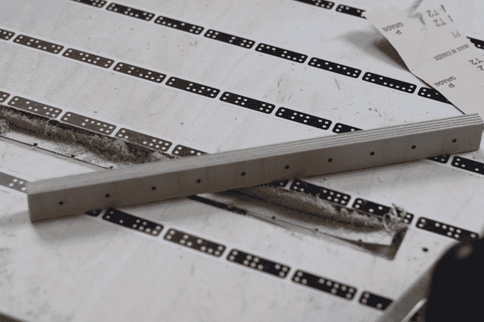](https://hackaday.com/wp-content/uploads/2016/07/img_0160.jpg)

The tape is used by the Origin to determine its location relative to the workpiece.

Origin 充分利用了这种带子的一个非常酷的特点，那就是作为一个识别标记。由于胶带不太可能出现两次相同的配置，Origin 可以使用放置的胶带的配置作为材料的唯一标识符。比方说，你的商店角落里放着一些波罗的海桦树。几个月前你从它身上切下一些[木制齿轮](https://hackaday.com/2016/03/03/incredible-marble-music-machine/)。好吧，当你需要从它上面剪下一片新的时候，Origin 会立刻识别出上面胶带的排列。它将知道它先前在哪里切断了齿轮。因此，在你的店里有一个完整的材料库，只需要很少的设置就可以开始切割。

至于放胶带，Origin 并不挑剔。它仅使用与胶带的相对距离，因此胶带可以以任何方向放置。不需要努力使带子保持任何特定的对齐。Origin 只要能在视野内看到至少六张多米诺骨牌，就能算出自己在哪里，达到最大精度。

最后。如果你切断了基准胶带，或者发现自己需要更多的胶带。再多加一点绝对微不足道。把它放在表面上重新扫描。你不会丢失你在工件上的进度。

[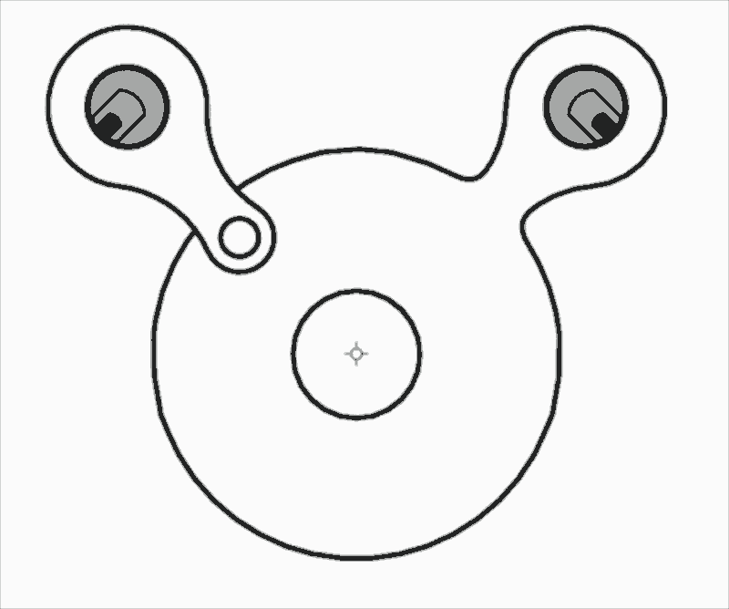](https://hackaday.com/wp-content/uploads/2016/07/ezgif-com-optimize1.gif)

An animation of the mechanism at Origin’s core.

## 微调原点位置的机制

Origin 的核心就是这个机制。两个偏心凸轮位于两个臂的内部，形成了一个非常紧凑的五连杆机构。这是非线性的，但幸运的是，这是确定性的。既然反正都是电脑控制的，这一点都不重要。任何微控制器都可以毫不费力地完成所需的转换。这意味着没有笨重的线性运动导轨，允许紧凑的设备。

最重要的是，偏心凸轮为快速、紧凑和受约束的运动提供了许多机械优势。这一点在弥补一个平庸作家的无拘无束和不协调的动作时尤为重要。Mike Szczys 和我都能够拿起工具，用它完美地切割，只需要很少的培训。

这肯定有窍门。由于实践，牛头刨床员工能够保持更严格的公差。Origin 实际上有相当多的反馈。用户通过移动设备来设置切割速度，而不是在 GCODE 中设置切割速度。这在切割易碎材料或接近纸板末端时尤其方便。不要只是接受会有一些井喷，你可以只是减缓削减和额外的温柔。它提供了很多控制。它不是一个为你工作的工具，Origin 是一个让你更好地工作的工具。

[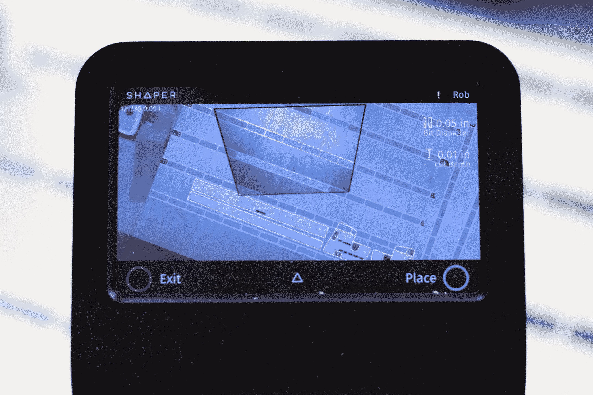](https://hackaday.com/wp-content/uploads/2016/07/img_0156.jpg)

Origin’s augmented view of the world.

Origin 的大部分跟踪能力来自于设备正面精心安装的摄像头。由于算法知道相机相对于切割工具的确切位置，它可以从基准带向后工作以确定其位置。当然，这并不容易。要达到 Origin 提供的精确度需要数年的努力，而且在任何无疑即将出现的竞争对手能够赶上他们之前，还需要一段时间。

[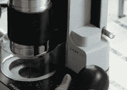](https://hackaday.com/wp-content/uploads/2016/07/img_0158-2.jpg)

Origin can take files from a USB stick. No internet needed.

在上面的照片中，我们可以很好地看到 Origin 的展示。中间的三角形是一个菜单按钮。切割时，钻头位置显示为一个以屏幕为中心的圆圈。如果你看屏幕的底部，你可以看到一些概述部分。这些还没有被剪掉。要放置一个零件，您只需移动和旋转原点，直到零件在电路板上位于其下方——原点就像鼠标一样工作。

中间的梯形是摄像机的实际实时视图。所有突出显示的多米诺骨牌都是 Origin 用来保持其位置的。梯形周围的一切对设备来说都是不可见的，它正在呈现它之前扫描的图片。通过这种方式，用户可以很好地了解工件。相当酷。

Origin 可以在内存中存储大量的路径。它还可以从云端获取矢量路径，直接从工具的触摸屏界面生成矢量路径，谢天谢地，它可以从 USB 驱动器读取设计。(看着你 Glowforge)。

[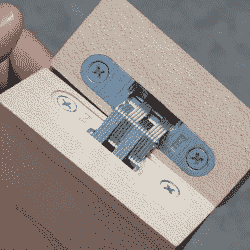](https://hackaday.com/wp-content/uploads/2016/07/img_0846-2.jpg) 最酷的特性之一，前面提到过，就是 Origin 其实可以用来画出需要的路径。想切一个 30mm 的洞？用铅笔在你想要的洞的中心标记一个 X。移动原点，直到在屏幕上看到 X。将圆心放在 X 轴上，然后拖动原点来更改大小。或者，只需使用屏幕键盘输入圆的尺寸。不止轮廓是可能的。你可以轻松地做一些事情，比如为隐藏的铰链设计一个口袋，而不必打开 CAD 或矢量软件。

关于起源最好的部分是它的反应。人们已经做了大量的工作来使它低于人类感知的阈值。Robert B. Miller 在 1968 年首次写道，任何用户界面元素都必须在十分之一秒内做出响应，否则用户会注意到延迟。考虑到这种机器所涉及的繁重处理量，它们能够保持在这个阈值以下几乎是奇迹。

## 它的发展过程是怎样的？

我们只是瞥见了毫无疑问已经起源的成千上万小时的发展。谢天谢地，他们给了我们一组精彩的亮点。

[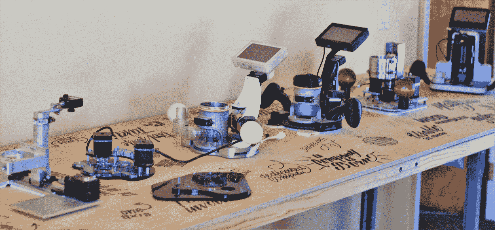](https://hackaday.com/wp-content/uploads/2016/07/img_0191-2.jpg)

《塑造者的起源》和《起源》都是从一个框架开始的。不是机器框架或者任何技术上有难度的东西；公司创始人之一亚历克·里弗斯(Alec Rivers)决定，他非常想给一张照片装框。据我们所知，项目开始几个小时后，甚至可能是几滴沮丧的眼泪，创始人开始意识到木工绝对不是他的菜。

然而，任何缺点都不可能长期不受进步的影响。工程总是在暗处等着，准备解决问题。“当然，我们可以制造一个机器人来做这件事，”亚历克想。“这很简单，只要和我犯的所有错误相反就行了，”他按照逻辑顺序说；思想畅通无阻。

我们被告知已经过了五年，画框还没有建成，但我们现在看到的是成形器的起源。

 [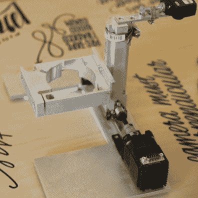](https://hackaday.com/2016/08/25/hands-on-the-shaper-origin-a-tool-that-changes-how-we-build/img_0194-2/) The very first version of the Origin was a MIT research project. [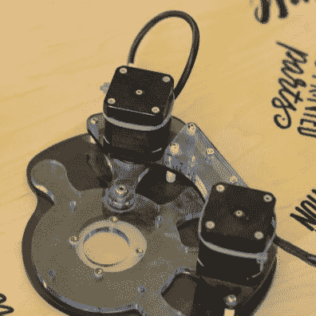](https://hackaday.com/2016/08/25/hands-on-the-shaper-origin-a-tool-that-changes-how-we-build/img_0195-2/) The next version featured the eccentric mechanism.

它始于一台机器视觉相机和一个便携式 x-y 平台。该平台使用常规丝杠和线性轴承来执行平移。假设用户会注意 Z 深度。下一次迭代是第一次使用今天使用的机制。Z 深度仍然由用户管理。他们必须手动插入路由器。

 [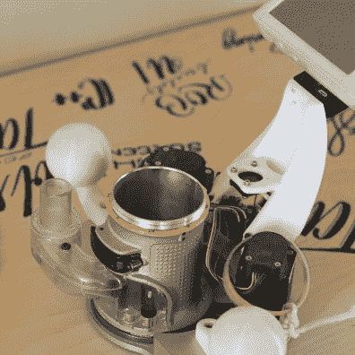](https://hackaday.com/2016/08/25/hands-on-the-shaper-origin-a-tool-that-changes-how-we-build/img_0196-2/) The machine gets more attractive as development continues. A large portion of the algorithms were developed on this iteration.  Continuing improvements are installed on the device. Here we see handles that resemble the ones on the device now.

正是在下一个点，Hackaday 第一次[在 Makerfaire 与 Origin 交互。](http://hackaday.com/2014/05/21/live-look-at-taktia-augmented-power-tool-and-carbide-3d-mill/)设备开始进化。笨重的把手不见了，更好的工业设计开始产生影响。尽管如此，它离我们今天看到的机器还有很长的路要走。从下面的视频(2015 年 Shaper 从 Taktia 改名为 Shaper)可以看出它有多远:

 [https://www.youtube.com/embed/BzMIh70syVc?version=3&rel=1&showsearch=0&showinfo=1&iv_load_policy=1&fs=1&hl=en-US&autohide=2&wmode=transparent](https://www.youtube.com/embed/BzMIh70syVc?version=3&rel=1&showsearch=0&showinfo=1&iv_load_policy=1&fs=1&hl=en-US&autohide=2&wmode=transparent)

进一步的用户测试和开发增加了 Z 轴控制。这是一个重要的发展。不仅可以装袋，而且原点现在可以在感觉到错误或切割已经完成时缩回。最后，Origin 开始看起来像我们今天看到的机器。我们不确定商业版本看起来是否相似，但我们认为会很接近。

  This iteration features Z depth control.  The lessons from the previous were all combined into one.

找到一个能生产基准带的制造商是一个相当大的挑战。不仅图案必须无限随机化，还必须极其精确地印刷，否则 Origin 的定位会有误差。Shaper 的另一位联合创始人伊兰·莫耶透露，他们最初的担心是他们必须自己制作。为此，他构建了一个相当酷的设置。工业喷墨头将在仔细卷绕的带卷轴上打印连续的图案。一个 python 脚本控制了这一切。谢天谢地，他们最终还是设法将生产过程教给了一家专业的胶带制造商，这家制造商现在正在为 Shaper 提供这种神奇的胶带。

  The custom tape making rig that served shaper for a long time. [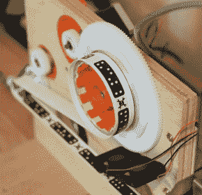](https://hackaday.com/2016/05/20/shaper-tools-will-blow-your-mind/sqrdominos/) The awesome custom tape Shaper made for us.

### 测试和更多测试:

[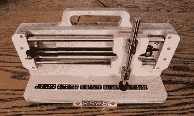](https://hackaday.com/wp-content/uploads/2016/07/1-q-0a-zcr-yejuqfigmxtkw.gif)

Shaper’s tape testing machine. Made with Origin of course.

如此复杂的设备自然需要大量的测试。Shaper 团队提出了许多有趣的内部解决方案来测试他们的机器。

例如，胶带需要[进行优化](https://bts.shapertools.com/it-s-all-about-that-tape-3e674b7bcb33)以供车间使用。它需要粘在各种表面上。它需要便宜。它需要从表面脱离而不留下残渣。它还必须耐用。毕竟，机床在使用过程中会被多次刮擦。

[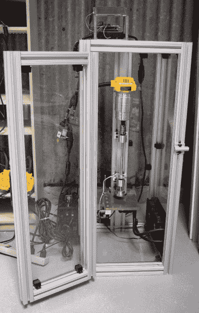](https://hackaday.com/wp-content/uploads/2016/07/dsc_0223.jpg)

Shaper 已经订购了第一批专业生产的磁带。他们还订购了全套耐磨涂料。是时候确定磁带的规格了，但是他们意识到他们的测试太不科学了，不能产生一个明确的赢家。所以他们做了唯一有意义的事。他们用身边的东西造了一台测试机。

这台机器很简单。一个 Arduino 驱动一个浮动的头部，头部前后粘着一些砂纸。它计算周期。受损最少的磁带显然会胜出。

另一个问题是主轴。而大家似乎都在用的 Dewalt 路由器，精细又花里胡哨；市面上有数百种刳刨机主轴，Shaper 希望找到一种能够提供最佳功率、控制、质量和成本的主轴，并将其集成到 Origin 。确定的唯一方法是测试选项——所有选项。但是有一个问题。你如何测试一个主轴呢？你有一个实习生整天走木头路线，保持主轴性能的主观日志吗？

[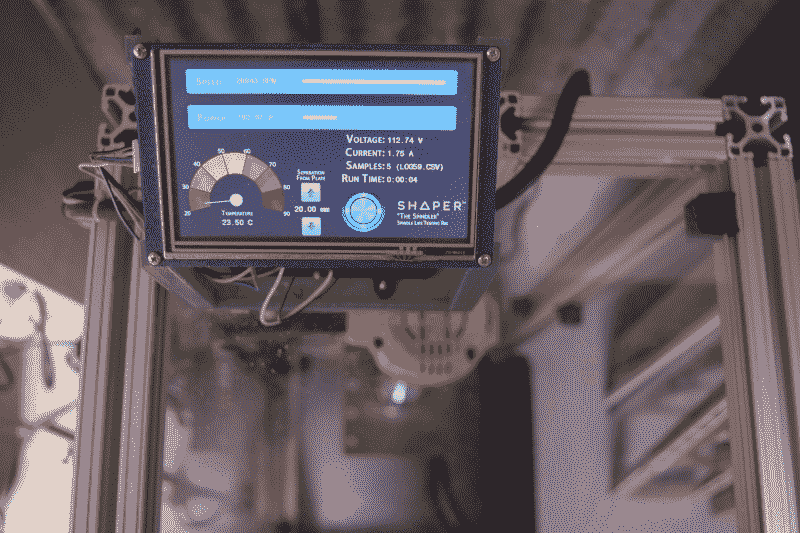](https://hackaday.com/wp-content/uploads/2016/07/dsc_0228.jpg)

The, “Spindler,” can automatically profile a spindle.

我们有点被测试设备惊呆了，但是这些人非常聪明。他们想出了一种在主轴上施加任意载荷的方法。他们通过将一个非常强的磁铁连接到转轴的末端来达到这个目的。磁铁悬浮在一块铝板上。通过移动磁铁靠近和远离金属板，它们可以通过在金属中感应涡流来动态调整负载。自然，当它消耗 500 瓦的功率时，这将使板加热相当多，但这给了他们一种测试市场上任何主轴的方法。一点现成的水冷意味着 CPU 和机器可以无限期运行。

杰瑞米·布鲁姆组装了一个简单的触摸屏控制面板，可以实时记录锭子指标，并允许他们推动锭子直到它们断裂。我们希望看到市场上所有路由器的数据。

[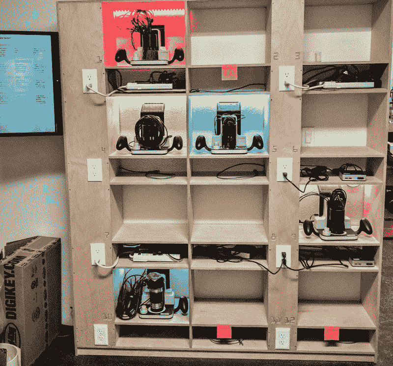](https://hackaday.com/wp-content/uploads/2016/07/1-ip6i4zirmoa1x6fpthzzda.jpeg)

“The Basket” – Shaper’s automatic logging and status shelves.

他们在他们的幕后博客上对此进行了详细介绍，但他们成功的另一个原因是他们跟踪错误和测试结果的优秀系统。上面的设备被称为“篮子”——他们喜欢开玩笑说，他们所有的“鸡蛋”(他们手工制作的测试原型)都在一个篮子里。这个篮子使用了专门构建的软件来检查单元的输入/输出，并记录每个单元的详细错误报告..当然，架子也完全由 Origin 制造。我们认为，它能够为插头切割适当大小的孔，这是值得的。

[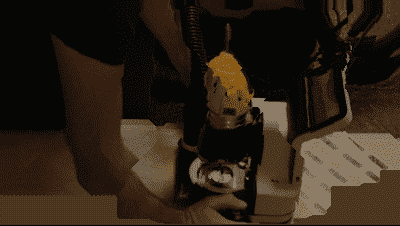](https://hackaday.com/wp-content/uploads/2016/07/1-oqyp2idodg2gpqtcogzqsa.gif)

Worth it.

这个篮子可以跟踪谁在使用这个工具，谁弄坏了这个工具，它的当前状态等等。他们甚至用它来跟踪测试者。所有数据都无缝地推送到他们的内部测试版日志系统。任何工程师在对新设计的硬件进行测试时都会面临的一个问题是，他们所看到的问题是设计上的错误，还是仅仅是装配上的错误。拥有组织良好的日志是做出此类决定的最佳方式。

## 我能用它做什么？

 [https://www.youtube.com/embed/urEWgSlTs4A?version=3&rel=1&showsearch=0&showinfo=1&iv_load_policy=1&fs=1&hl=en-US&autohide=2&wmode=transparent](https://www.youtube.com/embed/urEWgSlTs4A?version=3&rel=1&showsearch=0&showinfo=1&iv_load_policy=1&fs=1&hl=en-US&autohide=2&wmode=transparent)

幸运的是，Shaper 最近开始发布更多该设备运行的视频。简单的回答是，任何你能想象到的用商店机器人或 Shapeoko 建造的东西都是公平游戏。但是，你也可以做得更多，因为没有限制，建立信封，你可以切割非板材，如现有的桌子和已经安装的面板等。 Shaper 目前建议 Origin 用于仿木材料、软金属、塑料和复合材料。然而，他们已经在瓷砖和花岗岩上做了很多测试。因为它所需要的只是基准胶带，所以它可以制作从火柴盒大小到 30 英尺会议桌大小的任何东西。本文中展示的大多数测试装备都是使用该设备制作的。下面是一个播放列表，展示了更多的视频例子。

 [https://www.youtube.com/embed?version=3&rel=1&showsearch=0&showinfo=1&iv_load_policy=1&fs=1&hl=en-US&autohide=2&wmode=transparent&listType=playlist&list=PLEHMLsAENuk-KgUxwhN1g-Hs_kbdxK4dj](https://www.youtube.com/embed?version=3&rel=1&showsearch=0&showinfo=1&iv_load_policy=1&fs=1&hl=en-US&autohide=2&wmode=transparent&listType=playlist&list=PLEHMLsAENuk-KgUxwhN1g-Hs_kbdxK4dj)

## 未来:

经过长时间的等待，Shaper 已经开放了该设备的预购。他们希望明年第一批产品能送到人们手中。请记住，这不是一个 Kickstarter，他们会说，“非常肯定会成功，我们认识一个人”，他们已经这样做了五年。所以我们赌他们很有可能会有好结果。有一些早期鸟折扣上升到最终估计零售成本 2，099 美元。

使用过 Shaper 的 Origin 之后，没有什么工具比它更适合我的个人商店了。多年来，我一直幻想拥有一个商店机器人，但即使我买得起，我有一个足够大的地方放它的可能性就更小了。这就打开了许多可能的途径。对于我用数控或激光切割机做的大多数事情来说，这个就可以了。对于我想要的大部分东西来说，这就够了。它只有面包盒大小，易于使用，并且支持。

The Pre-Order Rendering Photo.