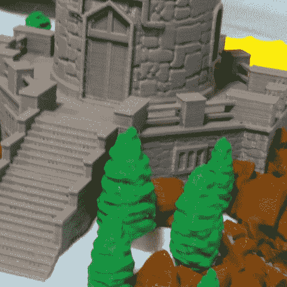
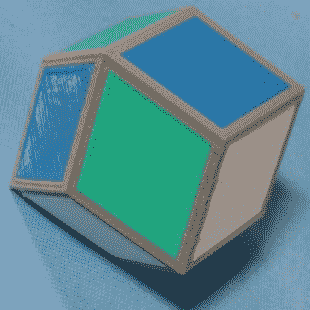
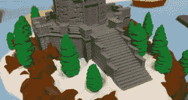
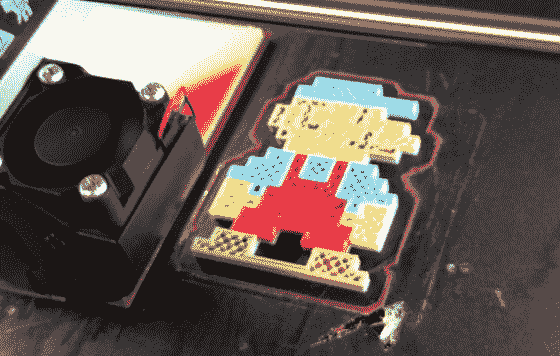
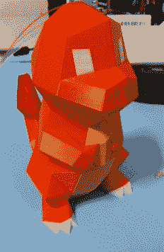
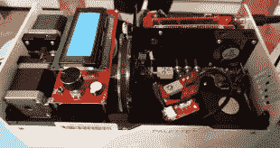
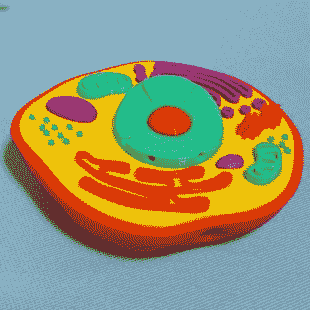
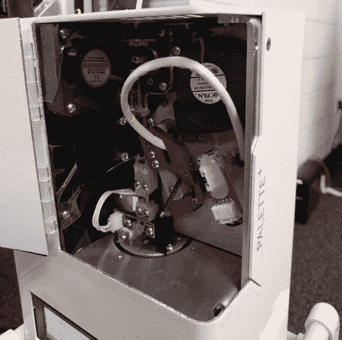

# 细丝拼接机器人实践

> 原文：<https://hackaday.com/2018/03/24/hands-on-with-filament-splicing-robots/>

3D 打印的未来似乎在多材料细丝打印机上。Prusa I3 多材料升级已经存在，本周末在 MRRF [E3D 宣布了他们惊人的多头打印机](https://wp.me/pk3lN-1gbY)。多材料打印将使你得到具有你想要的特性的机械零件，比如带有防滑胎面的车轮和坚固的轮毂。它将为您提供易于移除的支持材料。不过，最受欢迎的用途肯定是多色印刷。这更容易做到，因为你真的只与 ABS 或 PLA 一起工作，如果你真的很聪明，你可以通过一个喷嘴挤压一切。

虽然有一些非常巧妙的方法来打印多种颜色的细丝，但有一项技术没有得到太多的关注，那就是自动细丝拼接。有了这个，一个软件分析一个模型，并结合成一个长的细丝线多线轴。一台备受关注的机器[是来自马赛克制造](https://www.mosaicmanufacturing.com/pages/technology)的 Palette+。在本周末的中西部 RepRap Festival 上有几台这样的机器，在这里任何人都可以不花 800 美元就能得到这台机器。

            The inside of the Palette+    The splicing mechanism of the Palette+

当谈到多色和多材料印刷时，首先想到的问题是工具链和将 STL 文件转换为物理对象的过程。Palette+使用了一个名为 Chroma 的软件，它以 STL 文件作为输入。要打印的对象中的每种颜色实际上是一个单独的 STL 文件，在 Chroma 的构建平台上组合在一起。上面展示的小火龙版画实际上是四种不同的版画；白色的眼睛是一个 STL，橙色的身体是第二个，黄色的肚子是第三个，尾巴上的红色火焰是第四个 STL。在 Chroma 应用程序中，这些 STL 被组装，颜色被分配，生成的文件被存储在 SD 卡上，并被推入调色板机器人。调色板然后在正确的地方用正确的颜色装配一根定制长度的细丝。将此与您最喜欢的切片机中的一些 g 代码结合起来，您就拥有了使用现有打印机进行多色打印所需的一切。

结果非常棒，是我见过的多色细丝打印机中最好的，无论是双挤压头，Prusa 的多材料升级，还是带有多个工具头的奇怪机器。

当然，也有不好的一面。因为调色板是为单挤出机打印机设计的，你不能将 ABS 和 PLA 长丝结合起来。将花哨的工程塑料和彩色 PLA 结合在一起就行了。这是一台一次只能使用一种塑料的机器。

也就是说，我们已经非常非常接近真正的多色印刷时代了。当然，这台机器的价格和一台好的 3D 打印机一样高，但如果你只是想打印一些彩色的塑料块，我还没有看到更好的。