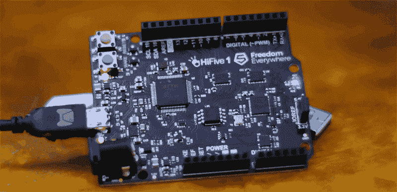
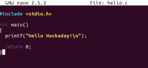
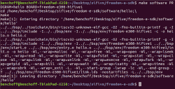
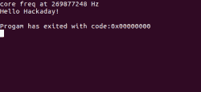
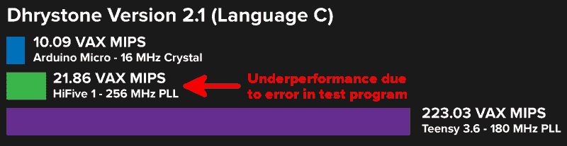
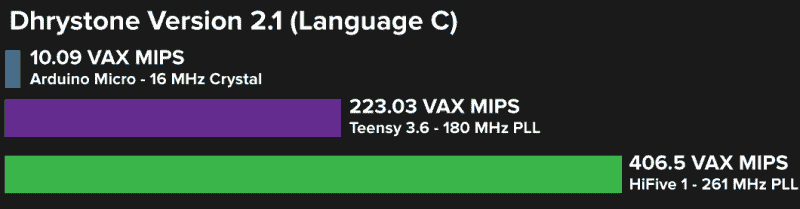

# 实践首款开源微控制器

> 原文：<https://hackaday.com/2017/01/05/hands-on-with-the-first-open-source-microcontroller/>

2016 年对于开放硬件来说是很棒的一年。开源硬件协会发布了他们的认证计划，在那一年的晚些时候，一些硅奇才在山景城会面，展示 RISC-V 指令集架构的最新进展。

RISC-V ISA 完全不同于任何其他的计算机体系结构。几乎所有其他芯片，从嵌入式控制器中的 8051，数百万个玩具中的 6502，到 AVR，PIC，以及英特尔正在研究的任何芯片，都是闭源设计。你不能研究这些芯片，你不能制造这些芯片，如果你想使用这些芯片，你的供应商名单取决于谁与谁有许可协议。

最近几个月，我们已经看到了很多 RISC-V 的东西，从 [OnChip 的 Open-V](http://hackaday.com/2016/11/22/mrisc-v-the-first-open-source-risc-v-microcontroller/) ，到现在来自 SiFive 的 [HiFive 1。SiFive 的工作人员主动让我看一下 HiFive 1，这是第一次实际操作第一个开放式硬件微控制器。](http://hackaday.com/2016/11/29/hifive1-risc-v-in-an-arduino-form-factor/)

### 

在我深入研究这一点之前，我必须讨论 HiFive 1 的开放性，以及 RISC-V 的一般情况。自由软件和开放硬件是一种信仰，生产开放硬件比自由软件要困难得多。无论设计有多好或多开放，第一个开源微控制器的生产将会引起太多的评论，这些评论使用“道德命令”的字眼，同时引用功利主义的例子来说明为什么开放和自由是好的。你应该忽略这些评论，但不仅仅是因为这些人只读过《傻瓜哲学的悬崖笔记》的封底。

### HiFive 1 和 RISC-V 的开放性

RISC-V 芯片最大的卖点就是没有授权费，而且这个微控制器是开源的。这是巨大的——你的 AVR、PICs、arm 和地球上的所有其他微控制器都是封闭的硬件。你不能研究硅。如果我们想要一台完全开源的计算机，它必须从某个地方开始，这就是。

也就是说，这是一个 Arduino 兼容板，带有 FTDI 芯片，提供 USB 到串行转换。如果我们有一个 facepalm 表情符号，我们会在这里使用它。FTDI 芯片不是开源的，他们设计了驱动程序来破解不属于他们的芯片。HiFive 1 的设计文件是用 Altium 制作的，这是一种专有的非自由软件。

This was the best picture for this section of content.

斯托曼会说 HiFive 1 是免费的吗？绝对不行。相反，与 PIC、ARM 或 AVR 相比，HiFive 1 是一个更加自由的微控制器。有些人会争论——通过互联网，使用带有管理引擎的新型英特尔处理器——这不足以被称为自由和开源。对他们来说，我会简单地链接到[涅槃谬误](https://en.wikipedia.org/wiki/Nirvana_fallacy)并让他们给我指出一个*更自由和开源的微控制器。让我们不要削减开源微控制器的想法，因为它在第一次发布时并不完美。*

### 硬件拆卸

那么，HiFive 1 里有什么？规格表足够简单，[数据手册足够完整](https://dev.sifive.com/documentation/freedom-e310-g000-manual/)，尽管有一些注意事项:

*   **微控制器:** SiFive Freedom E310 (FE310)
    *   **CPU:** 四台 E31 CPU
    *   **架构:** 32 位 RV32IMAC
    *   **速度:** 320+ MHz(股票频率好像是 256 MHz 左右，这个可以改)
    *   **性能:** 1.61 DMIPs/MHz
    *   **内存:** 16 KB 指令缓存，16 KB 数据暂存
    *   **其他特性:**硬件乘法/除法、调试模块、片内振荡器和 PLL 的灵活时钟生成
*   **工作电压:** 3.3 V 和 1.8 V
*   **输入电压:** 5 V USB 或 7-12 VDC 插孔
*   **IO 电压:**支持 3.3 V 或 5 V
*   **数字输入/输出引脚:** 19
*   **PWM 引脚:** 9
*   **SPI 控制器/硬件 CS 引脚:** 1/3
*   **外部中断引脚:** 19
*   **外部唤醒引脚:** 1
*   **闪存:** 128 Mbit 片外(ISSI SPI 闪存)
*   **主机接口(microUSB):** 编程、调试和串行通信

基本上，HiFive 1 是封装在 Arduino Uno 外形中的 SiFive FE310 微控制器。引脚间距一如既往地愚蠢，SDK 中还支持一些 Adafruit shields。

没有模拟引脚，但与标准 Arduino 芯片相比，多了两个 PWM 引脚。Arduino Uno 和 Leonardo 有 32 千字节的闪存，而 HiFive 1 在外部 SOIC 芯片上有 16 兆字节的闪存。

由于有三个电压电平转换器，HiFive 1 支持 3.3 和 5V I/O。在我看来，对 5V 逻辑的支持是巨大的——几乎每个开发板制造商都已经将 5V I/O 视为技术进步的牺牲品。HiFive 没有，尽管 FE310 微控制器本身只能承受 3.3V 电压。应该注意的是，增加电压电平转换器会使*的 BOM 增加至少*一两美元，并使电路板的最终成本翻倍。这是一个很好的接触，但这里有削减成本的空间。

除此之外，板上唯一值得注意的芯片是 FTDI FT2232HL，这是一款受支持但肯定不是免费的开源 USB 转 UART 芯片。这是一个双端口芯片，同时提供编程、串行和调试连接。

### HiFive 1 入门

SiFive 的人意识到文档和 SDK 是将芯片变成开发板所必需的。为此，他们有一个裸机 SDK 和对 Arduino IDE 的支持。该板本身带有一个引导加载程序，当你将 HiFive 1 插入 USB 时，你会得到相当于 Arduino 的闪烁草图。是的，你也可以拥有开源的 blinkies。活着是多么神奇的时刻。

现在有两种方法来编程 HiFive 1。Freedom E SDK 和 Arduino IDE。Arduino IDE 似乎依赖于 Freedom E SDK，所以不管怎样，你都必须运行 SDK。

目前，SDK 只能在 Linux(和 OS X，可能还有 Cygwin)下工作，但对 Windows 的支持即将到来。对于 Linux 用户来说,[入门指南](https://dev.sifive.com/hifive1/hifive1-getting-started-guide/)已经足够了，尽管构建所有工具需要相当长的时间(至少 30 分钟)。

一旦安装了 Freedom E SDK，对 Arduino IDE 的支持就非常到位了。你将不得不与董事会经理混在一起，但只需点击几下，你就会得到一些奇妙的东西。你可以用开源硬件让 LED 闪烁。

### 实际上是在编程

LED 闪烁足以证明这是可以编程的，但是在 Arduino IDE 工作之前我们必须安装的大量 SDK 怎么办？在这里，启动和运行 SDK 也很容易:

对于这个例子，我只是将 SDK 附带的“hello world”程序改为“hello Hackaday”程序，编译并运行它。是的，像我这么笨的人也能编译程序上传到 HiFive 1 上。

### 这东西还是新的，好吗？

在收到 HiFive 1 之前，我原本计划将这款开发板与其他小型通用开发板进行基准测试。SDK 附带了一个 Dhrystone 程序，这是显而易见的选择。结果并不好，但这并不能反映 FE310 微控制器的强大。请允许我展示令人震惊的信息图*你不应该关注*:

Ignore this infographic

本次测试使用了[这款带 Arduino Micro、HiFive 1 和 Teensy 3.6 的 Dhrystone Arduino 草图](https://github.com/ghalfacree/Arduino-Sketches/blob/master/Dhrystone/dhry21a/dhry21a.ino)。正如你所料，Arduino Micro 性能很差(但仍然比 1988 年的大型机快 10 倍)，而 Teensy 3.6 非常快。根据这个基准测试，HiFive 1 的计算能力几乎是 Arduino 的两倍，但运行速度却快了 16 倍。如果这个基准是准确的，它将立即意味着 RISC-V ISA 的终结。

上述基准不准确，由于对定时器频率的不正确假设，Dhrystone 性能不佳[。我在 SiFive 论坛上提出了这个问题，几个小时后就有了补丁。真正的基准是什么？](https://forums.sifive.com/t/poor-dhrystone-performance/233)

That’s a fast microcontroller. RISC architecture is gonna change everything.

我喜欢这个测试。在开始这篇评论时，我原本计划在 Arduino、Teensy 和 HiFive 1 上运行几个基准测试，拼凑一个图表，花一百来个字来描述结果。我还有很多。

很快，我们可以看到 HiFive 1 比 T1 快。*真的真的快*。现在，如果你想建造一个巨大的 RGB LED 显示屏，你有一个很好的选择:Teensy 3.6。如果你需要一个微控制器来抽取大量数据，Teensy 有足够的能力、内存和函数库来轻松完成。在这种小型但要求非常高的用例中，HiFive 1 可能会更好。HiFive 1 有更多的闪存(尽管它是 SPI 闪存)，它有 DMA，处理能力大约是 Teensy 3.6 的两倍。这可能会非常非常酷，我迫不及待地想看看 HiFive 1 能从引脚中推出多少的真实例子。

这是你基于综合基准对 HiFive 1 性能的 100 字评论。然而，让这个基准测试发挥作用揭示了更多关于 HiFive 软件的状态，以及 SiFive 对它的支持力度。

不可否认，我确实有一个非常早期的版本，HiFive 1 的众筹活动上周才得到资助。没有人会想到一个新发布的具有成熟架构的主板所配备的三个演示应用程序中的一个会被完全破坏(除非是[的全能芯片](http://hackaday.com/2016/04/21/pine64-the-un-review/)，但无论如何)。很少有人会期望开发人员在不到 24 小时的时间内对支持论坛上的一个随机的人做出回应。

所有这些都回到了对 HiFive 1 的一个观察:它是新的。HiFive 1 和所有 RISC-V 微控制器都没有巨大的市场份额、用户群或数十年的工作成果。然而，SiFive 团队似乎很认真地对待他们的工作。他们正在解决他们遇到的问题，并不断推出新的文档。这很好，也很好地表明了 SiFive 的 RISC-V 芯片将获得多大的支持。

### 芯片即服务

我应该指出的是，SiFive 的人并不从事构建 RISC-V Arduino 板的业务。他们的工作是为人们制造芯片。[我们在这里谈论的是定制硅](https://www.sifive.com/about/belief/)。

最容易画的平行线是在西夫和奥什公园之间。这些公司没有自己的制造能力；价值在于将最终用户(工程师、初创公司)与制造商联系起来。OSH Park 将你连接到一个真正了解紫色的董事会，SiFive 将你连接到一个芯片工厂。就 FE310 而言，这就是 TSMC。

对于任何想要硅的人来说，你可以学习，这是伟大的。不，这不像把电路板送到工厂那么简单，但这是一个开始。SiFive 选择从开放硬件开始这一事实非常棒，我们迫不及待地想看到其他硬件用他们的汗水和氢氟酸制造出来。

**更新:**如果你想在自己的 FPGA 上运行内核，你已经可以得到用于 SiFive 芯片的[RTL](https://github.com/sifive/freedom)。

### 这是一个开始

在基本层面上，HiFive 1 是一个功能强大的微控制器，具有大量闪存，支持数百个 Arduino 库。太棒了，仅此一项就可能值 60 美元的门票。

然而，这里的大故事是 HiFive 1 的开放性。是完全开放的吗？不，HiFive 1 本身使用 FTDI 芯片，我听说 FE310 芯片有一些专利，这些专利对芯片的功能来说根本无关紧要。对开放硬件的严格解释不允许该板被称为开放硬件。那些提出这种解释的人是愚蠢的，为了反驳这一论点，我要引用他自己的话:

> …我们需要在数字产品(可能还有其他种类的产品)的设计中区分等级。连接芯片的电路是一级；每个芯片的设计都是另一个层次。在 FPGA 中，基元单元的互连是一个层次，而基元单元本身是另一个层次。在理想的未来，我们希望设计在各个层面都是自由的。在目前的情况下，仅仅是让一个关卡免费就是一个巨大的进步。
> 
> –理查德·M·斯托曼，*免费硬件和免费硬件设计*

一个未能完全开放的设计不值得与明确封闭的设计归为一类。

尽管如此，这是我们迄今为止最好的成绩，而这仅仅是个开始。我们将有更多更开放的微控制器，但在那之前，HiFive 1 实际上是一个非常酷的板。