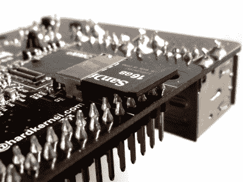
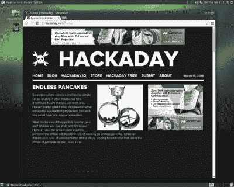
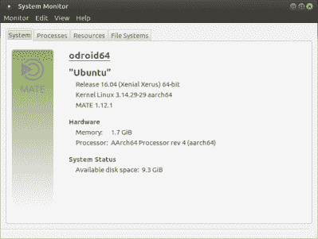

# 动手操作 od roid C2；树莓 Pi 3 挑战者

> 原文：<https://hackaday.com/2016/03/16/hands-on-with-the-odroid-c2-the-raspberry-pi-3-challenger/>

几周前[我们报道了 Odroid C2](http://hackaday.com/2016/03/02/odroid-c2-bests-raspberry-pi-3-in-several-ways/) 的发布，这是一款来自韩国公司 [Hardkernel](http://www.hardkernel.com/main/main.php) 的单板电脑，外形和价位与 Raspberry Pi 3 相同。板载四个 2GHz 的 ARM Cortex A53 内核和 2Gb 的 DDR3，它的纸张规格轻松超过了 Pi 3 在相同内核和 1Gb DDR2 上的 1.2GHz。这可能是我们的读者非常感兴趣的主板，所以我们订购了一个以供查看。

来自朝鲜的包裹如期而至，盒子里的 C2 被一个结实的硬纸板外包装保护得很好。我们订购了一些额外的东西:一个预装了 Ubuntu 的 micro-SD 卡和一个 USB 电源线(稍后会有更多介绍)，它们都是正确的。

拆开电路板包装时，很容易看出它们是如何紧密遵循 Raspberry Pi 外形的。有一些不同，没有摄像头或 DSI 连接器，SD 卡在不同的地方，电源插孔，Pi 有音频插孔，奇怪的是，网络端口是另一种方式。否则，它看起来似乎应该适合大多数 Pi 情况。当然，我们手头仅有的一个案例是为特定 Pi 模型裁剪的 PiBow，所以遗憾的是我们无法测试这个断言。

### 熟悉的外形

除了以太网、USB、HDMI 和 GPIO 端口之外，电路板顶部的大部分都被覆盖处理器和两个 RAM 芯片的薄型散热器占据。在 USB 和网络端口对面的一端有一个 UART 插座和红外接收器，在 HDMI 插座旁边有一个 2.5 毫米的电源插孔。微型 USB 电源是一个 USB OTG 端口，而不是您可能在此外形规格中预期的电源端口。

The SD card is in a slightly unusual position

在底部是另外两个 RAM 芯片，SD 卡插座和 eMMC 插座。SD 插座位于具有较高轮廓的 GPIO 引脚旁边，以便卡伸出引脚底部。这意味着电路板的底面需要比其他电路板多一点的空间。

因此，伴随着一个新玩具开箱时发出的“呜”和“啊”声，我们开始把 C2 从沉睡中唤醒。必要的外围设备与您预期的同类其他单板计算机相同:USB PSU、SD 卡、键盘和鼠标、网络电缆、作为 HDMI 显示器的三星电视。Odroid 告诉我们，在大多数情况下，C2 的功耗低于 0.5A，但他们建议如果使用 USB 外设，可以使用 2A 电源。在这一点上，值得强调的是，C2 有一个 2.5 毫米的电源插座，而不是你可能期望的微型 USB，所以当你订购 C2 时，你也订购一个电源或导线是很重要的。我们选择了 USB 到 2.5 毫米的领先优势，而不是 Hardkernel 的 wall-wart。

### 通电

一切都插上电源，打开它，C2 上一些漂亮的蓝色和红色 led 灯告诉我们它正在启动。看看显示器，有一个小问题。“不支持模式”。我们认为没问题，把三星电视换成宏碁显示器。同样的问题。哎唷，我们不希望通过猛拉电源线来关闭它！但是 Hackaday 的作者不会被这样的不便所困扰，所以是时候进行一次快速的 ssh 了，我们安全地关闭了它。如果你在其他类似的单板计算机上做过显示器的工作，你可能会有一些在这些情况下去哪里的线索，在 SD 卡的 FAT 分区上找到 boot.ini 并打开文本编辑器。Odroid 网站上有一个 wiki 页面处理这个问题，但是虽然它有关于 boot.ini 的信息，但我们不禁注意到它在如何找到它方面有些欠缺。然而，这并不是最有经验的黑客读者应该担心的事情，但这可能超出了这些类型的电路板的一些潜在市场。

在将 SD 卡放入 PC 并打开 boot.ini 时，很明显问题出在 60hz 时 1080p 的固定默认分辨率上。是的，我们的三星台式电视不是高端型号。注释掉它，取消注释一个更可接受的解决方案，一切都好了。Ubuntu Mate 桌面，蓄势待发。

Making sure it can do the important stuff

面对新电脑上一片空白的桌面，你会怎么做？我们启动一个浏览器。在几次错误启动后，它拒绝加载，我们运行了 Chromium，正如你所料，它提供了一个非常强大和快速的浏览平台。Ubuntu Mate 还附带了其他桌面软件的正常选择，例如 LibreOffice 运行顺畅。值得指出的是，虽然 Ubuntu 的图形软件库应用程序报告说，在大多数类别中，该平台没有可用的软件。

### 网路性能

那么，我们怎样才能了解 C2 的力量呢？它的基准已经公布，它的竞争对手也是如此，所以覆盖相同的领域没有什么意义。我们知道，速度至少快了三分之一。但是网络接口怎么样呢？这是一个千兆以太网端口，其 MAC 内置于 SoC 中，因此与竞争中挂在 USB 集线器上的 100 兆 MAC 相比，它应该很快。

遗憾的是，我们没有一个闪亮的测试实验室来测试 C2 的网络，我们不得不凑合着做一个更真实的测试，涉及到一个巨大的文件通过一个商用家用千兆交换机在 Ubuntu 服务器上的不同共享之间移动。我们测得 C2 为 171.12 兆比特/秒，π3 为 78.88 兆比特/秒，也就是说 C2 比π3 快大约 2.17 倍。你可能会认为这些数字更令人印象深刻，毕竟理论上千兆端口应该是 100 兆端口的十倍！但这是测试的真实性质，也许我们的廉价电缆并不像宣传的那样好，或者也许我们遇到了服务器的瓶颈，就像任何在家庭网络上做这个的人都会遇到的一样。

### 优点:GPIO 引脚多，散热好

C2 的许多客户将购买它来获得所有这些 GPIOs，这些 GPIOs 除了几个模拟输入、一个基准电压源和一些非常小的遗漏之外，还共享着人们熟悉的树莓 Pi 引脚排列。因此，一个关键点将是它们的编程简易性，所以值得花点时间研究一下。Hardkernel 提供了一个关于通过 sysfs 访问它们的页面，[提供了它们自己的 wiringPi](https://github.com/hardkernel/wiringPi) 端口，但是 Python GPIO 访问稍微粗略一些。该发行版没有预装任何可访问的开发工具，这应该不会耽误大多数黑客读者很长时间。

在我们测试 C2 的时候，我们经常检查散热片的温度。我们看到的最热温度接近 37 摄氏度，当时它正在从 sudo apt-get dis-upgrade 中打开大量档案。作为比较，在网络测试期间，没有散热器的 Pi 3 处理器的温度达到了 44 度。

那么我们如何看待 C2 呢？在某种程度上，这绝不可能是对 C2 的唯一回顾，因为当然有这样一只大象在房间里，它就是《覆盆子 Pi 3》。Hardkernel 有意识地把自己放在这个位置上，选择形状因素、发射窗口和价格，所以也许它不应该是这样一个看不见的大象。

从硬件角度来看，C2 是赢家。除了无线网络之外，它拥有您需要的一切甚至更多，额外的处理器速度和 RAM 使它具有优势。当唯一的怪癖是奇怪放置的 SD 卡和 2.5 毫米电源插孔而不是 micro USB 时，可以肯定地说它没有太大的问题。如果我们称 Pi 3 是一台合适的计算机，当我们检查它时，它碰巧也有 GPIO 管脚，那么 C2 是相同的，而且更多。

Ubuntu Xenial system details

不过，在软件方面，C2 的产品没有那么紧俏。从第一次开机开始，这台机器上的 Ubuntu 发行版感觉比我们在台式电脑上习惯的 Ubuntu 发行版更粗糙，更像是一个半成品而不是消费品。从一个普通黑客的角度来看，这似乎不是问题，毕竟我们更有可能熟悉发行版内部。但是当你回到房间里的大象，意识到树莓派的销量如此之高是因为它有操作系统开发和社区支持来创建一个非专业父母可以为他们的孩子建立的发行版时，你就开始明白问题可能出在哪里了。如果他们能够复制拉斯边的轻松，建立一个像剑桥的水果派一样的社区，那么他们的包装将是无与伦比的。

## 一锤定音

那么，作为一名业余读者，你应该买 C2 吗？如果您喜欢 bash 提示符，并且不介意不时地用它的软件弄脏自己的手，那么当然可以。从物有所值的角度来看，这是一个赢家。

但如果你是为树莓基金会瞄准的教育和年轻人市场购买，那么你可能最好购买速度稍慢但支持更好的主板。我们可能都很熟悉落入厄运的深渊，这是作为非技术亲属的 PC 的非官方一线支持，你可能会听到一个青少年拥有一个 C2 的发行版，我们的发行版比 Pi 3 上的 Raspbian 更常见。

无论如何，这是 Hardkernel 的一长串 Odroid 板中的最新产品，并且随着每一代产品的相继推出，它们变得越来越好。他们不再只是一个在硬件方面追赶的竞争对手，所以我们期待看到当他们赶上他们的软件时会产生什么。