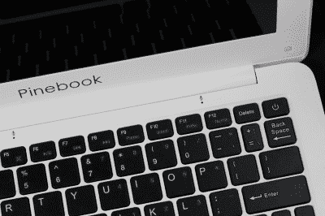
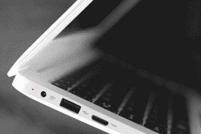
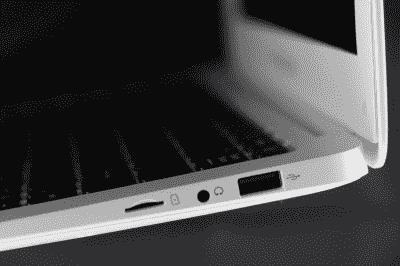
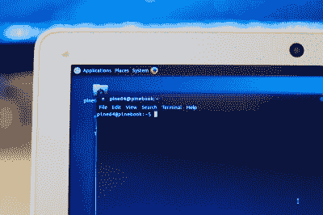
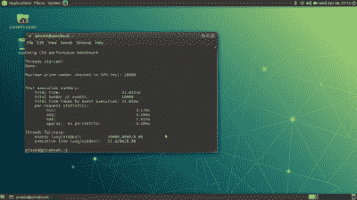
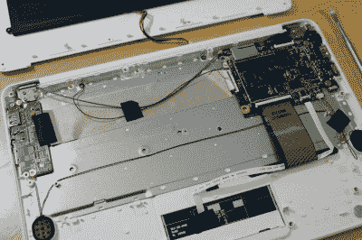
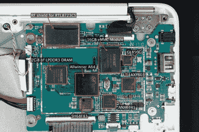

# 手放在松木书上

> 原文：<https://hackaday.com/2017/04/28/hands-on-with-the-pinebook/>

Pine A64 是一款 64 位四核单板计算机，于 2015 年年底[启动，将于 2016 年年中交付。成本仅为 15 美元，被誉为“树莓派杀手”，该董事会从 3.6 万名支持者那里筹集了 170 万美元。它运送到它的支持者那里，几乎普遍受到](https://www.kickstarter.com/projects/pine64/pine-a64-first-15-64-bit-single-board-super-comput)[的差评](http://hackaday.com/2016/04/21/pine64-the-un-review/)。

现在他们回来了，这次是带着笔记本电脑——11.6 英寸的 89 美元，或者 14 英寸的 99 美元。两者都由与最初的 Pine A64 板相同的 64 位四核 ARM Cortex A53 驱动，但至少 Pine 这次在管理用户期望方面做得更好。

The 11.6-inch Pinebook.

但是，不能随便买一个下架。新的松果书是按订单生产的(BTO ),过程有点冗长。你需要做的第一件事是[在 Pine 64 网站上把自己放入 BTO 队列](https://www.pine64.org/?page_id=3832)。选择您想要的型号(11.6 英寸或 14 英寸)，然后输入您的电子邮件地址。我选择了 11.6 英寸的型号。

当你排在队伍的最前面时——我的理解是相当长，几个月，在这一点上——你会收到 Pine 的电子邮件，要求你确认订单，并提供一些配件的追加销售；一个 USB 以太网适配器，一些不同长度的 USB 到 Type-H 桶形电源线，以及一个迷你 HDMI 到 HDMI 适配器。

然后，你把 Pinebook、任何你想要的配件和运费加起来——根据你在世界上的位置，运费通常在 20 美元到 40 美元之间——然后把你的地址、电话号码和 PayPal ID 寄回 Pine。此时，您将收到向您的 PayPal 帐户付款的请求。支付账单，你的 Pinebook 将在下一批 BTO 发货。

我不记得自己是什么时候加入 BTO 的，但肯定不会晚于去年第四季度初，甚至可能更早。4 月 12 日，我收到了派恩发来的第一封 BTO 的邮件，18 日回复。这本 Pinebook 于 24 日从香港起运，27 日我在英国收到了它——在向快递公司额外支付了 35 英镑的进口税后——在它的塑料保护盒里。

截至发稿时，下一批 BTO 货计划在 5 月 5 日从深圳发货，而不是香港。你的经历可能与我的大相径庭。

## 硬件

与 Pinebook 进行比较的明显产品似乎是 Pi-Top，但实际上没有可比性。[早在 2014 年，由 Indiegogo](https://www.indiegogo.com/projects/pi-top-a-raspberry-pi-laptop-you-build-yourself#/) 资助的 [Pi-Top](https://pi-top.com/product/pi-top) 是一款树莓 Pi 驱动的笔记本电脑。它有 10 小时的电池寿命，13.3 英寸的屏幕，并且是你自己组装的套件。Pinebook 看起来和摸起来都像一台“真正的”笔记本电脑，而 Pi-Top 却不是。圆周率陀螺也要 299 美元，是松本价格的三倍多。

The Pinebook keyboard.

我对 Pi-Top 的一个主要抱怨是它的键盘——自从我停止使用机械打字机后，我就再也不用那么用力敲键盘了。Pinebook 的键盘更好，好得多，尽管我不太确定他们使用的是什么键映射——它似乎是美式和英式布局的结合——物理键盘使用起来很舒适和坚固。

相反，我在这里主要抱怨的是触控板，它相当糟糕，尽管我不得不承认，它的性能与我不幸使用的几款低端 Chromebooks 相当。它也比 Pi-Top 的触控板好，所以也许我对它期望过高。

麦克风的孔在键盘上方可见，而两个向下发射的扬声器分别位于键盘的两侧。扬声器有点小，在高音量下有些失真。

Left side of the Pinebook with barrel power connector, USB and mini-HDMI ports.

Pinebook 使用一个 5 伏桶形连接器供电，它配有一个 5 伏、3 安培的壁式电源插座，你可以在订购时将 USB 转桶形连接器电缆作为附件，或者自己将零件拼接在一起。充电后，笔记本电脑应该可以用电池运行大约六个小时，但是现在由于软件出现了一些问题，这意味着你的电池寿命可能会比预期的短。

桶形连接器在 Pinebook 的左侧，旁边是一个 USB 端口和一个迷你 HDMI 连接器。现在，再次由于软件问题，通过 mini-HDMI 连接器的视频输出[已知无法工作](https://forum.pine64.org/showthread.php?tid=4472)，Pine 预测这将在五月中旬左右得到解决。

另一方面，Pinebook 的右手边是另一个 USB 端口和一个耳机插孔，至少在理论上[兼作 UART 端口](http://linux-sunxi.org/Pine_Pinebook#Adding_a_serial_port_.28voids_warranty.29)，尽管我还没有测试过这个端口——尽管现在从该端口输出的音频也[已知不工作](https://forum.pine64.org/showthread.php?tid=4472)。还有一个微型 SD 卡插槽，我已经测试过了，工作正常。

Right side of the Pinebook with micro SD card slot, headphone socket, and USB port.

屏幕上方是一个使用比亚迪微电子 [BF3703](http://www.byd.com/energy/download/CMOSDatasheet/BF3703CS.pdf) VGA CMOS 图像传感器的 Silicon Motion 640×480 像素(0.3MP) USB 摄像头。它给出了一个可预见的糟糕的图像质量——上次我在我的手机里有一个 640×480 像素的相机，我想是在 90 年代末——但它开箱即用，并且完全受 [Linux UVC 驱动程序](http://www.ideasonboard.org/uvc/)的支持。

坦率地说，考虑到笔记本电脑的价格，我很惊讶 Pinebook 竟然有摄像头。所以我不是在抱怨。

除了触控板之外，屏幕可能是产品质量最差的部分。该面板是一个体面的大小为 1366×768 像素，足够明亮。不幸的是，我的上面有明显的水平线。换句话说，它闪烁不定。不断地。面板的色彩表现也不是很好，但与闪烁相比，这真的是一个非常小的问题。

The Pinebook screen is readable, but not high quality.

闪烁是持续不断的，因此，虽然屏幕完全可读，但长期使用可能不是一个好主意。~~我不确定这是我的单位的问题，还是 Pinebook 的总体设计或制造问题，并且~~我很想听听其他手拿 Pinebook 的人的评论，这是否是一个更普遍的问题。

从冷启动启动到登录屏幕需要 27 秒，输入密码后——默认用户的密码是‘pin e64’——桌面完全打开还需要 13 秒。从桌面关机到冷机只需要八秒多一点。

**更新:**我遇到的屏幕问题显然是由软件问题引起的[，该问题只影响 11.6 英寸的机型，14 英寸的机型不存在。该问题尚未解决，尽管目前认为根本原因是 ANX6345 驱动程序或 fbturbo 设置。](https://forum.pine64.org/showthread.php?tid=4472)

## 软件

Pinebook 出厂时安装了 Ubuntu MATE 16.04。不幸的是，它运行缓慢，至少对我来说，速度感觉比 Raspbian 上的 PIXEL 桌面在 Raspberry Pi 3 上运行慢得多。考虑到 A64 处理器的速度，这是令人惊讶的。虽然触控板的质量差可能是造成这种反应迟钝的原因，但我感觉这里存在优化问题；真的不应该感觉这么慢。

The default Ubuntu MATE desktop.

运行 Firefox 特别痛苦，这就排除了它作为“随意浏览网页的笔记本电脑”的可能性，你可以把它放在沙发上。

所以，就像上次一样，Pinebook 的主要问题似乎是围绕着软件。当 Pine 发布他们最初的主板时，事情比[的情况有了很大的改善，不像最初的 Pine A64 主板，Pinebook 实际上是可用的。然而，Pine 已经明确表示，“……很大程度上将由社区来帮助进一步开发和改进 BSP [Board Support Package] Linux 在设备上的体验。”](http://hackaday.com/2016/04/21/pine64-the-un-review/)

有可能[当前为 Linux 主线内核增加支持 Allwinner 支持的努力最终会有回报，但是在此之前，你需要依赖 Pine，或者更有可能是 Pine A64 板和 Pinebook 周围的社区来改进硬件支持。](http://linux-sunxi.org/Linux_mainlining_effort)

这意味着围绕硬件的文档非常重要。然而，这种文件是缺乏的。它是分散的，如果你期待看起来像 Raspberry Pi 文档的东西，你会失望的。[支持论坛](https://forum.pine64.org/forumdisplay.php?fid=76)也人口稀少。现在还为时尚早，但是现在还没有很多社区来收拾残局。

然而，除了 Pinebook 附带的 Ubuntu Linux 版本之外，Pine A64 [的 Android 移植也在进行中](https://forum.pine64.org/showthread.php?tid=4474)，而它[似乎](https://drive.google.com/file/d/0B3V0fRXGK3FuNzZmT2tPcGJ4TTQ/view)处于相当后期的开发阶段。所以，如果你在 Pinebook 自带的 Linux 安装上有问题，你可能想[试试 Android 版本](https://github.com/ayufan-pine64/android-7.1/releases)。

## 往松木书里面看

打开 Pinebook 非常简单，笔记本电脑的底部有十个飞利浦螺丝——不过要小心，靠近楔形物薄前缘的螺丝更小，所以不要弄混了——所以翻转它，拧开它们，然后用[金属扳手](https://www.ifixit.com/Store/Tools/Metal-Spudger-Set/IF145-017-1)小心地撬开后壳。

The inside of the Pinebook case is mostly battery.

右侧可以立即看到主板，最左侧是处理机箱另一侧插座的子板。

在移除外壳底部后，还有四个飞利浦螺丝来移除电池，以及一些将电池连接到电路板的胶带。连接器刚刚从插座中取出，所以请将胶带放在手边，当您再次将所有部件装回时，将需要它来重新拔插电缆。

Removing the battery exposes the trackpad PCB.

取出电池后，你可以看到最后的电路板，它藏在电池下面，处理触控板。

主板本身隐藏在一个正方形胶带和射频屏蔽的右上方。如果您小心地撬开保护罩上的胶带，保护罩应该会脱落，并且在合上笔记本电脑时很容易重新安装。

在电路板的中心附近可以看到 all winner A64 T1 处理器，而它正下方的芯片是 Sino Wealth T2 sh68f 83 T3，这是一个低速 USB 微控制器，用作 HID 键盘/触摸板桥。在 A64 处理器的左边是一个预见 [NCLD3B2512M32](https://linux-sunxi.oimg/9/93/FORESEE_178ball_12x11.5_LPDDR3_16G_Spec_V1.0-1228.pdf) ，带有 2 GiB 的 LPDDR3 DRAM，运行频率为 533 MHz

The main Pine board with the major silicon labelled.

从 CPU 的右上方可以看到一个 [16 GB 的 eMMC 模块](https://www.pine64.org/?product=16gb-emmc)。你可以在[的松树商店](https://www.pine64.org/?product_cat=pinebook)买到该模块的替代品——大小从 8 GB 到 64 GB 不等。该模块可由用户更换。据报道，该模块的读取速度高达 80 MB/s，写入速度高达 40 MB/s。Pinebook 能够从内部 eMMC 或外部 micro SD 卡启动。

另外三个较小的芯片是 X-Powers [AXP803](http://files.pine64.org/doc/datasheet/pine64/AXP803_Datasheet_V1.0.pdf) ，它处理电池管理和充电，一个 Genesys Logic [GL850G](http://www.kean.com.au/oshw/WR703N/GL850G%20USB%20Hub%201.07.pdf) ，它充当 USB 2.0 集线器控制器，最后是 Analogix [ANX6345](http://static6.arrow.com/aropdfconversion/a721954531511baa7fa45829145fd591b43ff112/3anx9804_product_brief.pdf) ，它处理 RGB 到 DisplayPort 的转换。

在顶部，你还可以看到第二个射频屏蔽，这比主屏蔽更牢固，但可以小心地撬开，露出 Realtek [RTL8723CS](http://www.realtek.com.tw/press/newsViewOne.aspx?NewsID=361) ，这是一个 SDIO 2.0 解决方案，包括 Wi-Fi、蓝牙 LR 和 FM 接收器。

与 Pine A64 板或 Raspberry Pi 供电的 Pi-Top 不同，Pinebook 的主板上没有 GPIO 引脚。

你应该知道，当你重新组装 Pinebook 时，触控板的表面有向外弯曲的趋势，你需要确保在重新连接背面之前将它推回原位，因为否则触控板按钮将无法在重新组装时工作。

## 摘要

总的来说，Pinebook 的构建质量非常好。除了触摸板，这真的不是很好，和屏幕，这很可能是我的单位的一个问题，它感觉像一个“真正的”笔记本电脑。

然而，要明确的是，这不是你的 Macbook 的替代品。你不能把这个给你即将上大学甚至高中的孩子，并期望他们能处理好。它也不是低端 Chromebook 的真正替代品，台式机的速度非常慢，我不会推荐它作为沙发上的廉价网络浏览笔记本电脑。

另一方面，我必须承认，我相当喜欢它。它比 89 美元的笔记本电脑要好得多，尽管有电池，但内部仍有很多空间来添加东西。我不完全清楚是什么事情，同样的，我也不确定我要用它做什么。但我会想出办法的。