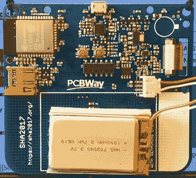
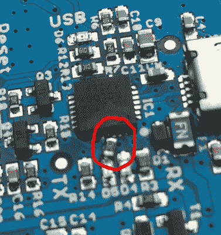
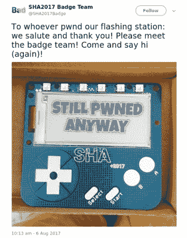

# 手握 SHACamp 2017 徽章

> 原文：<https://hackaday.com/2017/08/14/hands-on-with-the-shacamp-2017-badge/>

这个徽章已经成为现代黑客阵营的定义特征之一，这是一种可穿戴的电子设备，既可以作为事件计算机，也可以作为一些温和的软件和硬件黑客攻击的平台。一些赛事有令人震惊的复杂徽章，而另一些则更简单，这种现象甚至催生了一个与正在讨论的赛事无关的非官方徽章生态系统。

[SHACamp 2017 徽章](https://wiki.sha2017.org/w/Projects:Badge)是黑客日作家的最新作品，当然包含的内容足以代表 2017 年黑客营徽章的状况。它没有像 CCCCamp 2015 的软件定义无线电那样的星形，而是一台非常方便的小型计算机。

徽章本身是一个大约 95 毫米×85 毫米大小的蓝色 PCB，前面板由 296×128 像素的电子墨水显示屏和一组电容触摸按钮组成，其布局让人想起游戏机。前面板顶部是一组 Neopixel LEDs 的空间，徽章所有者必须自己焊接这些 led。

PCB 背面是 badge 电路和一个 1000mAh 锂聚合物电池。令人惊讶的是，集成电路很少，因为设备的“大脑”来自邮票 Wi-Fi 模块中的 ESP32。其余元件专用于 Silicon Labs CP2102 USB 转串行接口、电源调节和电池充电，以及 Freescale MPR121 触摸传感器和 GPIO 扩展器芯片。除了 USB 接口，还有一个 microSD 卡插座和一个用于所谓“围巾”或附加板的扩展插座。必须由用户在这一侧焊接的另一个部件是振动器单元。截至营地结束时，唯一创建的围巾板是一个裸露的原型板。

作为一名参加夏令营的人，这仅仅描述了作为顾客的第一印象。没有像这样的徽章是大规模生产的消费电子产品，而是每一个都是为特定事件定制的设计。在我们与会者报到时收到的组装徽章背后，是一个志愿者团队数月来的开发和制造步骤，徽章团队负责人[Sebastius]和[Kartoffel]在徽章黑客帐篷外的荷兰阳光下休息时解释了这一点。然后，我们的故事就不再是对徽章的描述，而是对从头开始制造中型电子组件的有趣探索。

## 如何在不掉头发的情况下制作四千枚徽章

这个特殊徽章的起源是在两年前 CCCCamp 2015 之后，但在受到 [EMF 2016 的 Tilda Mkπ](https://hackaday.com/2016/08/09/tilda-mkπ-the-emf-camp-2016-badge/) 徽章的功能性的严重影响下，它固化为接近最终制作的东西。列出营地徽章的理想特征似乎是显而易见的，但它需要显示所有者的姓名或手柄，易于黑客攻击，提供活动信息的访问权限，最重要的是，从程序开始就为其用户工作。第二个要求是徽章在强烈的阳光下可读，因为以前的徽章在这方面有些令人失望。网络原本是通过蓝牙热点提供的，但后来由于担心在活动中过度使用 2.4GHz 频谱，决定改用 WiFi。最后，EMF 徽章的成功为带有相关应用程序库的 MicroPython 软件环境指明了道路。

[![The various layers of the badge PCB. [Kartoffel]](img/f440edded1c3f4b4048cd81b851fce8a.png)](https://hackaday.com/wp-content/uploads/2017/08/sha-badge-schema.png) 

徽章 PCB 的各层。[ [Kartoffel](https://files.sha2017.org/d/ce90c4433d/files/?p=/badge/6%20badge%20schema.png) ]

从 2016 年的最后几个月到 2017 年，第一批徽章原型出现了。选择使用当时非常新的内置 WiFi 的 Espressif ESP32 微控制器，并使用电子墨水显示器，而不是 LCD 或有机发光二极管。该设计经历了几个早期原型和其他芯片的选择，以及预制造测试生产运行，揭示了他们选择的 USB 连接器的一些问题，这些连接器具有塑料突起，电路板上没有孔。在这一点上[Sebastius]停下来反复强调，他从 EMF 的[Jonty]那里得到的进行生产前测试的建议是他们能做的最好的事情，因为没有它，我们谁也不会得到徽章。

他们选择的触摸控制芯片即将报废，因此价格飙升，这让他们有点头疼，但他们并没有放弃那些 USB 插座。在取放过程中，用塑料突出物替换他们的插座的结果是与电路板的边缘重叠足够多，以至于接触到下一个嵌板，他们的制造商和赞助商之一 PCBWay 完成了一些英勇的大规模返工以交付货物。一切似乎都很好，电路板被制造出来并从中国运往欧洲。

当完成的板到达时，它们完美地工作。或者至少，他们看起来是这样。很快就发现，大约一半的电路板出现了意想不到的问题，即从 USB 切换到电池电源会重置 ESP32。这最终被追踪到硅实验室的 USB 到串行芯片，一个修复必须炮制。

The hand-added resistor on badges with a fake Silicon Labs USB chip.

### 是假的！

选择 Silicon Labs 部分是因为与 FTDI 芯片等熟悉的替代产品相比，软件驱动程序在所有平台上都很容易。硅实验室本身以大量芯片的形式提供了一些赞助，但这对于整个生产过程来说是不够的。其余的必须来自中国，正如你们中的一些人可能已经猜到的，来自中国的芯片是假货。

即便如此，它们也不是糟糕的赝品，它们的表现正如你所期待的那样，但它们的设计师犯了一个致命的疏忽，在 USB 线上遗漏了一个保护二极管。因此，由此产生的断开峰值足以重置 ESP32，从而为项目带来潜在的灾难。事实证明，这种修复既简单又极其困难，一个切割轨道和一个微小 SMD 电阻的极其精细的焊接，一个志愿者焊接团队为此付出了巨大的努力。在受影响的电路板的背面可以看到修复，固件有一点代码来识别假芯片，并通过闪屏角落的一对字母显示芯片类型，以便于识别。

所有这些设计、采购和返工肯定是一项艰巨的工作，我们这些参加过营地的人都应该非常感谢团队为我们提供了一个从一开始就有效的徽章。我们中的一些人在收到徽章时立即注意到了返工的电阻器，但对其背后的工作规模没有任何概念。

## 软件呢？

硬件只是徽章的一半，因为徽章的成败取决于软件。在这种情况下，SHA 徽章遵循了你所期望的引导到昵称屏幕的屡试不爽的路线，只需按一下按钮，就可以启动已安装的应用程序(徽章的说法是“鸡蛋”)。有一个应用程序库(孵化器)，因为这是一个黑客营徽章，所以鼓励用户在 MicroPython 中编写自己的应用程序。在这方面，营地参与者没有失望，许多应用程序将徽章的功能推到了极限。

The SHA badge team’s [response to their flashing station being compromised](https://twitter.com/SHA2017Badge/status/894245126054313985).

但这是一个黑客阵营，尽管我们通常不太热衷于围绕“黑客”一词的负面内涵，当然人们会用徽章做一些轻微的淘气的事情。例如，勒索软件和病毒会在任何不小心安装了它们的人的徽章上留下印记。第一个 SHA badge 勒索软件的作者写的文章本身就是一篇引人入胜的文章。然后是徽章刷新站，徽章黑客帐篷里的一台笔记本电脑，徽章有问题的人可以访问它来刷新他们的固件。在没有病毒或勒索软件的情况下，这是很常见的事情，即使是表现最好的应用程序有时也会出现崩溃周期。因此，这个刷新站是一个重要的目标，果然，有人设法损害它，并使用它来分发轻度恶意固件。这是我们社区性质的一个标志，这两种行为都受到徽章团队的欢迎和赞赏，它们是我们文化的一部分。

作为徽章的最终用户，我的印象如何？这是典型的这种徽章，因为该软件是粗糙的边缘，它并不总是最稳定的体验，但这一个比其他许多好。在崩溃循环导致无法使用后，Hackaday 徽章需要几次旅行才能重新刷新，而且有很多应用程序要么无法工作，要么使徽章锁定。但这是黑客营徽章的正常过程，随着每次连续的固件更新，体验变得更加流畅。触摸按钮有时会意外触发，特别是当徽章被佩戴而不是持有时，所以我运行昵称应用程序，在电子墨水屏幕上显示“Hackaday”，然后在不使用时断开电池，制作一个静态徽章。否则，我的显示器固定胶屈服于热量(就像许多用户一样)，所以我从徽章条上拿了一块双面胶带来修复它。

就开发而言，徽章的应用程序可以很容易地用 MicroPython 编写。是时候惭愧地承认，虽然我做了一些杂乱无章的黑客工作，但我没有创造出任何值得应用程序库的东西。然而，对于任何拥有阿沙徽章的人来说，它都值得一看，因为在所有的营地徽章中，我认为这一枚最不可能被束之高阁。我们已经习惯了具有各种惊人功能的徽章，但直到现在我们还没有一个像这样的电子墨水屏幕的徽章。这是一个徽章，其延长的电池寿命和持久的屏幕将在 SHA 2017 的记忆消退后很长一段时间内在各种监控和信息应用程序中占据一席之地。

总之，对 SHA 2017 徽章的评价是什么？电子墨水屏幕和 ESP32 处理器背离了黑客营徽章的既定趋势，当与受 EMF 2016 徽章启发的 MicroPython 环境相结合时，它确实是一个非常实用的徽章平台。该设计是完全开源的，因此鉴于 ESP32 模块的现成可用性，我们很有可能在未来的徽章中看到更多其 DNA 的迹象。SHA 徽章团队在这里制作了一个值得骄傲的徽章，如果其他营地基于他们的工作，那么他们将在一个坚实的基础上这样做。

***后记:***sha 2017 的徽章团队有[一个全部属于他们自己的](https://wiki.sha2017.org/w/File:Badgebar_banner.png)标志，以一对卡通动物为特色。对于我们这些不是来自荷兰的好奇者来说，它们是对荷兰流行儿童角色的阿沙主题模仿。由于在活动期间贴纸似乎无处不在，似乎应该清理一下。