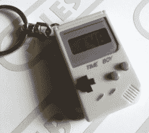
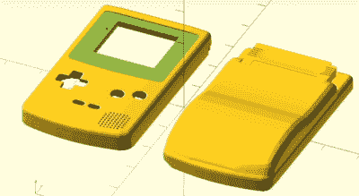
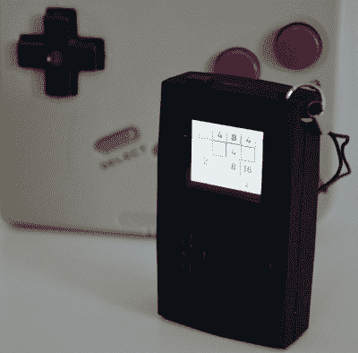

# 亲手制作史上最小的游戏机

> 原文：<https://hackaday.com/2018/02/12/hands-on-with-the-smallest-game-boy-ever-made/>

PocketSprite 是最小的全功能 Game Boy Color 和 Sega Master 系统仿真器。它不仅小到可以放在你的口袋里，而且小到可以在你的口袋里丢东西。[它现在可以作为一个人群供应活动](https://www.crowdsupply.com/teampocket/pocketsprite)，它是你在一个便携式、支持 WiFi、完全可黑客攻击的视频游戏控制台中想要的一切。它也玩巫师 3。可能还有孤岛危机，因为迷因。

这已经酝酿了一年半。PocketSprite 的第一个硬件版本是由硬件工程师 extraordinaire [Sprite_TM]在 2016 年 Hackaday 超级大会上公布的。由于[Sprite]有一长串令人难以置信的令人印象深刻的硬件技巧，如在硬盘上安装 Linux*和构建电子鸡矩阵，他总是不得不继续深入硬件前沿。*

2016 年，[雪碧]展示了有史以来最小的游戏机，由当时全新的 ESP32 驱动。这是作为开源软件发布的，希望中国的一家工厂能够获得这些文件，并开始生产迷你游戏男孩供大家享受。现在，一年半后，这终于发生了。在与制造奇才[史蒂夫·K]的合作中，[雪碧]是 TeamPocket 的幕后策划者。口袋大小的游戏男孩形状的模拟器现在是真实的。这是我们的动手复习。

 [https://www.youtube.com/embed/iV9ckQfYCQk?version=3&rel=1&showsearch=0&showinfo=1&iv_load_policy=1&fs=1&hl=en-US&autohide=2&wmode=transparent](https://www.youtube.com/embed/iV9ckQfYCQk?version=3&rel=1&showsearch=0&showinfo=1&iv_load_policy=1&fs=1&hl=en-US&autohide=2&wmode=transparent)

### 从手表到模拟器

 【口袋妖怪】是【妖怪】儿时的梦想。很久以前，[精灵]偶然发现了一个可以放在钥匙链上的游戏机形状的物体。这一次男孩让小精灵大吃一惊，他梦想在他的钥匙链上有一个游戏男孩，他可以拿出来玩俄罗斯方块或科比。

不幸的是，时间男孩令人失望。这仅仅是一个数字时钟，完全撕掉了原来的 DMG 游戏男孩的商业外观。从那时起已经过去了很长时间——我们已经超过了以前最小的游戏男孩——微型游戏男孩，那么为什么[Sprite]不能只使用一个强大的微控制器，一个小显示器，并混合一个微小的，钥匙链游戏男孩呢？

pocket sprite 在 2016 年的 Hackaday 超级大会上向世界推出，并且仍然是我们见过的最令人满意的硬件创造演讲之一。[Sprite]从一个 ESP32(作为一个 ESP-WROOM-32 模块)、一个 96×64 有机发光二极管显示器和将这个硬件变成一个功能控制台的最少组件开始。该案例是一件艺术品，在 OpenSCAD 中建模(*！*)作为一个缩小的游戏男孩颜色，模拟器进行了大量的优化，【雪碧】甚至还加入了一些漂亮的功能，比如可以玩得很差的《毁灭战士》和《巫师 3》出奇的好。可以看下面这个传说中的对话。

 [https://www.youtube.com/embed/BYXAZZfJm-g?version=3&rel=1&showsearch=0&showinfo=1&iv_load_policy=1&fs=1&hl=en-US&autohide=2&wmode=transparent](https://www.youtube.com/embed/BYXAZZfJm-g?version=3&rel=1&showsearch=0&showinfo=1&iv_load_policy=1&fs=1&hl=en-US&autohide=2&wmode=transparent)

[Sprite]的 Game Boy 的目标一直是让它开源。除此之外的希望是，中国的一家随机工厂将意识到对微型游戏机的需求，制造几个模具，购买数千个 ESP32([Sprite]顺便说一下，为 ESP32 的制造商 Espressif 工作)，并将这些游戏机微型口袋发布到全球速卖通和淘宝上。出于某种原因，这种情况从未发生过，而且由于大 N 的好打官司以及他直接抄袭游戏男孩颜色的案例，他对自己做众筹有点害羞。无论如何，制造一个东西比制造成千上万个东西要容易得多。

然而，在过去的几个月里，[Sprite]一直在与“制造大师”[Steve K]合作，将这个一次性项目变成一个实际的项目。OpenSCAD Game Boy 的彩色外壳不见了，取而代之的是一个更简单、更矩形、决定不再原子化的紫色外壳。软件进行了优化，增加了游戏装备模拟。【雪碧】的 Game Boy mini 现在已经是一款产品了，那么它是如何叠加起来的呢？

### 像穿着上紧发条的鞋子的 Tanooki 一样冷静

 现在 PocketSprite 是真的了，据我所知，硬件几乎一模一样。在里面，你仍然会发现相同的 ESP32，一个小扬声器，小按钮，我敢打赌是音频驱动器的 H 桥。它看起来比第一版硬件有一些轻微的改进，但这实际上是[Sprite]在 2016 年 Hackaday 超级大会上展示的同一款小游戏。

[大众供应活动](https://www.crowdsupply.com/teampocket/pocketsprite)和[官方口袋精灵页面](https://pocketsprite.com/)展示了规格，你会得到这个推销广告中的一切。值得注意的是到 [PocketSprite GitHub](https://github.com/PocketSprite) 的链接，它提供了修改后的 SMSPlus(游戏装备和世嘉主系统)仿真器和 Gnuboy(游戏男孩和游戏男孩颜色)仿真器的源代码。还包括一个 SDK，用于在 ESP32 上玩《巫师 3》的不可思议的黑客行为。[Sprite]和 VNC 一起做的，这听起来并不令人印象深刻，直到你意识到这也是一个你可以放在口袋里的 Nvidia 盾。

这是我们一直在等待的硬件，我们迫不及待地想看看社区用它做什么。请记住，这不仅仅是一个模拟器:这是一个全功能的 WiFi 和蓝牙微控制器系统，运行在可充电电池上，带有大量的闪存和 SDK。太棒了，完全值得等待。