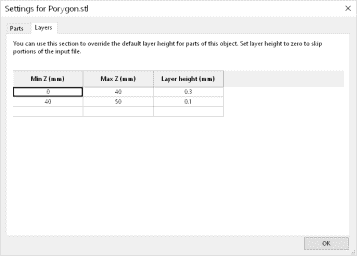
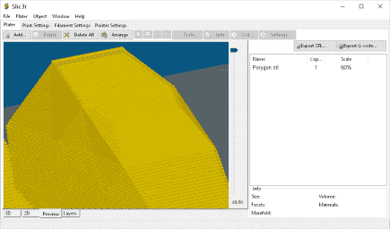
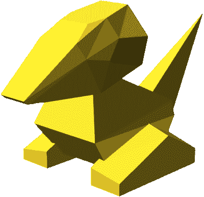
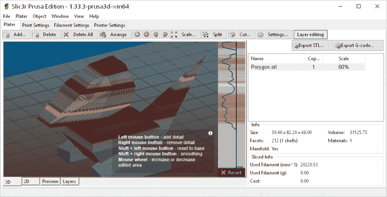
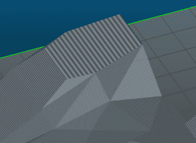
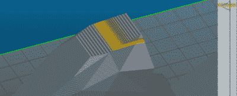
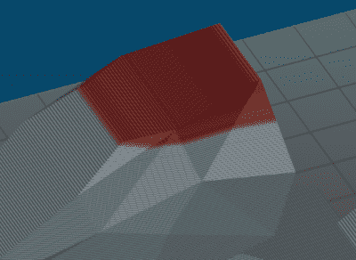
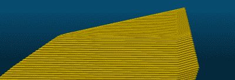
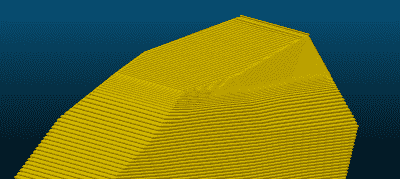
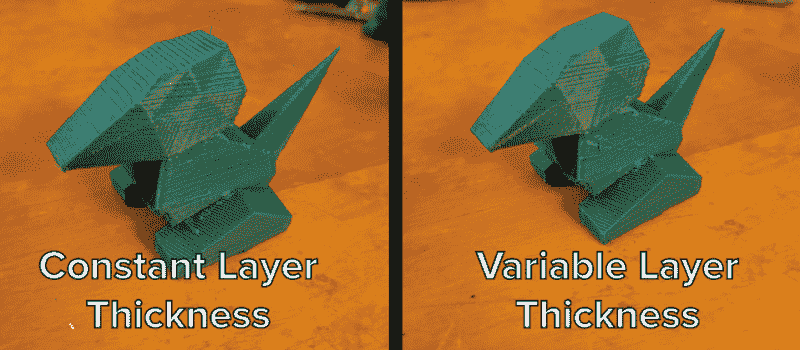

# 手动操作可变层高

> 原文：<https://hackaday.com/2017/02/16/hands-on-with-variable-layer-height/>

3D 打印机是一种妥协的练习。一般来说，你不希望你的工具头上有太多的质量，因为这可能会导致你的打印振铃和其他机械工件。然而，对于许多细丝来说，直接驱动挤出机更好，并且关于构建何种打印机的决定最终归结为在速度、构建面积和打印奇异细丝的能力之间的选择。

即使在切割 3D 模型时，3D 打印爱好者也必须在打印质量和打印从喷嘴喷出需要多长时间之间取得平衡。现在，几乎任何打印机都可以在很高的层高度上制作出奇妙的模型，但是没有人愿意等几天才能打印完成。

在过去的几年里，印刷时间和印刷质量之间的平衡被完全忽略了。我们看到的最好的解决方案之一是可变层高度切片。基本上，如果你打印的东西没有太多的细节，你不需要在你的 3D 打印小层。你可以把它想象成以 0.3 毫米的图层高度打印胸围的颈部，以 0.1 毫米的图层高度打印面部。

是的，十年前有几篇论文奠定了可变层高度切片的概念基础。不过，当时 3D 打印机并不常见。最近，Autodesk 的集成增材制造团队[发布了 Varislice](http://hackaday.com/2016/11/03/variable-thickness-slicing-for-3d-printers/) ，用于在 3D 打印对象上自动生成可变层高度。但是，到目前为止，对于可变层高度切片，还没有好的自动化解决方案，并且用于手动配置可变层高度切片的工具非常糟糕。

在过去的几个月里，Prusa Research 一直在开发他们自己的 Slic3r 版本，其中包括一个易于使用的可变层高度切片界面。[这个版本的 Slic3r 刚刚发布](https://github.com/prusa3d/Slic3r/releases/tag/version_1.33.3)，现在该动手了。可变层高切片行得通吗？

公平地说，Slic3r 的可变层切片已经存在了一段时间。可变层高度[的设置就在](http://manual.slic3r.org/expert-mode/variable-layer-height)处，从制版机上可以很容易地访问。尽管这不是一个直观的界面。在旧版本的 Slic3r 中设置可变图层高度就像设置这些图层的 Z 轴偏移和图层高度一样简单。结果是一样的，但是调整一个模型不像 Prusa 版的 Slic3r 那么容易。

  The old variable layer height settings dialog  The output for Slic3r’s old variable layer height settings

Electric Soldier Porygon

对于这个例子，我要用一个我自己设计的模型:[终极低多边形口袋妖怪](https://hackaday.io/project/4032-the-original-low-poly-pokemon)。这是我对 2015 年低聚口袋妖怪痉挛的回应，[它实际上是由计算机代码](http://bulbapedia.bulbagarden.net/wiki/Porygon_(Pok%C3%A9mon))制成的。如果你想要一个关于如何在 OpenSCAD 中编写多面体代码的很好的例子，这就是你想要的。

我的 Porygon 模型很好，但是，这个模型有一个缺点:头顶稍微倾斜。如果平面相对于模型底部是平的，这就不是问题。头部的轻微倾斜意味着在模型视觉上最吸引人的部分会有明显可见的层线。这个问题的解决方案是要么以非常低的层高度打印模型(打印需要一段时间)，要么在 Porygon 头部的顶部使用可变的层高度设置。

### 挖掘 Slic3r 的可变层厚

Slic3r 的 Prusa 版本的 UI 与标准版本没有太大的不同。实际上，唯一的变化是屏幕顶部的“图层编辑”按钮，以及制版机窗口右侧的一个奇怪的灰度图层选择工具。

Editing layer heights on a model

使用图层编辑工具，只需按住鼠标左键，就可以轻松地向模型的各个部分添加细节。有平滑，一切都是彩色编码，易于可视化。这个过程是自动的，Slic3r 为您完成所有的工作。

The unsmoothed top of Porygon’s head

Smoothing Porygon’s head

The smoothed top of Porygon’s head.

Gcode visualization of smoothing

The Gcode visualization of the smoothing

只需点击几下鼠标，我就可以纠正我的 Porygon 模型的最大问题。我现在有了一个非常非常低的图层高度，我也有了一个模型，可以在几个小时内打印出来，而不是几天。

生成 Gcode 是一回事，但是真实的结果从来不会显示在计算机屏幕上。为了验证这一点，我需要把这些小圆点打印出来。结果令人鼓舞:

这些 Porygon 打印的图层高度实际上太高了(0.4 毫米喷嘴上的 0.35 毫米)，但作为一个例子，我认为它是可行的。左边的 Porygon 清楚地显示了它头顶上的“阶梯”特征。这就是模型是如何建立的——解决这个问题的唯一方法是在较低的层高度打印这个模型。

右边的 Porygon 头部没有明显的阶梯特征。可变层厚 Porygon 的顶部是完全光滑的。我可以调整顶层和底层的厚度以获得更好的打印效果，但这是一个很好的例子，说明可变层厚打印可以得到什么。

这就是事情变得有趣的地方。在 0.35 毫米的层高度，这个模型需要两个多小时才能打印出来。在 0.1 毫米的层高度，这个模型需要 5 个小时才能打印出来。用可变层高度切片的这个模型的版本仅用了大约两小时十五分钟就打印出来了。如果我只关心 Porygon 头部顶部平面的质量，我可以在不到一半的时间内获得五个小时的打印质量。

### 可变层高度切片的要点

可变层高度切片的早期例子是*自动*，这意味着切片器决定在哪里放置细节。Prusa 发现，决定在哪里放置细节的算法默认整个打印都是高细节的，这使得自动图层高度没有用。

回到 2013 年，Slic3r 的主分支收到了一个自适应切片的拉请求[，但它花了特别长的时间才进入主分支，并且再次出现了自动平滑导致*完成*平滑的问题。](https://github.com/alexrj/Slic3r/pull/1386)

至少目前来看，手动调整图层高度是我们最好的选择，而且效果非常好。这是最近 3D 打印软件中比较有趣的进步之一，你应该去看看。

现在我们有了手动可变图层高度调整，我应该提一下，可变*细节*调整的想法是以前已经考虑过的。这类似于可变层高度调整，只是在 x 和 y 轴上有选择性的细节。想一个半身像，脸部印 0.1mm，后脑勺印 0.2mm，这个*想法*是存在的，但是没有实现。我从 2011 年左右就听说了，但迄今为止还没有人破解这个算法难题。如果你正在寻找一个挑战或者一篇硕士论文，那就去吧。