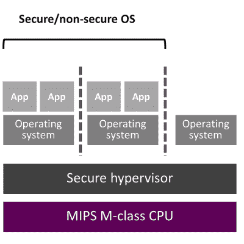

# 微控制器的硬件虚拟化

> 原文：<https://hackaday.com/2015/09/17/hardware-virtualization-in-microcontrollers/>

看看任何足够先进的数控机器或机器人，你会注意到一些奇特的东西。一方面，你有一台运行真正的操作系统进行更高级处理的计算机，无论是视觉还是语音识别，或者只是连接到互联网。另一方面，你有另一台计算机只负责半实时任务，如移动电机，伺服系统，读取传感器和开关。你不会用微控制器做繁重的任务，Raspberry Pi 足以证明实时功能不适合运行 Linux 的芯片。有许多版本最好使用两个处理器，但这种情况可能很快就会改变。

[Microchip 最近宣布为 PIC32 系列微控制器增加一项支持硬件虚拟化的功能。这一增加得益于](https://www.microchip.com/pagehandler/en-us/press-release/high-performance-32-bit-mcu-fa.html) [MIPS M5150 Warrior-M 处理器](http://blog.imgtec.com/mips-processors/microchip-upgrades-pic32mz-ef-family-to-mips-m-class-m5150-mcu)，这是首款支持硬件可视化的微控制器。

对于微处理器来说，硬件虚拟化已经存在很长时间了。硬件虚拟化的第一次实验始于 IBM System/360 时代，十年前，x86 架构的硬件扩展出现在英特尔和 AMD 处理器中。微控制器和片上系统还没有硬件虚拟化，新的 MIPS M5150 是第一个提供该功能的微控制器。

MIPS m 5150 的虚拟化由 Seltech 提供的管理程序完成。在这个管理程序之上，许多不同的操作系统，从实时系统到普通的 Linux 应用程序，可以同时运行，彼此完全分离。

在 Imagination Technologies 的一个视频中(见下文)，可以发现微控制器上硬件虚拟化的真正威力。MIPS M5150 CPU 在同一 CPU 上运行 Linux 和 uiTRON 操作系统。uiTRON 系统控制一个电机，Linux 启动和重启，不影响实时系统。试着用几十种 ARM Linux 板中的任何一种来做这件事。

虽然 PIC32 并不是一个非常强大的微控制器——就性能而言，它更类似于路由器中的 SoC 但运行实时系统和通用操作系统的能力是一个游戏规则的改变者。有了硬件虚拟化，从智能机器人、能力非凡的四轴飞行器到真正有意义的 CNC 控制器的应用都成为可能。

 [https://www.youtube.com/embed/RjQZTBK1trY?version=3&rel=1&showsearch=0&showinfo=1&iv_load_policy=1&fs=1&hl=en-US&autohide=2&wmode=transparent](https://www.youtube.com/embed/RjQZTBK1trY?version=3&rel=1&showsearch=0&showinfo=1&iv_load_policy=1&fs=1&hl=en-US&autohide=2&wmode=transparent)

