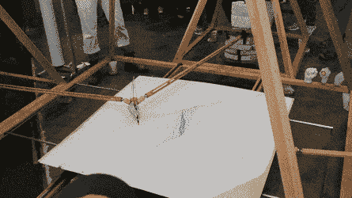

# 谐波图生成了像指纹一样独特的几何图像

> 原文：<https://hackaday.com/2017/02/22/harmonographs/>

20 世纪 70 年代末，当我和哥哥还是孩子的时候，我们的黑客爸爸给我们看了这张 1960-61 年的图册，图册上有一个有趣的封面图案。他让我们做一个思维实验，让我们想出如何能有一台机器在目录封面上画出设计。

不正确的是，我们首先想到的是这个设计是用一个[肺活量描记器](https://en.wikipedia.org/wiki/Spirograph)创建的。肺活量计有两个主要部分:一个内外圆周上有齿轮齿的大圆环和一组较小的齿轮，齿轮上有孔，用于插入绘图工具，通常是圆珠笔。你握住大圆环，将笔插入较小的轮子中，然后绕着大圆环啮合并旋转较小的轮子。但是螺旋图不能用来画不规则、不对称的图形。你总是可以再造一个设计。由于齿轮的性质，它们都不是独一无二的、一次性的设计。

[![A spirograph set like this cannot make the image above[Image credit: Multicherry CC-BY-SA 3.0]](img/22d04a644624bfe9ad8ce54b17d93b66.png)原来这样的机器叫做](https://hackaday.com/wp-content/uploads/2017/02/spirograph_set_uk_palitoy_early_1980s_perspective_fixed.jpg)[摆线拉丝机](https://github.com/jbum/CDMS)。但是，即使有了这种机器，也可以根据需要经常复制设计。你可以修好齿轮和杠杆，然后画一个设计图。如果设置没有被打乱，可以再复印一份。这里有一个[的视频，是摆线机](https://www.youtube.com/watch?v=BG9e06IWAxE)的电动版本。

做出这种设计的最终答案是使用一种叫做[和声图](https://en.wikipedia.org/wiki/Harmonograph)的装置。harmonograph 的独特之处在于，虽然你可以做出外观相似的设计，但几乎不可能完全复制它们——没有哪两个设计是完全相同的。这个思维实验最终让我哥哥建立了自己的和声仪。这是很久以前的事了，那时我们唯一的互联网是图书馆，它在城市的另一边，不方便心血来潮地突然出现。这限制了我们对设备信息的访问，但最终，在几个月后，项目完成了。

### 了解情况

我们很快意识到使用齿轮不是解决这个问题的方法。一个摆钟给了我们一些似乎可行的解决方案的提示。很久以后，我们才知道最早的“横向”谐波图是由单轴摆组成的。一个人沿着绘图平台横向移动笔，而另一个人垂直于笔移动绘图平台。他们有限的运动导致了李萨如曲线。如果将钟摆固定在万向节上，允许它们有更多的运动自由度，那么更复杂的设计是可能的。

Harmonograph seen at BAMF 2016 ([video](https://youtu.be/eeThoWV3rUE))

但是从理论到实践并不总是容易的。我们可以把绳子绑在一只钢笔上，用一些重物把它压下来，把它系在一个钩子上，然后绕着它转。这可能行得通，但我们需要一个球形(凹面)表面来让笔不断接触。这里有一个例子，展示了[油漆从一个摆动的容器](https://www.youtube.com/watch?v=3rigdgiHmnQ)的喷嘴中流出。或者，我们可以使用自由浮动或弹簧阻尼的笔，它能够在垂直轴上自由移动，以确保在钟摆摆动时与纸张接触。【Jonathan Lansey】描述了这样一个单摆的构造[带有浮动笔机构](http://www.jonathan.lansey.net/pastimes/pendulum/index.html)的谐波图，以及详细的数学分析。

### 我们的原型

经过一段时间的思考，我们终于对如何构建我们的设备有了一个好主意——双摆设计，一个摆移动笔，另一个移动绘图平台。我们可以把一个刚性的钟摆连接到一个万向架上，在它上面固定一个铰接杆，在杆的末端固定一支笔。移动钟摆，笔也会移动，但由于有铰链杆，笔会一直与纸接触。我们所有的计划都是手绘草图。我们试着使用手头的材料，所以从草图到成品有很多变化。这有助于我们有自己的车间，有建造车间所需的所有工具和机器。

我们最终的设计由一个焊接钢架组成，可以悬在桌子的边缘，所以它不是一个独立的设计。框架上有两个万向节，每个万向节都有一个钟摆。一个用它的配重来搬运笔杆，而另一个用来移动画板。调节钟摆的高度改变了时间常数，调节笔杆的配重控制了笔在纸上推动的力度。更多的重量引起摩擦，使钟摆变慢。重量减轻了，钢笔线条变得纤细。在下面的视频中看到的新版本，是几年前建造的，与我们在 70 年代建造的相似，只是它完全是独立的和便携的。

### 谐波计设计改进

可以增加额外的运动角度来创造更令人惊叹的艺术。除了通过单摆移动笔，你可以使用两个摆，让笔以更复杂的运动方式移动。[Karl Sims]描述了这种简单制造的[三摆设计](http://www.karlsims.com/harmonograph/)的构造。或者你可以附上两支，甚至三支笔，创造出多种颜色的设计。

在 2017 年，几乎可以轻松地即时获取任何类型的信息，我们很容易比 70 年代更多地了解谐振记录器。例如，《新科学家》1983 年第 1389 期第 100 卷第 1 期就有一页关于谐振记录器的精彩概述，让我们对它的历史有所了解。[Anthony Ashton]的书 *[《谐振记录器:音乐数学的视觉指南】](https://books.google.co.in/books?id=j8OZzQWS9ZgC&dq=harmonograph&hl=en&sa=X&ved=0ahUKEwi-ofCwtfnRAhXLQo8KHRjODukQ6AEIGzAA)* 被认为是这方面的权威参考。在任何搜索引擎中粗略搜索谐振记录器图片，你会有数百张美丽的图片值得欣赏。

我们展示了一个[三摆谐波图](http://hackaday.com/2010/07/02/three-pendulum-harmonograph/)，它是很久以前使用【卡尔·西姆斯】的计划建造的，我们想知道你们当中是否有人已经建造了另一个？让我们知道。

 [https://www.youtube.com/embed/czpeDPYGNL0?version=3&rel=1&showsearch=0&showinfo=1&iv_load_policy=1&fs=1&hl=en-US&autohide=2&wmode=transparent](https://www.youtube.com/embed/czpeDPYGNL0?version=3&rel=1&showsearch=0&showinfo=1&iv_load_policy=1&fs=1&hl=en-US&autohide=2&wmode=transparent)

