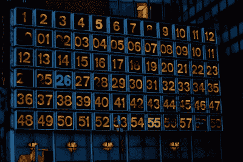

# 拥有自己的 200 水街数字钟

> 原文：<https://hackaday.com/2017/12/31/have-your-own-200-water-street-digital-clock/>

在纽约市一栋建筑的正面，无处不在的星巴克咖啡连锁店的一家分店上方，有一个时钟。这不是一个普通的时钟，200 Water Street 时钟是艺术家[鲁道夫·德·哈拉克]创作的艺术装置，由 72 个发光数字组成，依次显示小时、分钟和秒。这是一个具有足够知名度的里程碑，康奈尔大学布鲁斯·兰德的学生杰森·本·内森和埃尔达·斯洛博丹决定把对它的致敬作为他们的课程项目。

 

夜晚水街时钟【via[NYC♥NYC](http://nyclovesnyc.blogspot.com/2010/02/digital-clock-on-water-street.html)】

这是一个相当简单的构建，这要归功于使用了 Adafruit Dotstar 多色 LED 灯条，灯条上布满了 APA102 像素。幕后是 PIC32 微控制器，时间信息来自现成的 60kHz WWVB 时间信号接收器。还有一个温度传感器，方便的第二个功能。

前面板是一块板层，上面用激光切割出所需的数量。所有的原理图和代码都是可用的，如果你喜欢你的手在建立自己的时钟版本。

如果你对现实生活中的时钟感到好奇，这里有一张图片。但是如果你站在它面前，你会得到一个更有趣的视角。如果你不能去那里，通过谷歌街景的奇迹得到一个近似值[。](https://goo.gl/maps/XoLfydHjtJv)