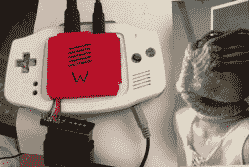

# HDMI 在 Gameboy 前进

> 原文：<https://hackaday.com/2017/05/30/hdmi-out-on-the-gameboy-advance/>

任天堂的 Gameboy 系列手持系统非常受欢迎，但是缺少一个重要的东西——视频输出。如果你想在更大的屏幕上观看游戏，进行更舒适的游戏会话或制作 chiptunes 等细节工作，这可能会很麻烦。一个选择是用 Gameboy 播放器来玩 Gamecube，但是这个系统的年龄意味着如果你想在现代数字显示器上看到清晰的画面，你就没那么幸运了。如果你能从 Gameboy Advance 获得 HDMI 输出，那不是很好吗？

A family resemblance?

说到处理视频信号，FPGAs 是无可匹敌的。[Stephen]在这个项目中利用 FPGA 读取 GBA 的视频信号，并将其转换为现代数字格式。不幸的是，这不是一个无缝的安装——有限的空间意味着 GBA 的屏幕必须完全移除，以类似于可怕的 Facehugger 的方式用适配器替换。

撇开包装不谈，这款设备的输出绝对令人惊叹——在现代 HDMI 电视上显示时，图像绝对清晰。这是因为 FPGA 从 GBA 捕捉精确的数字输出，并将其作为 HDMI 输出，没有模拟模糊、转换或噪声破坏图像。输出是一个美味的 1280×720，从 GBA 的原始分辨率升级。要了解更多细节，[查看论坛主题，在那里[Stephen]运行构建。](http://shmups.system11.org/viewtopic.php?f=6&t=56870)

唯一缺少的是细节——我们很想知道更多关于使用的硬件，以及在构建过程中的任何考验和磨难！据我们所知，该版本不仅仅停留在视频上——使用了 SNES 控制器来代替原来的按钮，并且我们感觉声音正在通过 HDMI 通道传递,声音也从 GBA 的耳机端口传输到电视。

很高兴看到这些针对旧硬件的项目问世——现代硬件有能力实现以前在复古游戏机上无法想象的事情。我们以前见过类似的项目——比如给一个原始的游戏机增加 VGA。

 [https://www.youtube.com/embed/8hb8VYtQU2E?version=3&rel=1&showsearch=0&showinfo=1&iv_load_policy=1&fs=1&hl=en-US&autohide=2&wmode=transparent](https://www.youtube.com/embed/8hb8VYtQU2E?version=3&rel=1&showsearch=0&showinfo=1&iv_load_policy=1&fs=1&hl=en-US&autohide=2&wmode=transparent)

