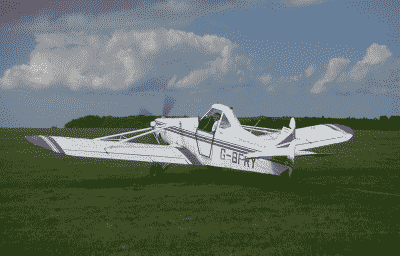

# 这就是联邦航空局的无人机注册系统没有意义的原因

> 原文：<https://hackaday.com/2015/12/21/heres-the-reason-the-faas-drone-registration-system-doesnt-make-sense/>

上周，美国运输部和联邦航空局[发布了他们管理无人机、模型飞机、无人驾驶航空系统和四轴飞行器的规则](http://hackaday.com/2015/12/14/faa-releases-rules-governing-unmanned-aerial-systems)——任何其他名称的玫瑰都将受到同样的监管。现在网上报名系统[已经上线运行](http://www.faa.gov/uas/registration/)。

在 FAA 的 UAS 注册系统下注册自己的要求很简单:如果你驾驶重量超过 250 克(0.55 磅)的模型飞机、无人机、控制线模型或无人驾驶航空系统，你将在民事和刑事处罚的威胁下被迫注册。

这是迄今为止美国联邦航空局颁布的最简单的规则之一，看看[的全文](http://www.faa.gov/news/updates/media/20151213_IFR.pdf)就知道这条规则有多复杂了。来自模型飞机学会、航空公司飞行员协会、消费电子协会的代表就什么类型的飞机应该注册、如何注册，甚至如何显示注册信息发表了意见。

对重量限制给予了相当大的关注；鸟撞是航空领域的一个问题，与无人机不同，鸟撞实际上已经导致客机坠毁。美国联邦航空局自己的野生动物袭击报告称，“体重< 1 公斤(2.2 磅)的物种被排除在数据库之外”。模型飞机学会要求注册的最小重量为两磅，引用他们的[公园传单](http://www.modelaircraft.org/parkflyer.aspx)项目来定义什么是“玩具”。

考虑无人机系统有效载荷运载能力的规则被考虑，固定翼和旋翼或四轴飞行器之间的固有差异被考虑，甚至投掷玩具炸弹的能力也被用于决策过程，最终将所有重量超过 250 克的遥控飞行器置于联邦航空局的管辖之下。我们至少应该赞扬联邦航空局做了他们说过要做的事情:以任何在玩具店排队的人都能理解的方式监管无人机。虽然联邦航空局可能已经制定了政府历史上最简单的规则之一，但这条规则实际上可能并不合法。

### 联邦航空局给了我们最简单的解决方案，但也许不是合法的解决方案

A Piper Pawnee PA-25, an agricultural airplane also used for glider towing. Also, Dusty from Planes. [Source](https://commons.wikimedia.org/wiki/File:Piper-Pawnee-G-BFRY.jpg)

要想知道美国联邦航空局对无人机系统的规定有多糟糕，我们只需要看看美国联邦航空局目前的规定。右边是一架 Piper pawn ee PA-25——一架通常用于“作物喷粉”和滑翔机牵引的飞机——根据它的用途，这架飞机的操作规则有所不同。

当用作农用飞机时，飞行员必须遵守一定的规则，在这种情况下就是 [Part 137](http://www.flightsimaviation.com/data/FARS/part_137.html) 。这些规则极其宽松；飞行员不需要观察正常的机场交通模式，当这架飞机被用于给作物喷粉时，飞行员基本上可以自由地做任何事情——在建筑物、人、电线和财产的 500 英尺范围内飞行——只要不造成危险。

如果飞机不用于喷洒作物，这些规则就会改变，农用飞机通常用于将滑翔机拖到一定高度。第 91 部分中有另一个规则，滑翔机飞行员需要持有适当的背书。由于 PA-25 是一架单座飞机，这种滑翔机牵引的飞行员将被要求每年驾驶由另一架飞机牵引的滑翔机三次。是的，为了驾驶他们的飞机，滑翔机飞行员被要求驾驶*另一架*飞机以保持最新状态。

这只是联邦航空局的规定有多混乱的一个例子，还有成千上万个类似的例子。在制定管理无人机或无人驾驶航空系统的规则时，联邦航空局展示了一点智慧，制定了一条任何人都可以理解的规则。如果它是无人驾驶的，远程控制的，在户外飞行，重量超过 250 克，飞行员必须注册。不过，这条规则有一个问题:它可能不合法。

几年前，国会通过了 2012 年的[现代化和改革法案，这是一本 300 页的巨著，为联邦航空局设定了指令，包括机场应该如何改善，什么样的医生证明适用于什么类型的飞行员，以及模型飞机的特殊规则。](https://www.gpo.gov/fdsys/pkg/CRPT-112hrpt381/pdf/CRPT-112hrpt381.pdf)

> 联邦航空管理局局长不得颁布任何关于模型飞机或作为模型飞机开发的飞机的规则或条例

在 2012 年的现代化和改革法案中，“模型飞机”被定义为“能够在大气层中持续飞行、在视觉视线内飞行、出于爱好或娱乐目的飞行的无人驾驶飞机。”如果符合这些条件，只要这些飞机不在机场 5 英里范围内飞行，美国联邦航空局可能不会对这些飞机制定规则。

然而，联邦航空局的 UAS 注册要求正是如此。一个月前，HobbyKing 上出售的 99%的飞机都是安全的，不受联邦航空局规则的约束。通过制定一个任何人都可以理解的简单规则，联邦航空局可能已经越过了一条线，超越了国会授予它的权力。

### UAS 监管的未来

可以理解，有不少人对新规定感到不满。[Bruce]，也就是 YouTube 上的[xjet][在这个问题上发表了自己的观点](https://www.youtube.com/watch?v=sZ1WLh0usjQ)，他将模型飞机的登记与性侵犯者的登记进行了比较。虽然这是煽动性的，但人们的情绪是，美国联邦航空局正在要求注册永远不会对国家领空构成威胁的飞机。

要求所有重量超过 250 克的模型飞机都要有注册号，这也许是有法律依据的。在 2012 年的现代化和改革法案中，联邦航空局仍然被允许“对危害国家空域系统安全的模型飞机操作人员采取执法行动。”这意味着空中碰撞，美国联邦航空局本身一直在宣传飞行员看到的 UAS 和模型飞机是“险些”撞上飞机。

当美国联邦航空局无人机系统注册系统最终诉诸法庭时，法律依据将取决于国家空域系统的安全性。鸟撞，以及表面上与无人驾驶飞机的空中碰撞，都可能导致客机坠毁。不过，鸟撞是相对常见的，UAS 的重量限制也不是基于经验证据。FAA 本身并不认为体重小于 1kg (2.2lb)的鸟的风险很高，提出了一个问题:无人机上 250g 的限制是不是太低了？

不过，目前我们还停留在目前的无人驾驶飞机、模型飞机和四轴飞行器的注册系统上。这不是最好的系统，但对于普通大众来说，这是可以理解的。即使该规则可能是非法的，并且不是基于经验证据，这也是联邦航空局想要的:任何人都可以理解的规则。