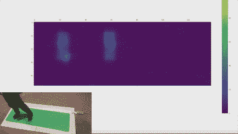

# 高分辨率、人体大小的压力传感器垫

> 原文：<https://hackaday.com/2017/10/29/hi-res-body-sized-pressure-sensor-mat/>

黑客经常发现压力敏感材料的用途，检测行走时的脚步声或合成器中的按键就是两个例子。[Marco Reps]决定制作一个高分辨率、人体大小的压力感应垫,主要用于计算机指导的理疗，尽管他不排除将它用于游戏(twister anyone？).这意味着要制造一个相当于人体大小的矩阵电路，包含大约 7000 个传感器，以及一块带有大量移位寄存器的电路板。结果具有令人惊讶的良好分辨率，能够清楚地区分脚的脚跟、脚弓和前部。

他选择的压力敏感材料是 Velostat，一种大尺寸的聚合泡沫。该泡沫浸渍有碳黑以使其导电，但是作为一种泡沫，当施加压力时，其电阻会改变。垫子的第一层由一厘米宽的铜带条组成，铜带纵向排列，间隔一厘米。接下来是 Velostat 和另一层水平放置的铜带。压力传感器是胶带重叠处形成的夹层。在下面的第一个视频中，他展示了如何测量和绘制 Velostat 的动态范围，以帮助决定使用 1 厘米的正方形。他还组装了一个较小的原型，效果不错。

Testing the mat

对于人体大小的垫子，我们计算了大约 50 乘 140 的重叠区域，总共大约有 7000 个 1 平方厘米的传感器。当然，为了测量那个大矩阵中的每个传感器，你可以想象，他制作了一个带移位寄存器的定制电路板。该板的工作原理是将正电压一个接一个地施加到列上，同时每次通过所有的行并读取它们的电压。制作这块板本身就是一次冒险，冒险让一家要价仅 2 美元的中国制造商来做。但请观看下面的第二个视频，其中他评估了结果，包括试图剥离一块电路板，但没有成功。遗憾的是，他忘了在电路板上为二极管留出位置，每列一个，解决这个问题是他带领我们经历的又一次冒险。耐心绝对是一个先决条件，不仅是为了做垫子，解决二极管的问题，也是为了连接 96 针带状电缆。我们赞扬他的努力和成果。查看下面的第二个视频，了解大垫子和电路板的制作。

 [https://www.youtube.com/embed/4JBSHqUcaG4?version=3&rel=1&showsearch=0&showinfo=1&iv_load_policy=1&fs=1&hl=en-US&autohide=2&wmode=transparent](https://www.youtube.com/embed/4JBSHqUcaG4?version=3&rel=1&showsearch=0&showinfo=1&iv_load_policy=1&fs=1&hl=en-US&autohide=2&wmode=transparent)

 [https://www.youtube.com/embed/0uPZwMg5B3k?version=3&rel=1&showsearch=0&showinfo=1&iv_load_policy=1&fs=1&hl=en-US&autohide=2&wmode=transparent](https://www.youtube.com/embed/0uPZwMg5B3k?version=3&rel=1&showsearch=0&showinfo=1&iv_load_policy=1&fs=1&hl=en-US&autohide=2&wmode=transparent)

正如我们所说，Velostat 在黑客社区中有各种各样的用途。一个例子是把它放在鞋里，每当脚踩在路面上时，led 就会亮起。另一个我们见过的是[在复音合成器](https://hackaday.com/2016/05/20/toy-piano-gets-synth-overhaul/)中捕捉按键。你能想到或已经用过它有什么用途？