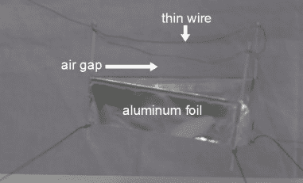
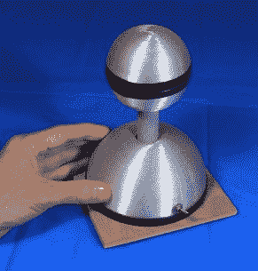
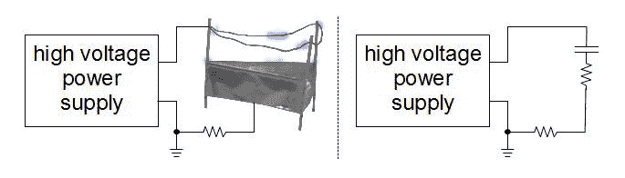
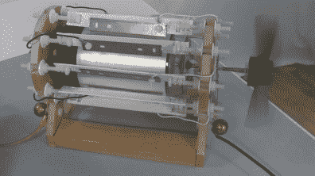
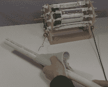
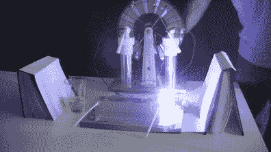
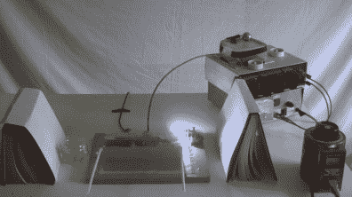

# 请用高电压，但别忘了电流

> 原文：<https://hackaday.com/2016/06/08/high-voltage-please-but-dont-forget-the-current/>

在涉及数万伏的高压应用中，人们往往只考虑所需的高压，而不考虑电流。当电荷穿过的电路部分是空气间隙，并且电荷是以离子的形式存在时，尤其如此。这与电子在铜线中流动或在电阻器中流动大相径庭。

以升降机为例。升降机是一种有趣的轻型飞行器。它由一根细线和一个铝箔裙组成，由一个气隙隔开。在气隙上施加 25 千伏电压，它就会升到空中。

  Lifter flying with high voltage power supply  Lifter parts

所以你可能会认为下图所示的 80kV 小型手持范德格拉夫发电机可以为升降机供电。然而，像许多高压应用一样，升降机通过电离空气来工作，在这种情况下，电离空气包围细线，导致蓝色电晕。这引发了一系列事件，产生向下流动的空气射流，通常称为离子风，将升降机向上提升。

  Small Van de Graaff generator  Lifter in the dark with bluish ionization

但是空气的电离需要电流，即来自高压电源的电线中的电子流。事实上，充满离子气隙相当于电路中的高电阻导线，外加一些电容；这是电路的一部分。

Lifter circuit and equivalent circuit

范德格拉夫发电机，即使是 DIY 的 84kV 发电机，也是一种低电流电源，无法提供足够高的电流来足够快地电离足够多的空气，以产生必要的强喷射流。然而，为上面的升降机供电的电源使用回扫变压器和科克罗夫特-沃顿电压倍增器从墙上的插座转换能量。这样它就能产生足够的电压并提供足够的电流。

另一个例子是[电晕电机](https://hackaday.com/2014/08/09/funky-looking-motor-is-powered-by-static-electricity/)，一种静电电机，它也是通过在一个气隙(实际上是多个气隙)上产生高压来工作的。间隙位于锋利的金属刀片和中性塑料圆筒之间。叶片将离子穿过间隙喷射到圆柱体上。

  Corona motor turning fan  Corona motor in the dark with ionization

Corona motor powered by the triboelectric effect

然而，间隙宽度很短，需要较低的电压。更重要的是，圆柱体不需要被电离太多，就能开始转动，这意味着不需要那么多离子。即所需的电流低于升降机的电流。在这种情况下，也许是我工作过的电流最低的高压电源，用棉布摩擦 PVC 管就足够了。利用了[摩擦电效应](https://en.wikipedia.org/wiki/Triboelectric_effect)。

在有些应用中，只需要在电容中积累足够的电荷，需要多少时间就有多少时间。一个明显的例子就是简单地产生一个大火花。

这方面的一个例子是 TEA 激光器。TEA 激光器的工作原理是通过一个小火花隙和两个平板电容器积累电荷。当电压积累到足以击穿火花隙中的空气时，火花隙就会点燃，随后在激光通道上产生火花，从而产生激光束。在下面的照片中，你可以看到[激光器由一个低电流的 Wimshurst 机器](https://hackaday.com/2015/07/08/legit-hack-creates-tea-laser-power-by-mr-wimshurst/)供电，由上面提到的用于升降机飞行的相同的强大的科克罗夫特-沃尔顿电源供电。两者产生相同的电压，积累相同数量的电荷，发射相同的激光束。然而，Wimshurst 机器需要大约 12 秒的手摇曲柄来这样做，导致激光仅每 12 秒发射一次。科克罗夫特-沃顿电源大约每 1 秒发射一次激光。

  Tea laser powered by Wimshurst machine  Tea laser powered by Cockcroft-Walton PSU

如何选择具有足够电流的高压电源来匹配您的应用？这在很大程度上是凭经验完成的。升降机需要移动大量的空气，为此需要大量的离子，因此需要高电流来产生大量的离子。另一方面，电晕电机使用库仑力工作。一个极性的叶片排斥带有相同极性电荷的圆柱体区域。仅用一个风扇作为圆柱体上的负载，不需要很大的排斥力。自然，对于更大的负载，需要更大的力，因此需要更快的充电速率和更大的电流。与 TEA 激光器类似，更频繁的激光束需要更高的电流。

我已经[带你了解了一系列可供你使用的高压电源](http://hackaday.com/2016/05/26/a-cornucopia-of-high-voltage-sources/)。所需的高电压已经从这些电源中的任何一个获得，我们现在需要看看从它们获得的电流。

回扫变压器和科克罗夫特-沃顿电压倍增器电源从墙上的插座获得电力。考虑到各种电阻、晶体管、电容、二极管和反激式变压器本身的损耗，仍然有相对较大的电流可用，即使是个位数或两位数毫安。对于高电压，这需要考虑很多(记住功率是电压和电流的乘积)。

在天平的另一端，摩擦电效应通过两种特定材料接触时电子的转移以及接触断开时这些电子的保留而起作用；基本上，它是通过摩擦材料来工作的。在这种情况下，与来自墙上插座的电流相比，传输的电荷非常少。

范德格拉夫发电机实际上是从摩擦电效应开始的。两种材料在一起摩擦，就是滚轮和皮带之间接触的产生和断开。然而，与用手将棉布摩擦 PVC 管不同，在范德格拉夫发电机中，滚筒可以以数百转/分钟的速度旋转，从而更快地产生电荷。但是对于台式范德格拉夫来说，这个量在低微安左右，与墙上插座的电流相比很小(这是假设你直接从范德格拉夫的圆顶上充电，而不是等待火花)。)

并且当相对盘上的扇区经过中和棒时，Wimshurst 机器通过感应产生其电荷。令人惊讶的是，可以微弱地点亮一个小型 20mA LED，LED 与中和棒串联放置。然而，当电荷在集电极被无效地去除时，电荷就大大减少了。Wimshurst 机器输出的电流通常是个位数微安(同样，我们不是在等待火花。)

这些是我记得的一些例子，人们，包括我自己，忘记了仅仅因为涉及到高电压，并不意味着基本的电子学不再适用。我很好奇你遇到过什么样的例子，无论是你还是其他人忘记了电流，或者甚至是一些其他的电学性质。请在下面的评论中告诉我们。