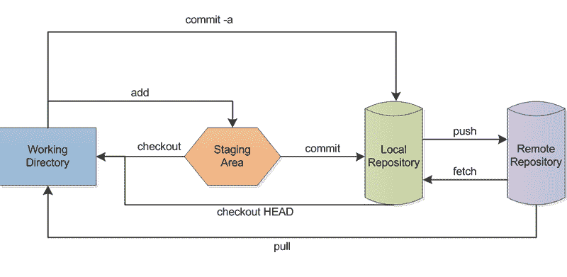

# Git 的历史

> 原文：<https://hackaday.com/2017/05/11/history-of-git/>

Git 是一种简单易用的工具，以至于你通常不会学到太多的细微差别。你从互联网上克隆了一个存储库，仅此而已。如果你做了更改，也许你会跟踪它们，如果你真的很有礼貌，你可能会创建一个 pull 请求来反馈给项目。但是你还可以做更多的事情。例如，您知道 Git 可以跟踪协作 Word 文档吗？或者跨多个 Linux 机器管理您的启动文件？

Git 属于做[修订(或版本)控制](https://en.wikipedia.org/wiki/List_of_version_control_software)的软件产品家族。这个想法是你可以开发软件(举例来说),并跟踪每个版本。好的系统允许多人同时参与一个项目。通常也有一些方法将一个项目分成不同的部分。例如，您可能会拆分为不同的市场开发产品版本，或者在不中断正常开发的情况下尝试一个实验性功能。在某些情况下，你最终会把这种分裂带回主线。

虽然在下一期中，我会给你一些你可能会觉得有用的 Git 的奇怪用法，但这篇文章主要讲述的是 Git 是如何产生的。开源开发以激烈的战争而闻名，至少在这个故事中有一些。在真正的黑客时尚中，故事的主人公决定他不喜欢他正在使用的工具，所以…好吧，你会怎么做？

## 版本控制器之战

从历史上看，许多具有这种功能的软件都有一种中央服务器的思维模式。也就是说，代码存在于网络的某个地方。当你想处理一个文件的时候，你会检查它。这只有在没有其他人检查它的情况下才有效。当然，如果你成功了，没有人可以检查你的文件，直到你把它们放回去。如果你远离网络，想做点什么，那就太糟糕了。

然而，更现代的工具放松了这些限制。理想情况下，一个工具可以给你一个项目的本地副本，并在你发布变更时自动更新其他副本。这样就没有中心副本可以丢失，你可以在任何地方工作，你也不需要和其他队友协调做不同的事情。

## 封闭工具

一个非常大的分布式团队开发 Linux 内核。到 1998 年末，团队一直在努力进行修订管理。一个内核开发者，Larry McVoy，有一个公司生产了一个可伸缩的分布式版本控制产品，叫做 BitKeeper。虽然它是一个商业产品，但有一个社区许可，允许你在使用该产品期间以及之后的一年内使用它，只要你不从事与之竞争的工具。该限制适用于商业和开源竞争。虽然该产品在你的机器上保存了大部分数据，但有一个服务器组件，所以该公司实际上可以跟踪你对该产品的使用。

2002 年，Linux 内核团队采用了 BitKeeper。[Linux Torvalds]是新系统的支持者之一。然而，其他开发者(以及像[理查德·斯托尔曼]这样的利益相关方)对使用专有工具开发开源感到担忧。BitMover——BitKeeper 背后的公司——添加了一些网关，以便希望使用不同系统的开发人员在某种程度上可以。

在很大程度上，事情平息了下来，只是偶尔有火焰冲突爆发。直到 2005 年，麦克沃伊的公司宣布将停止免费版 BitKeeper。表面上的原因是由于一个用户开发了一个客户端，将商业版的功能添加到了免费版中。

## 新工具

因此，有两个项目开始开发替代品。一个是 Mercurial，另一个当然是 Git。[McVoy]联系了一位商业客户，要求其员工[Bryan O'Sullivan]停止向 Mercurial 投稿，他照做了。当然，Mercurial 和 Git 都取得了成果，Git 不仅成为了内核团队的版本控制系统，也成为了许多其他人的系统。

## Git 的诞生

[Linus]确实在寻找另一个现成的系统。当时没有一个具有适合内核开发团队的性能或特性。他设计 git 是为了快速、简单，并避免做 CVS(一个备受指责的版本控制程序)做过的事情。

据说最初的开发花了几天时间。自从 2005 年末发布 1.0 版本以来，该软件已经衍生出了不止一个主要网站，并且已经成为许多开源和商业开发人员的首选系统。

## 回购人

流程图展示了 git 如何同时处理大量开发人员的秘密:存储库或回购。每个开发人员都有整个项目的总副本(本地存储库)。事实上，如果您不关心共享，您甚至不需要远程存储库。你的私有回购和其他人的一样都是一个全功能的 git 项目，甚至是远程的，它可能在 GitHub 或其他网络服务器上。您在工作目录中进行更改，暂存您“完成”的内容(目前)，并将其提交到 repo。到时候，你把你的修改上传到遥控器，它就会和其他人的修改合并在一起。

有趣的是，git 不仅仅处理文本文件(我将在下一期文章中向您展示更多)。不过，它确实最适合文本文件，因为它足够智能，可以注意到文件中没有重叠的变化，并自动合并它们。因此，如果我在某些代码中修复了一个涉及 for 循环的错误，而您更改了一些错误消息，git 会在我们的代码合并时将其全部整理出来。

当然，这并不总是奏效。这会导致冲突，您必须手动解决。但是除非你让两个人接触完全相同的代码部分，否则 git 通常可以很好地解决这种差异。当然，二进制文件通常不会这么奢侈。你不能完全区分一个图标，看到一个人在上面画了胡子，而另一个人把背景变成了绿色。然而，从技术上来说，如果你能找出算法，你可以把它添加到 git 中。

## 结局

如果你想增加你的 git 知识，而不仅仅是做一个克隆，你可以花 15 分钟在这个教程上。如果你已经知道了基础知识，你可能会在[更高级的教程](https://www.atlassian.com/git/tutorials/advanced-overview)中找到一些新的东西，或者查看一下【莱纳斯】不久前在 git 上发表的演讲视频。

顺便说一下，2016 年，BitKeeper 宣布他们将转向 Apache 许可，当然，这是开源的。有点讽刺，不是吗？

 [https://www.youtube.com/embed/8ET_gl1qAZ0?version=3&rel=1&showsearch=0&showinfo=1&iv_load_policy=1&fs=1&hl=en-US&autohide=2&wmode=transparent](https://www.youtube.com/embed/8ET_gl1qAZ0?version=3&rel=1&showsearch=0&showinfo=1&iv_load_policy=1&fs=1&hl=en-US&autohide=2&wmode=transparent)

#### 照片致谢:

*   燕尾服士兵，by [Sharkey]， [CC BY-SA 3.0](http://creativecommons.org/licenses/by-sa/3.0/)
*   [Linus Torvalds]来自 Linux 杂志， [CC BY-SA 3.0](http://creativecommons.org/licenses/by-sa/3.0/)
*   [Lbhtw]， [CC BY-SA 3.0](https://creativecommons.org/licenses/by-sa/3.0/deed.en) 的流程图