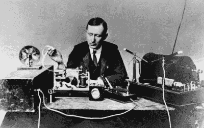
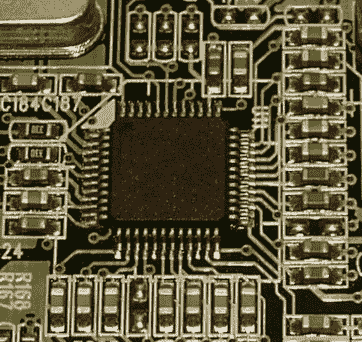
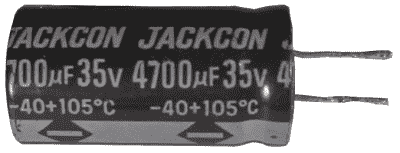
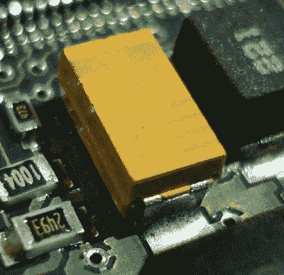
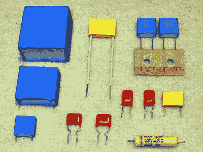
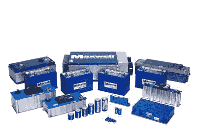

# 电容器的历史——现代

> 原文：<https://hackaday.com/2016/07/26/history-of-the-capacitor-the-modern-era/>

电容器历史上的[开拓时期](http://hackaday.com/2016/07/12/history-of-the-capacitor-the-pioneering-years/)是电容器主要用于早期了解电的时期，甚至早于电子的发现。这也是做室内演示的时候，比如让一排人手拉手，让一个电容器通过他们放电。电容器的现代时代始于 19 世纪晚期，随着电力实际应用时代的到来，需要具有特定性能的可靠电容器。

## 莱登罐

马可尼与发射装置，发表于 LIFE [Public domain]，via[Wikimedia Commons](https://en.wikipedia.org/wiki/File:Guglielmo_Marconi_1901_wireless_signal.jpg)

一个这样的实际应用是在马可尼的无线火花隙发射机中，从 1900 年开始，一直到第一个和第二个十年。发送器产生高电压，通过火花隙放电，因此使用陶瓷电容器来承受该电压。还需要高频率。这些基本上是莱顿瓶，要获得所需的电容需要很大的空间。

## 云母

1909 年，William Dubilier 发明了更小的云母电容器，然后用于无线硬件谐振电路的接收端。

早期的云母电容器基本上是夹在一起的云母和铜箔层，称为“夹式云母电容器”。尽管这些电容器不太可靠。由于云母片压在金属箔上，所以在云母片和金属箔之间有气隙。这些间隙允许氧化和腐蚀，这意味着极板之间的距离会发生变化，从而改变电容。

20 世纪 20 年代，开发出了银云母电容器，这种电容器的云母两面都涂有金属，消除了空气间隙。用薄金属涂层代替厚箔，电容器也可以做得更小。这些非常可靠。我们当然没有就此止步。电容器的现代时代以一个又一个引人入胜的故事为标志。让我们来看看。

## 陶器的

围绕微处理器的 MLCCs。通过 Elcap [CC BY-SA 3.0]，via[Wikimedia Commons](https://en.wikipedia.org/wiki/File:CPU-Beschaltung-mit_MLCC-P1040239-d.jpg)

在 20 世纪 20 年代，云母在德国并不丰富，因此他们对新系列的陶瓷电容器进行了实验，发现二氧化钛(金红石)的电容具有线性温度依赖性，可用于温度补偿，可以取代云母电容器。起初产量很小，到了 20 世纪 40 年代，产量增加了。它们由两面金属化的圆盘组成。

为了获得更高的电容，使用了另一种陶瓷，钛酸钡，因为它的介电常数是云母或二氧化钛的 10 倍。然而，它们的电参数不太稳定，只能在稳定性不太重要的情况下替代云母。这在二战后得到了改善。

1961 年，一家美国公司率先推出了多层陶瓷电容器(MLCC ),这种电容器体积更小，电容更高。截至 2012 年，每年生产超过 10^12 钛酸钡陶瓷多层电容器。

## 铝电解的

Electrolytic capacitor

19 世纪 90 年代，Charles Pollak 发现铝阳极上的氧化层在中性或碱性溶液中是稳定的，并于 1897 年获得了硼砂电解质铝电容器的专利。第一个“湿”电解电容器在 20 世纪 20 年代短暂出现在收音机中，但寿命有限。由于含水量高，它们被称为“湿的”。它们基本上是一个容器，金属阳极浸在硼砂溶液或其他溶于水的电解质中。容器的外部充当另一个板。这些被用于大型电话交换机，以减少中继噪声。

现代电解电容器的专利是由萨缪尔·鲁本在 1925 年申请的。他在涂有氧化物的阳极和第二块金属箔之间夹了一层凝胶状的电解质，这样就不需要盛水的容器了。结果是“干”电解电容器。另一个增加的是箔片之间的纸空间。所有这些都大大降低了尺寸和价格。

1936 年，Cornell-Dubilier 公司推出了他们的铝电解电容器，包括诸如粗糙化阳极表面以增加电容的改进。AEG 公司 Hydra-Werke 同时在德国柏林开始大规模生产。

第二次世界大战后，广播电视技术的迅速发展导致更大的生产量以及各种各样的款式和尺寸。改进包括通过使用基于有机物的新电解质来降低漏电流和等效串联电阻(ESR)、更宽的温度范围和更长的寿命。从 20 世纪 70 年代到 90 年代的进一步发展还包括降低漏电流、进一步降低 ESR 和提高温度。

在 2000 年至 2005 年期间发生了被称为“[电容器瘟疫](https://en.wikipedia.org/wiki/Capacitor_plague)的事件，可能是由于使用了偷来的配方，但没有使用某些稳定物质，导致过早失效。

## 钽电解

一种表面贴装钽电容器。由 Epop [Public domain]，via[Wikimedia Commons](https://commons.wikimedia.org/wiki/File:CMS_tantalum_capacitor.JPG?uselang=en-gb)

钽电解电容器在 20 世纪 30 年代首次被制造用于军事目的。这些使用了卷绕的钽箔和非固体电解质。20 世纪 50 年代，贝尔实验室制造了第一个固体电解质钽电容器。他们把钽磨成粉末，烧结成圆柱体。起初使用的是液体电解质，但后来他们发现二氧化锰可以用作固体电解质。

虽然贝尔实验室做出了基本发明，但在 1954 年，斯普拉格电气公司对工艺进行了改进，生产出了第一个商业上可行的钽固体电解质电容器。

1975 年出现了聚合物钽电解电容器，具有更高导电性的导电聚合物取代了二氧化锰，从而降低了 ESR。NEC 在 1995 年发布了用于 SMD(表面贴装器件)的聚合物钽电容器，三洋在 1997 年紧随其后。

钽矿石容易受到价格冲击，1980 年和 2000/2001 年发生过两次。后一次冲击导致了铌电解电容器的发展，二氧化锰电解质提供了与钽电容器大致相同的性能。

## 高分子膜

薄膜电容器。Elcap [CC-BY-SA 3.0]，via[Wikimedia Commons](https://en.wikipedia.org/wiki/File:Wiki-Folkos-P1090317-1.jpg)

金属化纸电容器于 1900 年由 G.F. Mansbridge 申请专利。金属化是通过用填充有金属颗粒的粘合剂涂覆纸张来完成的。在 20 世纪早期，这些电容器通常被用作电话(电信)中的去耦电容器。)第二次世界大战期间，博世改进了工艺，通过在纸上涂上漆并使用金属真空沉积来涂覆来制造它们。大约在 1954 年，贝尔实验室制作了一层 2.5 微米厚的金属漆膜，与纸张分开，从而制成了更小的电容器。这可以认为是第一个聚合物薄膜电容器。

第二次世界大战期间，有机化学家对塑料的研究使这一点更进一步。1954 年，第一个聚酯薄膜电容器就是其中之一。聚酯薄膜是杜邦公司在 1952 年注册的商标，是一种非常坚固的 PET(聚对苯二甲酸乙二醇酯)。1954 年生产了 12um 金属化聚酯薄膜电容器。到 1959 年，这份名单包括了由聚乙烯、聚苯乙烯、聚四氟乙烯、PET 和聚碳酸酯制成的电容器。到 1970 年，电力公司开始使用没有纸的薄膜电容器。

## 双层(超级电容器)

超级电容器，Maxwell Technologies，Inc .【CC BY-SA 3.0】，via[Wikimedia Commons](https://en.wikipedia.org/wiki/File:Maxwell_Ultracapacitors.jpg)

带我们了解最后一种电容器类型，这是一种相当令人兴奋的电容器，电容可达数千法拉。20 世纪 50 年代早期，通用电气公司的研究人员利用他们在燃料电池和充电电池方面的背景，对带有多孔碳电极的电容器进行了实验。这导致 H. Becker 将该电容器申请专利为“具有多孔碳电极的低压电解电容器”，而不理解其背后导致极高容量的原理。葛没有进一步追究。

俄亥俄州的标准石油公司开发了另一个版本，并最终在 20 世纪 70 年代将其授权给 NEC，NEC 最终以超级电容器的商标名将其商业化。它的额定电压为 5.5V，电容高达 1F。它们的大小可达 5 cm^3，被用作计算机内存的备用电源。

渥太华大学名誉教授布莱恩·埃文斯·康威从 1975 年到 1980 年一直致力于氧化钌电化学电容器的研究。1991 年，他描述了超级电容器和电池在电化学存储方面的区别，并在 1999 年再次创造超级电容器这个术语时给出了完整的解释。

产品和市场增长缓慢，产品名称包括 Goldcaps、Dynacap 和 PRI 超级电容器，后者是 1982 年由 Pinnacle Research Institute (PRI)为军事目的开发的第一个低内阻超级电容器。

市场上相对较新的发展包括用锂离子掺杂活性炭阳极的锂离子电容器。这些电容在 2.7V 左右时可达数千法拉(4 位数)。

## 结论

根据您对我们的[电容器的历史–开拓岁月](http://hackaday.com/2016/07/12/history-of-the-capacitor-the-pioneering-years/)帖子的评论，术语“电容器”的使用并不少于电容器。那么电容器这个术语从何而来呢？这似乎是未知的，但牛津英语词典引用了 1922 年的 BSI(英国标准协会？)电气工程术语表，称“电容器”是一个“新术语”，并建议将其用于避免与蒸汽“冷凝器”混淆。

虽然这结束了我们的电容器历史，但我们确信，仅基于[大量类型的电容器](http://hackaday.com/2016/06/21/capacitors-made-easy-the-hackaday-way/)，还可以增加更多。如果你有任何有趣的补充建议，请告诉我们。历史只是进步之路的一部分，让我们知道你所知道的任何当前或预期的未来发展。一个 50 年后的黑客作家会对现在和未来 50 年的电容器说些什么呢？