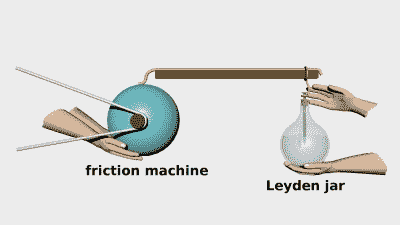
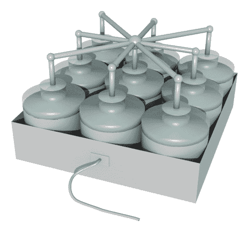
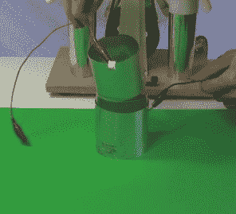
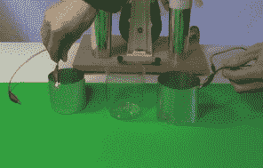
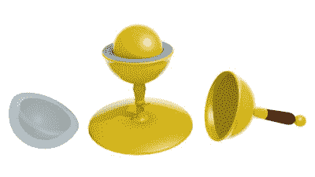
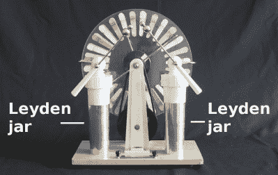

# 电容器的历史——开创性的岁月

> 原文：<https://hackaday.com/2016/07/12/history-of-the-capacitor-the-pioneering-years/>

电容器的历史始于电力的开拓时期。我把它比作航空业的拓荒时代，那时你用木头和帆布制作自己的飞机，奋力跃入空中，却对空气动力学了解不足，不知道如何停留在那里。电力也有类似的时期。在发现电容器的时候，我们的理解是如此原始，以至于电被认为是一种流体，它有两种形式，玻璃状电和树脂状电。正如您将在下面看到的，正是在电容器的早期，这一切都改变了。

历史始于 1745 年。当时，发电的一种方式是使用摩擦机。这是一个玻璃球，当你用手掌抚摸它时，它以每分钟几百转的速度旋转。这在玻璃上产生了电，然后可以释放。今天，我们称这种效应为[摩擦电效应](https://en.wikipedia.org/wiki/Triboelectric_effect)，你可以看到这里演示的[驱动液晶显示屏](http://hackaday.com/2016/02/02/power-from-paper/)。

Discovery of the Leyden jar

1745 年，德国波美拉尼亚的埃瓦尔德·格奥尔格·冯·克莱斯特(Ewald Georg von Kleist)试图将电能储存在酒精中，他认为他可以通过导线将电能从摩擦机引到玻璃药瓶中的酒精中。由于电被认为是一种流体，这是一种合理的方法。他推断，玻璃会成为酒精中电流“液体”逃逸的障碍。他的做法与插图中所示的类似，将一根钉子穿过软木塞，插入酒精中，同时用一只手拿着玻璃瓶。他当时没有意识到他的手所扮演的重要角色。冯·克莱斯特发现，如果他触摸电线，他会得到一个火花，一个比他通常从单独的摩擦机器得到的更强大的火花。

1745 年末，他将自己的发现传达给了一群德国科学家，这个消息也传到了荷兰的莱顿大学，但形式混乱。1746 年，Pieter van Musschenbroek 和他在莱顿大学的学生 Andreas Cunaeus 成功地做了同样的实验，但用的是水。Musschenbroek 随后将这个实验告知了更广泛的法国科学界。它被认为是冯·克莱斯特和穆申布罗克独立发现的。但是正如你在下面看到的，这仅仅是开始。

法国实验者 Abbé Nollet 给这个瓶子起了个名字，莱顿瓶，并把它作为一种特殊类型的烧瓶卖给对科学好奇的有钱人。

莱顿大学也意识到，只有当玻璃容器被拿在手中时，它才起作用，而如果它被绝缘材料支撑着，它就不起作用。

今天我们认识到，接触玻璃的酒精或水充当电容器的一个极板，而手充当另一个极板，而玻璃是电介质。高压电源是摩擦机，手和身体提供接地。

物理学家、波兰但泽市长丹尼尔·格拉思(Daniel Gralath)第一个将多个罐子并联起来，以增加储存电荷的数量。在 18 世纪 40 年代和 50 年代，本杰明·富兰克林，在后来成为美利坚合众国的地方，也用莱顿瓶做了实验，并把这些多个莱顿瓶的集合称为一个炮台，因为它与一个炮台的大炮很相似。

  Battery of Leyden jars  Taking apart a dissectible Leyden jar  Dissected Leyden jar

富兰克林用装满水的莱顿瓶和衬有箔片的莱顿瓶做了很多实验，并得出结论，电荷储存在玻璃上，而不是储存在水的体积中。他通过使用可解剖的莱顿瓶(见上面的照片)来做到这一点，这种瓶子的内外箔片可以从玻璃上取下。这后来被证明是不正确的。富兰克林用的是钠玻璃，这种玻璃具有吸湿性。当箔片从玻璃上移开时，电荷通过电晕转移到玻璃上的湿气中。当用一罐石蜡或烤玻璃代替时，电荷仍留在金属板上。还有另一种较弱的效应，称为[电介质吸收](https://en.wikipedia.org/wiki/Dielectric_absorption)，它涉及玻璃或电介质内的偶极子，允许电容器在极板短路后保留一些电荷。

富兰克林随后研究了两边都有箔片的平板玻璃，在一封信中描述了串联。

大约在同一时间，富兰克林在不涉及电容器的实验中表明，电只有一种电荷载体，尽管他认为它是一种“微妙的流体”，电子的发现不得不等到 19 世纪晚期。他发现一个带电的物体要么有过量的这种液体，要么有不足。这否定了两种电的概念，即玻璃状电和树脂状电。

在 1776 年，Alessandro Volta 用不同的方法测量电势(电压，V)和电荷(Q ),发现对于给定的物体，V 和 Q 是成比例的，即电容定律，尽管当时不叫它。正是因为这项工作，伏特以他的名字命名。

“电容器”这个术语直到 20 世纪 20 年代才开始使用。很长一段时间以来，它们被称为冷凝器，在一些国家和一些应用中仍然如此。“电容器”一词最早是由 Volta 在 1782 年创造的，源于意大利的电容器，因为它比单独的导体储存更高密度的电荷。

Faraday’s specific inductive capacity apparatus

在 19 世纪 30 年代，迈克尔·法拉第做了实验，确定电容器极板之间的材料对电容器极板上的电荷量有影响。他用球形电容器做了这些实验，基本上是两个同心的金属球，中间可以有空气、玻璃、蜡、虫胶或其他材料。利用库仑扭秤，他有效地测量了球体之间的空隙充满空气时电容器上的电荷。保持电势差不变，然后当缝隙被其他材料填充时，他测量电荷。他发现其他物质的电荷比空气的电荷大。他称之为比电感电容，正是为了这项工作，电容的单位被称为法拉。

“电介质”一词最早出现在威廉·惠威尔写给法拉第的一封信中，他推测法拉第创造了“反磁性”一词来类比电介质，也许法拉第应该使用“反磁性”,但它不适用于“电介质”,因为两个元音是连在一起的。

Wimshurst machine with Leyden jars

莱顿瓶和电容器由带箔的平板玻璃制成，一直被用于火花隙发射器和医疗电疗设备，直到 19 世纪晚期。随着无线电的发明，电容器开始采用现代形式，部分原因是需要较低的电感来工作在较高的频率下。较小的电容器是用柔软的电介质片制成的，比如油纸，通常两面都卷上箔片。但现代电容器的历史是另一篇文章的大主题。

电容器早期历史的一个有趣之处是，它们给人一种 DIY 的感觉，许多都是自制的。事实上，莱顿瓶今天仍然被高压黑客使用，就像这个 [3D 打印 Wimshurst 机器](http://hackaday.com/2015/02/06/3d-printed-wimshurst-machine/)和这个[毁灭之莱顿瓶](http://hackaday.com/2009/01/24/leyden-jar-of-doom/)中纯粹的乐趣。你为你建造的任何东西制造莱顿瓶或任何其他类型的电容器吗？此外，有没有你使用或看到使用电容器而不是电容器的例子？我们很想知道。请在下面的评论中告诉我们。