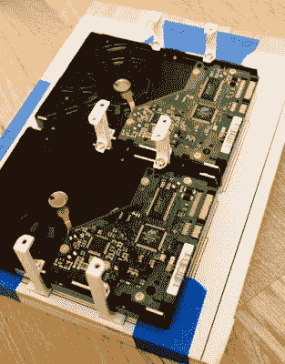

# 家用服务器有 AMD CPU 和宜家机箱

> 原文：<https://hackaday.com/2017/11/09/home-server-has-amd-cpu-and-ikea-case/>

参加过定制 PC 构建辉煌时代的读者无疑会记得为他们精心策划的构建挑选案例的压力。你可能想通过买一个便宜的箱子来降低一点总成本，但是那样你就不得不日复一日地盯着某个经济箱。另外，如果没有透明的窗户和照明设备，你如何在网上发布图片来吹嘘你的最新建筑？

虽然有些人可能会花更多的时间选择带灯的机箱风扇，而不是光驱，[Miroslav prail]肯定不是其中之一。当他决定为他的家庭网络构建一个新的 NAS 时，[Miroslav] [决定将他的所有资金投入到设备的内部，并将他的构建放在宜家的木制存储箱中](https://kmh.prasil.info/posts/nascrate-budget-nas/)。虽然低成本肯定是决定的主要因素，但事实证明，板条箱实际上为硬件组件提供了相当大的空间。作为一个额外的奖励，坐在客厅里看起来并不可怕。

 【米罗斯拉夫】在他的博客上发表了一系列详细的文章，向我们展示了建造他称之为“NAScrate”的整个过程。想要千兆以太网和真正的 SATA 控制器，[Miroslav]选择了 [ASRock C70M1](http://www.asrock.com/mb/AMD/C70M1/) ，这是一种集成双核 AMD 处理器的迷你 ITX 板。虽然不完全是一个发电站，但它肯定会用受水果启发的单板计算机来擦地板，这些计算机经常主导这些类型的构建。

为了获得许可，[Miroslav]在 OnShape 渲染了整个建筑，这让他对自己的设计有了足够的信心，可以继续进行实际建设。该构建涉及几个 3D 打印部件，最引人注目的是一些聪明的硬盘安装支架，允许驱动器堆叠成节省空间的排列，同时仍为它们之间的气流留出空间。

[Miroslav]巧妙地避开了任何宗教辩论，在他新构建的 NAS 上留下了他对软件和操作系统的特定选择，但他确实提到了像 [FreeNAS](http://www.freenas.org) 这样的东西将是一个合乎逻辑的选择。

虽然这可能是我们迄今为止报道的第一个木制项目，但一般来说，[家庭服务器是黑客们最喜欢的项目](https://hackaday.com/2013/07/25/android-stick-mutates-into-a-home-server/)，从[预算友好的临时构建](https://hackaday.com/2012/12/18/hacked-together-nas-in-a-box/)一直到[重新设计的企业硬件](https://hackaday.com/2011/12/19/hacking-old-server-hardware-for-new-home-use/)。