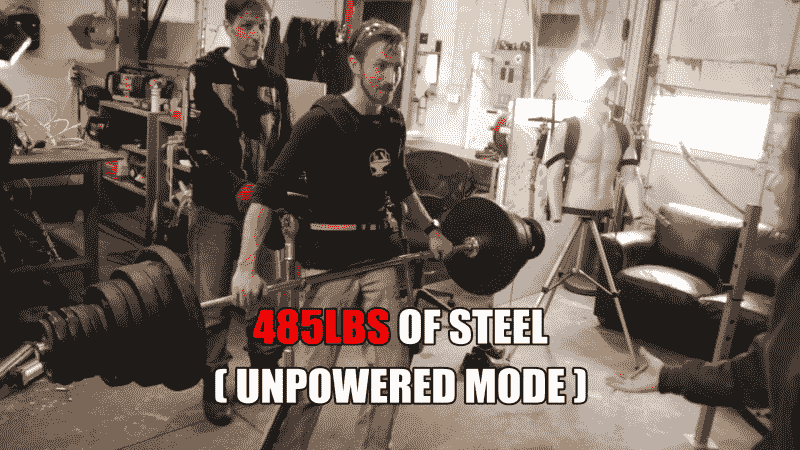

# 自制外骨骼轻松托起迷你库珀

> 原文：<https://hackaday.com/2016/01/25/homemade-exoskeleton-lifts-mini-cooper-with-ease/>

你们有些人可能知道也可能不知道，我对所有与外骨骼相关的东西都感兴趣。在过去一年左右的时间里，我一直在摆弄自己的设计，就在刚刚过去的这个周末，我测试了最新的下体设计。有很多无聊的(有些人会说是安全的)方法来测试这一点。但那一点都不好玩。在我的测试中，我用外骨骼的下半部分捡起了一辆迷你库伯。

你可能还记得[我最初的上身设计](http://hackaday.com/2014/08/30/homemade-superhero-james-diy-exoskeleton/)，那是我在车库里拼凑出来作为概念证明的东西。它的效果很好，令人惊讶的是，它在互联网上掀起了风暴——一周内就有超过一百万人观看了我在自家后院冰壶 170 磅的视频。火已经燃起来了——我知道我必须做些更好的东西。这就是我寻求建造全身动力外骨骼的开始。

最初的最大问题是缺乏背部支撑——不管我能举起多少重量，仍然是我虚弱的人类骨架承受着重量。所以是时候回到绘图板，从头开始设计了。

### 梦想成真

这个项目进展缓慢，我的时间被讨厌的工作占用了，直到圣诞节前，我决定辞去产品开发员的全职工作(我是一名机甲工程师)，专注于外骨骼和 YouTube，实际上成为了一名“受雇黑客”——在未来的帖子中会有更多的介绍！

此后不久，德国科学节目伽利略(Galileo)伸出手，问他们是否可以在他们的节目中展示我的新外骨骼——我同意了，并可能或可能没有向他们承诺一项我甚至不确定我是否有能力做的力量壮举——举起一辆汽车。

像大多数工程师一样，我在压力下工作得最好，所以在离面试不到一周的时候，我们开始了腿部工作。获得抬起一辆汽车的力量是相当容易的。我有一对 63 毫米口径的气压缸，在 125 磅/平方英寸的压力下，一个能举起 800 多磅。有趣的是，为了做到这一点，我把它们附在我身上。

 [https://www.youtube.com/embed/ZzpcnmspoEU?version=3&rel=1&showsearch=0&showinfo=1&iv_load_policy=1&fs=1&hl=en-US&autohide=2&wmode=transparent](https://www.youtube.com/embed/ZzpcnmspoEU?version=3&rel=1&showsearch=0&showinfo=1&iv_load_policy=1&fs=1&hl=en-US&autohide=2&wmode=transparent)

现在实话实说，气缸安装不是那么优雅。这就是为什么我把外骨骼设计成完全模块化的——当你不需要它们的时候，你可以把气缸拆下来——因为你永远也不可能用那样巨大的气动装置来运行。更不用说我们没有电弧反应堆技术来驱动外骨骼一段合理的时间…

### 别担心，他们会上锁

不，不，真正的天才(如果我自己这么说的话)在圆柱体后面的机械腿上。能够承受巨大力量的锁定关节。

外骨骼上的棘轮关节让我可以承受重量，而不会有任何压力或力量通过我的身体。在上面的测试中，**我们用完了放在**杠上的砝码*。*关节使外骨骼在自由浮动模式下保持灵活，这意味着我甚至可以带着它们跑步——但在锁定模式下需要时，可以提供惊人的支撑和刚性。

类似于[“无椅椅”](http://www.wired.com/2015/03/exoskeleton-acts-like-wearable-chair/)，像这样的外骨骼腿可以让工人在尴尬的位置工作，而不会使他们的身体紧张。或者对于全身解决方案，洛克希德·马丁公司的 [FORTIS 外骨骼怎么样？](http://www.lockheedmartin.ca/us/products/exoskeleton/FORTIS.html)

Left: Noonee “Chair-less Chair”, Right: Lockheed Martin FORTIS

虽然先进的电池技术将极大地扩展动力外骨骼服的潜力，但我相信功能外骨骼的下一个突破要简单得多。都是关于**机械优势。**

### 杠杆作用

轮子，然后是自行车彻底改变了运输业。它允许人类利用齿轮系的机械优势来做他们以前从未做过的事情。就像[以超过 120 公里/小时的速度](http://hackaday.com/2013/11/24/pedaling-at-128kmh/)在你自己的，非常人性化的动力下移动。

我们已经使用了许多利用杠杆和齿轮比的工具，那么如果我们可以创造一种外骨骼，像自行车一样用于运输，而是让人类在建筑、救灾、军事等领域达到超人的力量水平，以及超越我们身体所能承受的所有其他任务，会怎么样？

这就是让我兴奋的地方。事不宜迟，下面是最后的准备，然后是大考。

 [https://www.youtube.com/embed/f0O5YMSvC8o?version=3&rel=1&showsearch=0&showinfo=1&iv_load_policy=1&fs=1&hl=en-US&autohide=2&wmode=transparent](https://www.youtube.com/embed/f0O5YMSvC8o?version=3&rel=1&showsearch=0&showinfo=1&iv_load_policy=1&fs=1&hl=en-US&autohide=2&wmode=transparent)

 [https://www.youtube.com/embed/vysZOHAsmwg?version=3&rel=1&showsearch=0&showinfo=1&iv_load_policy=1&fs=1&hl=en-US&autohide=2&wmode=transparent](https://www.youtube.com/embed/vysZOHAsmwg?version=3&rel=1&showsearch=0&showinfo=1&iv_load_policy=1&fs=1&hl=en-US&autohide=2&wmode=transparent)

现在很明显，离开这个项目(和测试！)到最后一分钟并不是最明智的做法，但是，嘿，德国电视摄制组在我们那天早上匆忙完成时拍摄了一点“制作”过程。我们学到了很多东西，在设计上还有很多需要改进的地方——你可能已经在视频中注意到，外骨骼的胫骨支架在第一次测试中实际上**松开了**！幸运的是，这不是灾难性的，我们能够在最终测试之前修复它。如果你有兴趣进一步关注这个项目，请考虑[订阅我的 YouTube 频道](http://www.youtube.com/subscription_center?add_user=mstrjames)，我几乎每周都会在那里发布更新。

早在 2008 年[我们就报道过现实生活中的动力服](http://hackaday.com/2008/05/23/real-life-power-suits/#more-1864)。我们可能很快就需要更新……但是显然这些设计都没有大规模的开展。你从没见过他们中的任何一个在现实生活中使用，对吗？但是它所需要的是一个正确的设计，并且一直坚持到底。

如果有任何人正在开发他们自己的人体增强硬件[我们想听听它的消息](https://hackaday.com/submit-a-tip/)！