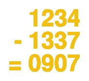
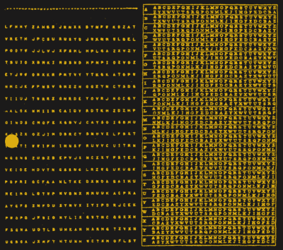
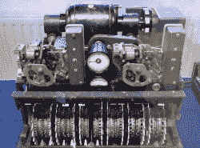

# 黑客如何记住 PIN

> 原文：<https://hackaday.com/2017/05/10/how-a-hacker-remembers-a-pin/>

如果你需要记住很多银行卡、门禁密码或其他小数字密码，最终会变得很麻烦。最糟糕的，对我来说，是我千载难逢使用一次的商业账户的银行卡。我大概五年用了八次，然后他们给了我一张有新 PIN 的新卡。叹气。

Quick, What’s My PIN?

一个正常人会如何应对别针的泛滥？他们会把数字写在一张纸上，放在钱包里。我们都知道结局，对吧？一个丢失的钱包和多个空银行账户。黑客会怎么处理？将每个数字写在卡上，但自然是加密的，使用的是唯一无法破解的加密方案:一次性密码(OTP)。

在加密方法中，OTP 是一只奇怪的鸭子。它们应该在你的大脑中被解密，但是只要密钥保持安全，它们就坚如磐石。如果你曾经尝试过用普通的加密方法来编写 [s 盒以及所有的加法、移位和混合](https://en.wikipedia.org/wiki/Advanced_Encryption_Standard)的代码，OTP 非常简单。代价是一个“长”密钥，但是 OTP 对于加密您的 pin 绝对是完美的。

本文的第一部分似乎是友好的“生活黑客”手册，您可以在其他地方获得，但不要绝望，它也是对 OTP 的后门介绍。后半部分深入到一次性密码本，其中包含一些深层的加密直觉、一些友好的数学运算，并有望提出一个令人信服的论点，即记下您的加密 pin 是正确的事情。同时，我列出了在实现 OTP 时可能会出错的三件事。(而且没有一个会让你震惊！)但最终，我的 PIN 加密解决方案将破解这三个中的一个，但仍然完好无损。好奇了吗？请继续阅读。

## PIN 解决方案

首先，解决银行卡问题的方法是:用只有你自己知道的秘密来加密你的 PIN。不再需要为每张新卡记住一个四位数，你只需要永远记住一个四位数。关键是要选择一个容易破解的加密方案，这样当你被要求在银行出纳员的窗口输入密码时，你就不会显得太奇怪。这是动态口令的经典用法——一种你可以在脑子里解开的加密方法。

首先，随机选择一个秘密的四位数。然后，从您的 PIN 中减去该数字，并将结果写在您的卡片上。当你站在银行柜员面前时，只要低头看看卡，然后把密码加回去，就能得到你的个人识别码。出纳员会认为你已经在卡上写了你的密码。你可以自鸣得意，因为你已经使用了一个牢不可破的加密方案。

除了正常的加法和减法之外，对于跨位数的进位和借位，您将需要使用模 10 数学——每当结果超出 0-9 的范围时，就从结果中加或减 10。我们将在下面讨论为什么，但现在，这里有一个工作示例。

 假设 PIN 是 1234——那就必须发生这么个人，对吗？我的随机秘密数字自然是 1337。我们加密吧。1 减 1 得 0，所以我把它写下来。2 减 3 得-1，这就是模 10 算法的用武之地。在这种情况下，-1 加 10 就变成了 9。3–3 = 0，4–7 = 7，mod-10。我的卡上现在写着 0907。

 现在我们来解密。低头看卡片，看到一个 0，加 1。然而，9 + 3 = 12，所以我们需要减去 10 得到 2。(这就是为什么在解密阶段选择加法，很容易去掉任何前导 1。)0 + 3 = 3 和 7 + 7 = 14 - > 4 <。我输入 1234，钱就是我的了！

一旦你掌握了把你的秘密数字加到任何其他数字上的窍门，你会惊讶于它的工作速度有多快。尝试一下，看看你是否能在十分钟内熟练掌握。

## 一次性垫

一次一密既是最简单的对称加密方案，也是完全不可破解的。它有三个关键特性，其中两个已经在上面演示过了，任何一个出错都是灾难性的。

OTP 最重要的特征是密码必须是随机的，并且与它加密的文本长度相同——因此 PIN 是四位密码。在 OTP 中，一切都围绕着秘密，这也是它的致命弱点。对于一个四位数的数字，保守四位数的秘密是没有问题的。但是想象一下，你想把你假期的加密照片发送给一个朋友。这是一大堆需要保密的关键材料。

 

原始 by [ [Matt_Crypto](https://en.wikipedia.org/wiki/Caesar_cipher#/media/File:Caesar_cipher_left_shift_of_3.svg) ]，公共域

其次，将消息与秘密相结合的方法必须类似于模运算，因为加密字符集和明文字符集(在我们的例子中是 PIN)必须一一对应。Mod-10 很容易确保这一点:两者都在 0-9 的范围内。也许您熟悉对二进制数据使用 XOR 运算符，这与加法或减法 mod-2 是一回事。(0 + 0 = 0，0 + 1 = 1，1 + 0 = 1，1 + 1 = 2 - > 0。QED。)你也可以使用字母，并像[凯撒密码](https://en.wikipedia.org/wiki/Caesar_cipher)或 ROT13 一样将字母表绕在“z”上，这只是将字母表映射成数字并进行数学 mod-26。

第三，也许这是第一个的推论，你不应该在一次性密码本中重复使用这个秘密。你可能认为这是显而易见的，因为它甚至以加密方法的名义出现，但是在实践中很难做到。事实上，我的 PIN 加密方案通过在多个密钥上使用相同的秘密打破了这一规则。我们很快就会谈到这一点。

## 打乱完美的加密

为什么 OTP 无法破解？破解大多数加密方案通常归结为概率和统计。例如，如果你用上面的 Caesar 密码加密一个文本，明文中的每个字母每次出现在密文中都会被映射到另一个字母。如果你知道原文是英文，其中最常用的字母是“e”，那么很有可能如果“q”是密文中最常见的字母，它就代表“e”。也就是说，我们找到明文和密文之间的统计相似性，并使用它们在两者之间架起一座桥梁。

使用一个与明文一样长的随机选择的密钥，可以打破与密文的任何统计关系。给定写在我的卡上的特定密文，从 0000 到 9999 的每一个 PIN 都是可能的，如果密钥是随机选择的，也是同样可能的。密文中没有关于明文的信息——简而言之，这就是克劳德·香农的证明。这就是为什么动态口令牢不可破。

 

戴安娜一次性密码本[ 

这实际上是理解密码学领域的关键:它试图在加密过程中扰乱关于明文的信息，这样即使使用了更短的密钥，也不会留下任何与明文统计相关的痕迹。这种对快捷键的渴望也不仅仅是为了方便:想象一下，你和 Hackaday 之前必须交换 500 KiB 的随机数据才能下载并阅读这篇文章。想象一下你必须为客人写下的 WiFi 密码有多长！这就是 OTP 琐碎无趣的原因——它可能牢不可破，但是对于大多数应用程序来说，这个秘密太长了。真正的密码是寻找用最少的密钥材料打破统计关系的算法。

记住这一点，您可以通过使用短的或非随机的密码来破坏 OTP 实现。想象用 1 作为你的密码，必要时重复；我们的密文应该是 2345，第二次尝试就能猜出密码。您还想使用随机密码；选择 0000 是因为它使数学变得简单，这是唯一比上述更糟糕的事情。(不过，严格来说，如果我拿到 0000、1111、9999、1234、4321 或类似的数字，我会再掷一次。)反正不要用生日。童年朋友的旧电话号码可能是可以接受的。

模运算的作用稍微微妙一些。无论使用什么函数，明文中可能的字符集都必须与密文一一对应。为什么？假设你用的是简单加法，而不是 mod-10 加法。为了得到 PIN 密文的最后一位，我们使用 4–7 =-3-> 7，并用 7 + 7 = 14 -> 4 解密。如果我们写下-3，攻击者就会知道我们的最后一位数字不能大于 6，因为加上最大值 9，只能得到 6。我们通过在密文中拥有比明文中更大的集合来泄露信息。

这就剩下最后一种搞砸的方法:重复使用“一次性”拍纸簿。很明显，对吧？不对。

Lorenz Machine, [Public Domain](https://en.wikipedia.org/wiki/Lorenz_cipher#/media/File:Lorenz-SZ42-2.jpg)

一方面，重用是一个明确的责任。在一个非常相似的加密方案中重复使用密码[破解了“Tunny”，这是二战期间的一个重要密码](https://en.wikipedia.org/wiki/Lorenz_cipher)。发送了一条 4000 字符的加密消息，但未被正确接收。发送者用同样的秘密重新发送了信息*，但是在文本中做了小的改动，使用了不同的缩写等等。这给了盟军足够的时间来破解 Tunny 并对加密它的机器进行逆向工程。游戏结束。*

下面是让 Tunny decrypt 起作用的数学方法，应该可以说服你永远不要重复使用一个密钥。如果我们用秘密密钥`C`对消息`A`和`B`进行编码，有人无意中听到了这两个消息，他们可以将它们一起进行模运算，得到`(A mod C) mod (B mod C) = (A mod B) mod C mod C = A mod B`，其中`mod`是我们现在习惯的按位或按数字取模运算符。因为取二进制模是它自己的逆运算，所以结果与明文都相关，与密钥无关。

从这里开始，比较`A`和`B`的智能猜测，并将它们与`A mod B`的结果进行比较，就可以破解代码。因此，如果你非常确定“攻击”出现在两个文本中(加密类型总是加密“黎明时的攻击”)，那么你可以尝试在不同的位置一起修改“攻击”，直到你与`A mod B`匹配。

## 出人意料的结局

但这是最后的转折！我们可以在我们所有的银行卡上重复使用密钥，尽管存在上述数学问题。为什么？因为 pin 本身是随机的。与战时发送的自然语言消息相反，如果`A`和`B`都是随机的 pin 码，`A mod B`和`A mod C`一样随机。

这就是黑客记住 pin 的方式:通过学习大量关于一次性密码本的知识，如何破解它，以及如果它需要保护的消息很短，它是如何有用的。以及如何，对于特定的消息，你甚至可以打破规则。