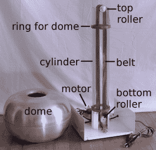
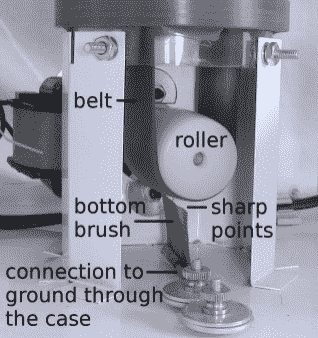
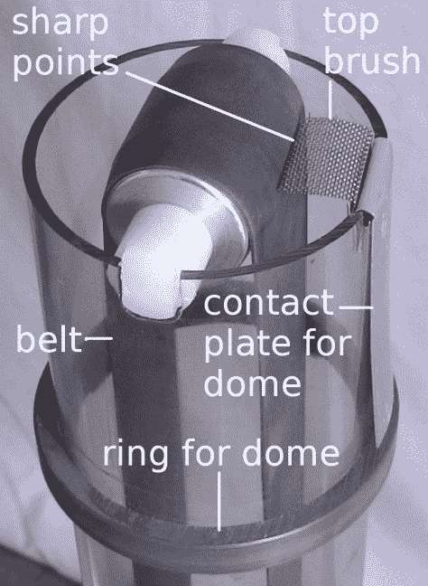
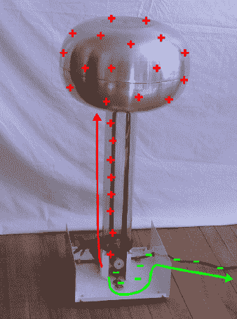
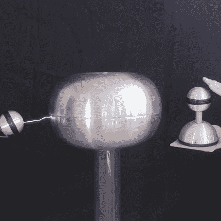
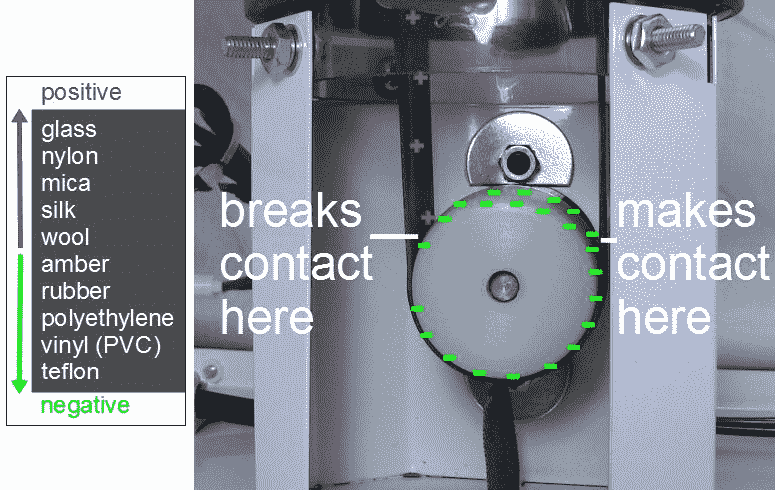
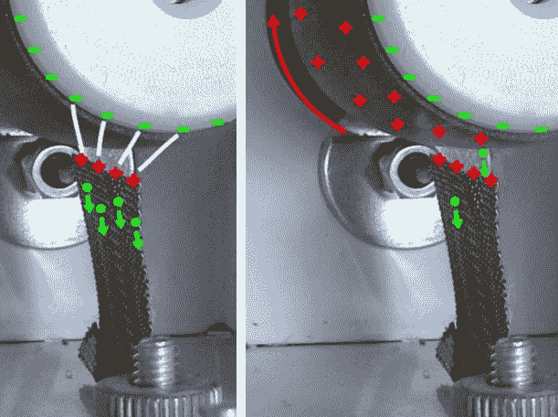
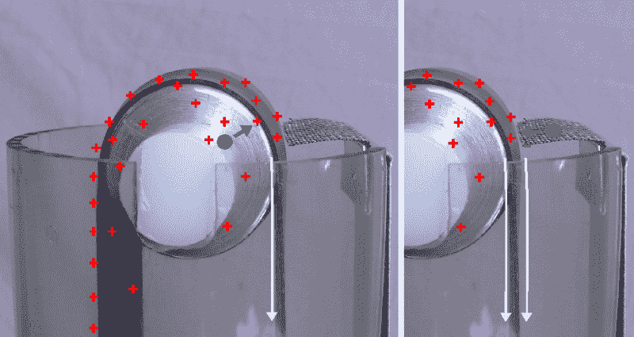
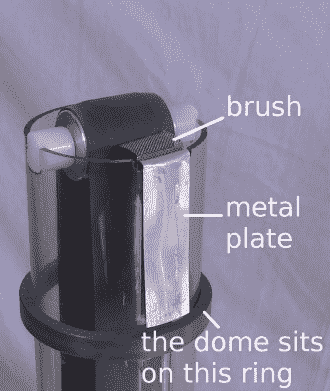

# 范德格拉夫发电机的工作原理

> 原文：<https://hackaday.com/2017/02/16/how-a-van-de-graaff-generator-works/>

我特别喜欢范德格拉夫(或 VDG)的一点是，它结合了一些离散的科学原理和一些机械产生的电流，使它成为一项有趣的研究。例如，您是否知道它的电压主要受圆顶直径和曲率的限制？这就是为什么手持摄像机是无害的，但你要避免被直径为 15 英寸的圆顶摄像机击中。接下来是这个有趣的高压发电机的工作过程。

## 大局

  Van de Graaff generator parts  The bottom parts  The top parts

范德格拉夫发电机的工作原理是，整个装置就像一个机电式电荷泵。带的外表面在底部充电，带的一边向上移动，带着电荷，电荷在顶部被带走，沉积在圆顶的外表面。

在查看具体区域之前，我们先从整体上快速浏览一下。底部有一个滚轴，顶部有另一个滚轴，两者都由一个由非导电材料制成的圆柱体固定。一条皮带缠绕在这些辊上，用一个电机带动下辊转动，带动皮带转动，进而带动上辊转动。圆顶在顶部包围了整个机械装置，在这种情况下，它位于一个环上。在上面的图像中，圆顶已经被移除，并显示为颠倒的，所以你可以看到它底部的开口。

    

底部滚轮处非常靠近皮带，但不接触皮带的是一个金属刷，其尖端朝向皮带。那把刷子通常是接地的，尽管它也可以连接到第二个圆顶，就像你在上面的图片中看到的手持 Van de Graaff。类似地，靠近顶辊的是另一个带尖的刷子，它靠近皮带但不接触。刷子通过接触金属板与圆顶相连，金属板伸出一点，向下延伸到圆顶所在的环上。

现在让我们从底部开始，看看不同的区域和电子效果。

## 底部滚轮和皮带

Triboelectric charging

关于底部的一个关键问题是，当辊子旋转时，辊子的外表面不断地与带的内表面接触和断开接触。制造这些表面的材料也很重要。这一起导致摩擦电效应的发生。

假如袜子和地毯是正确的材料组合，摩擦起电效应和你用袜子摩擦地毯时产生的电荷是一样的。在分子水平上，这种摩擦意味着分子间的接触会不断重复。当接触时，电子从一个方向移动到另一个方向，当接触断开时，电子留在那一边。这使得一种物质带正电，另一种带负电。

摩擦电系列是一个材料列表，在列表的一端是带负电的物质，在列表的另一端是带正电的物质。离列表中间越远，材料的电荷越多。在这种范德格拉夫发电机中，底部辊的外表面是聚四氟乙烯，靠近负极端。皮带是橡胶的，相对于特氟隆在正端方向。

因此，随着范德格拉夫底部接触的不断形成和断开，辊的表面带负电，而带的内表面带正电，但由于其表面积比辊大得多，所以带的正电荷较少。

## 皮带和底部刷子

Charging the bottom brush and belt

但这还不够好。我们需要给皮带的外表面充电。这就是底部刷子的用武之地。滚筒的负电荷排斥刷子尖端的电子，使它们带正电。每当你有一个带尖点的带电物体时，电荷在尖点处会更紧密地聚集在一起。最终结果是在这些点附近产生一个强电场。

该强电场通过从空气中的原子中剥离电子来电离空气，导致带和点之间的蓝色电晕。日冕是充满离子和自由电子的导电空气区域。电子被带的外表面排斥，并被吸引到电刷，在电刷处它们被进一步排斥到地。这使得皮带的外表面带正电。

由于传送带在移动，正电荷被带到顶部的滚筒上。

## 顶辊和皮带

Charging the top roller and taking charge from the brush

顶辊或者由金属制成，或者由与底辊的摩擦电系列相反的材料制成。在这个特别的 Van de Graaff 中，顶辊是金属的。无论哪种情况，最终结果都是一样的。

由于带的外表面和内表面都带正电，电子从金属辊中出来试图中和它们，使辊带正电荷，而带的内表面带中性电荷。

底部的带和刷之间的相同行为发生在顶部，只是电荷相反。在皮带表面和刷子尖端之间的间隙中形成电晕，电子从刷子被拉到皮带表面，中和皮带的外表面。那些电子来自哪里？

## 给穹顶充电

  The brush contacting the dome  Charging the dome

这些电子来自穹顶的外表面。请注意，顶部的电刷与金属板相连，金属板向下延伸到圆筒的侧面，圆顶与金属板电接触。

穹顶就像一个法拉第笼，发生的事情与法拉第的冰桶实验相同。那个实验证明了任何沉积在圆顶内部的电荷，或者法拉第案例中的冰桶，将最终停留在圆顶的外部。穹顶内部将保持中立。这里的关键是，因为内部总是中性的，你可以不断地向内部沉积越来越多的电荷，不会有相同电荷的积累来排斥它。任何沉积的电荷立即移动到外面。

这就是为什么范德格拉夫的电压极限是由圆顶的直径和曲率决定的。你可以不停地给穹顶充电，它就会不停地充电。就像刷子一样，如果圆顶有尖点，那么它很容易与周围环境形成强电场，形成泄漏电晕。所以穹顶越大越圆，周围的电场就越弱。电晕更难形成，周围的空气也更难导电。

当然，还是有局限性的。例如，圆顶和 Van de Graaff 底部的接地部分之间的电场可能变得足够强，足以形成电晕，随后产生火花，暂时中和圆顶。

但并不是所有的范德格拉夫发电机都是这种形状。我们已经看到一个[用一个汽水罐做穹顶，像魔杖一样握在手里](http://hackaday.com/2011/08/24/high-voltage-build-your-own-84-kv-lightning-stick/)，另一个[用圣诞树装饰穹顶](http://hackaday.com/2013/01/04/van-de-graaff-generator-built-for-a-few-dollars/)。令人震惊！