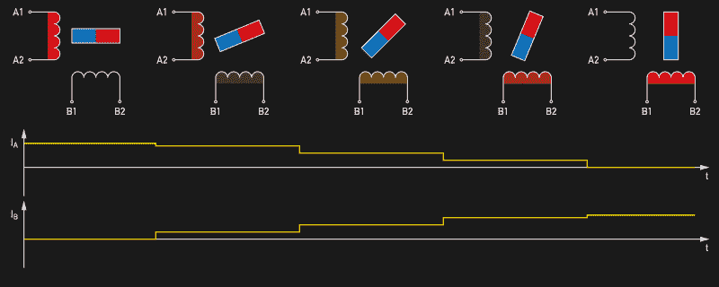
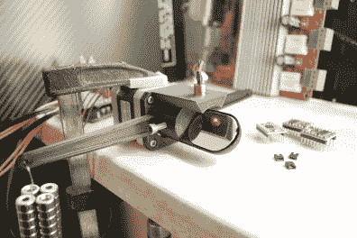
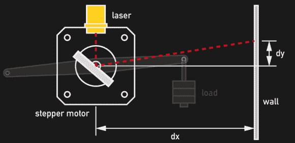
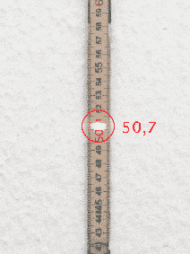
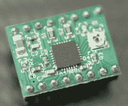
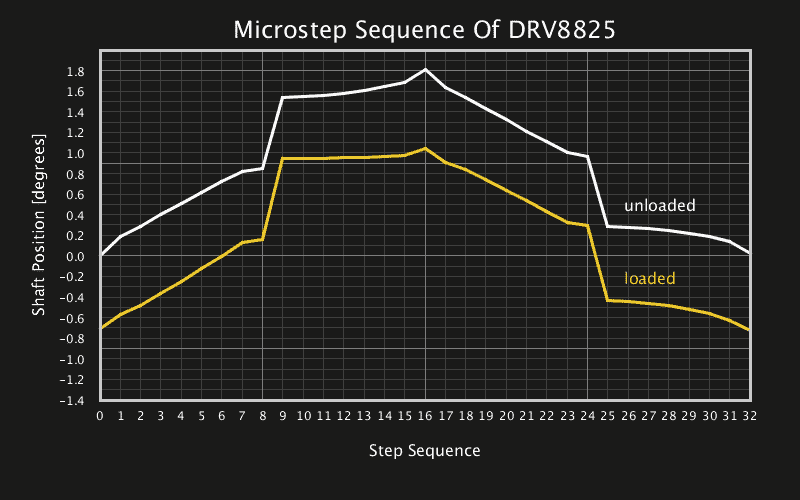
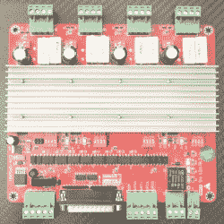

# 微步真的有多精确？

> 原文：<https://hackaday.com/2016/08/29/how-accurate-is-microstepping-really/>

步进电机将一次完整的旋转分成数百个离散的步骤，这使它们成为精确控制运动的理想选择，无论是在汽车、机器人、3D 打印机还是 CNC 机器中。你在 DIY 项目、3D 打印机和小型 CNC 机器中遇到的大多数步进电机都是双极、两相混合式步进电机，每转 200 步，或者在高分辨率型号中每转 400 步。这分别导致 1.8°和 0.9°的步进角。

Can you increase the resolution of this stepper motor?

在某种程度上，步是运动的像素，通常，给定的物理分辨率是不够的。在全步进模式(波形驱动)下硬切换步进电机的线圈会导致电机从一个步进位置跳到下一个步进位置，从而导致过冲、扭矩波动和振动。此外，我们希望提高步进电机的分辨率，以实现更精确的定位。现代步进电机驱动器具有微步进功能，这是一种将任意数量的微步挤压到步进电机的每个全步中的驱动技术，它显著减少了振动，并(据称)提高了步进电机的分辨率和精度。

一方面，微步实际上是步进电机可以物理执行的步骤，即使在负载下也是如此。另一方面，它们通常不会增加步进电机的定位精度。微步必然会引起混乱。本文致力于澄清这一点，因为这是一个非常依赖于驱动器的问题，我还将比较常用的 A4988、DRV8825 和 TB6560AHQ 电机驱动器的微步进能力。

## 微步进

Bipolar stepper motor symbol

在混合式步进电机中，微步进电机驱动器将调整定子线圈中的电流，以将永磁转子定位在两个连续全步之间的中间位置。然后，一个完整的步进被分成多个微步，每个微步由两个线圈电流实现。

许多老式工业电机驱动器只有 4 个微步(四分之一步模式)，但如今，每个全步通常有 16、32 甚至 256 个微步。如果我们以前有一个每转 200 步的步进电机，我们现在有一个每转 51，200 步的奇迹。理论上。

Symbolic example of quarter-stepping in a bipolar stepper motor. The gradual current and field changes in each microstep cause the rotor to set in intermediate positions. Disturbingly simplified.

在实践中，我们仍然在处理开环驱动器，这意味着电机驱动器不*知道*电机轴的准确角位置，它不会纠正偏差。摩擦、电机自身的制动力矩以及最显著的作用在转子上的外部负载都不会被驾驶员注意到。如果不通过编码器和更复杂的特殊驱动器来闭合环路，我们最多可以假设电机将在其目标位置附近的某个地方 2 个全步(是的，那么差)，这是转子突然进入错误的全步位置之前的最大偏转，从而导致失步。

从一个微步到另一个微步的增量扭矩是由无情的三角学控制的，只是电机动态扭矩的一小部分。为了确保电机轴实际设置在+/- 1 微步内，我们还需要相应地降低负载。超过这个较小的增量扭矩不会导致失步，但它会导致相同的绝对定位误差高达 2 个全步。下表显示了这种毁灭性的关系。

| 每全步的微步数 | 每微步增量保持扭矩 |
| one | 100 % |
| Two | 70.71 % |
| four | 38.27 % |
| eight | 19.51 % |
| Sixteen | 9.80 % |
| Thirty-two | 4.91 % |
| Sixty-four | 2.45 % |
| One hundred and twenty-eight | 1.23 % |
| Two hundred and fifty-six | 0.61 % |

来源:[步进电机技术笔记:Micromo 的微步进神话与现实](http://www.micromo.com/microstepping-myths-and-realities)

好消息是，只要我们使用足够强大的电机驱动器，并且无论是通过外部负载还是电机的内部惯性，如果我们不超过该增量扭矩，实现微步定位精度的唯一理论限制是电机的内部摩擦和制动扭矩。这些值在很大程度上取决于电机类型，但通常是相当低(几乎可以忽略不计)的值。例如，以下测试中使用的电机的制动力矩为 200g·cm。这仅仅是其 4000g·cm 保持扭矩的 5%。根据上表，该电机应该能够精确定位，每个全步进驱动器有 16 个微步。

那么，这个理论适用吗？就微步定位精度而言，所有微步电机驱动器的性能都一样吗？我最近有机会为一个项目测试一些电机驱动器，结果让我相当惊讶。

## 测试设置

对于测试设置，我从我的红外温度计借用了红色激光指示器，并通过 3D 打印夹具将其连接到电机上。3D 打印的镜子支架将第一表面镜子连接到电机的轴上，并具有两个长度为 100 毫米的杠杆，用于给电机加载给定的质量。对于负载测试，我将 100 g 的质量附加到一个杠杆上，这导致通过杠杆产生 1000 g cm 的负载动量。这是用于该测试的电机保持扭矩的四分之一:万泰 42BYGHW609，每相 1.7 A，4000 g cm 保持扭矩，每转 200 步。

  Unloaded test setup, vapor for awesome laser effects.  Test setup loaded with 1000 g cm.

我将电机组件安装在一个坚硬的窗台上，并将其定位，使激光指针点投射到房间对面墙上的一个口袋尺上，大约 6 米远。光学杠杆放大了精确读数的步骤。最初，我计划只手动记下读数，但很快意识到编写一个小的 Java 图像处理脚本来从照片中提取读数可以在很短的时间内完成。因此，一个 DSLR 相机被连接到我的测试电子设备——一个 Arduino 和一个 RAMPS 1.4——被触发以获取位置读数。我当然应该把激光指向尺子旁边干净的白色墙壁，但是红色通道上的一个简单的阈值在准确提取尺子上的亮红色激光点方面做得很好。根据标尺上的读数和墙上的距离，我后来计算出了电机轴的角位置。

  The angular motor position is obtained by arctan(dy/dx)/2  Debugging output of CV program

所有步进电机驱动器都在 16 微步/全步模式下进行了测试。在测量之前，将步进电机置于全步止动位置，并将镜子对准垂直于墙壁的光束。然后在一个方向上执行 16 个微步，同时在每一步之后触发相机。之后，反向执行 16 个微步，使步进电机回到原来的位置。同样，相机在每一步之后都会被触发。测量两个方向上的位置应该可以让我了解电机的缓冲反冲(如果存在)，但导致了比预期更有趣的见解。对每个驾驶员执行该测试序列，包括空载和负载 1000 g cm。在负载测试中，更强壮的司机造成了一点超调，所以在触发照片之前，给了他们时间来休息。

值得一提的是，以下所有结果都源自完全相同的电机，以及相同的物理电机步骤，以确保可比性。除了计算轴位置角度之外，没有进行任何平均或其他处理。然而，所有的测试都在不同的硬件(即相同的驱动器 IC，但是来自不同来源的不同分线板)上执行了多次，以确保结果的完整性。即使是奇怪的结果(如 DRV8825)也可以在不同的设置下重现。请注意，下图可能会给人一种时间连续测量的错觉。它们实际上在 x 轴上的标记处显示了一系列离散的测量值，线形图只应使其更容易一眼看出非线性。

## 快板 A4988

在类似 Pololu 的步进驱动器分线板上的 Allegro A4988 在空载和负载下表现最佳。尽管它每相仅提供 1 A 电流，但在空载测试中实现了非常线性的等间距微步，与理想位置的偏差很小，但可重现，在 1 微步以内。有趣的是，A4988 在半音位置显示出最大的偏差。

Step 1 to 16 are in positive direction, step 17 to 32 go in negative direction.

不出所料，轴的位置在负载下会明显偏移:超过半个全音程。无限分辨率的梦想破灭了。然而，该图还显示，全步位置也不能免受这种偏转的影响，即使它们由电机轻微的制动扭矩支持。

## 德州仪器 DRV8825

在类似 Pololu 的步进驱动器分线板上的德州仪器 DRV8825 表现最差。我用不同来源的不同分线板重复测量了几次，所有的分线板都产生了与这个几乎相同的曲线。然而，由于驱动器能够向电机提供 2.2 A 的更高电流，因此在全步进和半步位置，它在负载下显示出明显更小的偏转。

Step 1 to 16 are in positive direction, step 17 to 32 go in negative direction.

无论是加载还是卸载，DRV8825 都表现良好，直到达到半步。然后，它在一个微步内几乎跳到下一个全步位置。在相反的方向上，它再次表现良好，直到它到达半个音程(这次是全音程的另一半)，然后分解到原来的全音程位置。这种行为很难解释。至少电机电流感测路径中的缺陷应该更均匀地影响定位。我相信 Hackaday 的读者可以解释、证实或反驳 DRV8825 的这种行为，或者指出测量设置中可能导致这些结果的缺陷。

## 东芝 TB6560AHQ

我可能会承认，我并没有对带有四个东芝 TB6560AHQ 3A 电机驱动通道的廉价红色 ST6560T4 驱动板抱太大希望，但它是一个很好的驱动 IC，表现令人惊讶。该测试将驱动器设置为 2.25 A，在整个微步序列中实现了良好的线性度，空载时偏差为 2 微步。

Step 1 to 16 are in positive direction, step 17 to 32 go in negative direction.

然而，在较高的全步进位置存在可再现的非线性，这是 A4988 没有显示的，TB6560AHQ 在负载下的行为明显不同于空转行为。此外，令人惊讶的是，电机在负载下偏转超过半个全步，因为更高的电流应该增加电机扭矩，类似于 DRV8825。

## 结论

我希望本文和测量结果能够帮助您做出设计决策，以及处理这些非常常见的驱动因素。我为一个相当窄的应用程序做了这个测试，它们不应该太一般化。虽然我敢得出以下结论:

使用开环微步的重型机器(如 CNC 路由器)中的步进电机主要受益于微步模式的振动减小和扭矩波动降低。他们不能依靠微步作为提高定位精度的手段(至少不能不保持大的扭矩裕量)，因为负载仍可能使轴的位置偏移超过一个全步。

然而，具有低负载和低摩擦的小而轻的应用可能确实求助于微步进，作为从标准步进电机中挤出更多精度的廉价技巧。即使使用廉价的低电流电机驱动器，看看性能非常好的 A4988，只要负载保持较低，理想情况下在微步的增量扭矩范围内，精确的角度定位也是可能的。

一如既往，我很高兴听到你对这篇文章的想法、观点和经验。我的 DRV8825s 是怎么回事？你大部分时间都依赖哪些步进电机驱动器？请在评论中告诉我们！