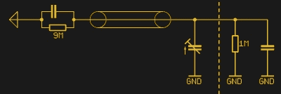
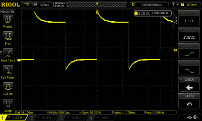
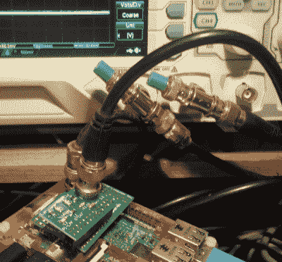

# 示波器探头如何工作，以及其他故事

> 原文：<https://hackaday.com/2017/03/15/how-an-oscilloscope-probe-works-and-other-stories/>

示波器可能是电子工作台上最通用的测试设备，为测量时序、频率和电压以及电路中由其产生的波形形状揭示的细微之处提供了多种可能性。

在现代望远镜的前面是一个 BNC 插座，你可以把你要研究的信号输入其中。然而，如果您只是在源和范围之间连接一个同轴 BNC 引线，您会立即注意到一些问题。你的波形会被扭曲。用最简单的术语来说，你的方波将不再是方的。

这是为什么呢？示波器运行的关键是一个非常高的输入阻抗，以最小化它所研究的电路的电流消耗。因此，在 BNC 插座后面，你首先会发现一个 1 兆欧的接地电阻，或者至少，如果不是一个物理电阻，也可以是其他等效电路。这种高电阻的作用是向外界呈现高阻抗，但也带来了不利影响。由于其值较高，即使很小的外部电容的影响也足以产生非常有效的低通或高通滤波器，这反过来会扭曲屏幕上的波形。

这个问题的答案可以在你的示波器探头中找到。看起来，探头只是一个插头，用一点电线连接到一个带接地夹的刚性点，但实际上，它包含一个简单而巧妙的电容问题缓解措施。

 

典型无源示波器探头的电路图。[Ge](https://commons.wikimedia.org/wiki/File:Passive-probe.jpeg?uselang=en-gb)【CC BY-SA 3.0】

大多数无源示波器探头都包含一个衰减器，用于将被测电路与电缆电容隔离，还包含与每个电阻并联的补偿电容，用于抵消电缆电容的影响。衰减器通常选择将输入电压除以 10，因此您会看到“10x”探针。示波器上的读数是探针上电压的十分之一，例如 1 V 电平测量为 100 mV。如果他们的设置显示了探头类型，许多示波器会自动将其转换为真实的数字。

The effect of a badly adjusted oscilloscope probe, a distorted square wave.

其中一个补偿电容是可调的，用于微调响应。示波器将有一个校准的方波输出，通常为 1 kHz，探头连接到该输出，然后调整电容器，直到屏幕上显示的波形真正是方波。电容太大，探头有低通滤波器的作用，而电容太小，它就变成了高通滤波器。根据校准终端检查探头，并在显示的波形不是方波时进行相应的调整，这应该成为工作台维护的半常规部分。

## 高潮和低谷

探头被设计成在原位向电路呈现高阻抗，并且不会扭曲最终显示的波形。然而，有时有必要测量期望低阻抗的输出，例如 50 欧姆的源。在这种情况下，信号源必须以相同的阻抗端接，因此应馈入一个 50 欧姆的电阻。

有些示波器有一个 50 欧姆的输入模式，这是一个按下按钮的问题。否则，可以在终端电阻上进行测量，但由于阻抗现在已经降低到小电容不再有显著影响的程度，如果示波器的电缆减少到最低限度，就没有必要了。在这些情况下，如果你有一个 BNC T 型接头和一个 50 欧姆的终端，你可以完全不用探针，把终端和 T 型接头都放在你的电缆末端，直接连接到示波器的 BNC 插座上。

对于许多读者来说，这本关于示波器输入和探头操作的基本入门书已经过时了。但我记得我的第一台示波器，以及它如何给我看起来很奇怪的结果，因为我太年轻，没有被教过探头补偿。当你拿到你的第一个示波器时，你很容易认为示波器是主要的事件，却没有意识到它的好坏取决于你如何将其连接到被测电路。