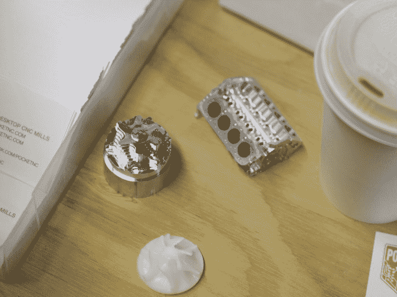
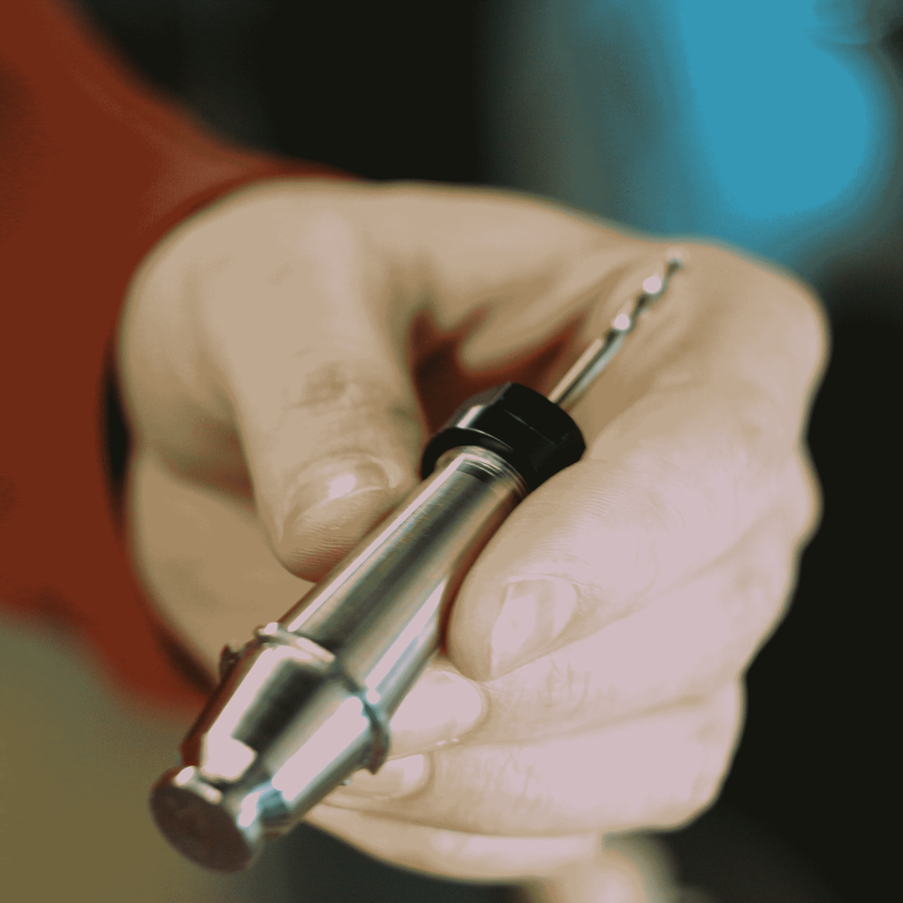

# Pocket NC 是如何生存并茁壮成长的？

> 原文：<https://hackaday.com/2016/06/01/how-did-pocket-nc-survive-and-thrive/>

在今年的湾区创客节上，我们有机会与 PocketNC 的马修·赫特尔交谈。在谈话过程中，他回答了我在 Kickstarter 上看到这个项目后提出的一些问题，并在他做这个项目时讲了一个很酷的故事。

当 [Pocket NC 5 轴台式数控铣床 KickStarter](https://www.kickstarter.com/projects/1090944145/pocket-nc-the-first-5-axis-cnc-mill-for-your-deskt) 出来的时候，我立刻把它当成了一个失败品。我认为永远不会有一个交付单位。这似乎太不可能了。对于一台有这么多大型加工铝件的机器来说，这个价格太低了。它有真正的线性导轨。它有一个真正的主轴，里面有一个运行 linuxCNC 的 beagle bone black。它不可能那么便宜。最后，我很高兴自己错了。Pocket NC 做得很好，交付了第一批设备，并接受了新订单。

The CNC equivalent of a brag track on a hip-hop record.

人们很容易对 Kickstarter 和 IndieGoGo 的骗局感到厌倦。或者甚至是项目令人失望的[行为，这些行为可能是合法的](http://hackaday.com/2016/05/11/peachy-printer-collapses-investor-built-a-house-instead-of-a-printer/)。人们经常对公司进行失败分析，但也值得调查人们在成功时做对了什么。

不久前有一家名为卢蒙实验室的公司。Lumen Labs 承诺市场上最便宜的龙门数控系统。在 Lumen Labs 的辩护中，他们确实有一个惊人的产品。这是最大、最便宜、最精确的数控铣床，如果他们只卖他们店里能生产的东西，他们会过得很好。然而，他们没有设置订单限制，很快数以千计的机器人订单滚滚而来。看似好运的东西是他们的丧钟。因为他们没有考虑加工时间和加工机器的实际成本；他们不知道这栋建筑的真实价格。他们的利润是负数。由于没有办法扩张，只能购买更多的机器和雇佣更多的人，他们很快就耗尽了所有的资本。今天，Lumen Labs 在互联网上是一个空白页，在 Make 博客上也没有什么好评。

然而，Pocket NC 没有犯这些错误。马特和米歇尔以夫妻团队的形式经营这家企业。他们都不是轻量级的，米歇尔曾在航空航天领域担任过一段时间的机械工程师，马特也有类似的荣誉。马特想出了大部分的设计，但他把生意的成功归功于米歇尔。她坚持要求他们尽可能精确地估算成本和潜在的超支。只有当他们详细了解每个组件的成本、加工步骤和潜在的挫折时，他们才能为 Kickstarter 的成功营销准确定价。

第一步是完成设计，这也是许多活动在发布前无法完成的一步。该设备被彻底迭代，直到他们有一个真正的 5 轴机器。接下来是重要的部分。他们制作了一些袖珍计算机，并计算了每一步的时间。他们知道精确到秒的加工、布线、测试和组装需要多长时间。利用这些信息，他们进一步优化了设计，并重复了这一过程。这种迭代方法给他们留下的不仅仅是一个合理的机械设计，还有对机器成本的透彻理解。

PocketNC has even had time to update their design with the KickStarter feedback. A new custom spindle design and bigger motor allows for a larger selection of tooling to be used.

我记得我觉得很奇怪，当活动开始时，他们设定了机器销售的最高限额。Kickstarter 活动的目的不就是筹集大量资金，在闪闪发光的现金海洋上驶向金色的夕阳吗？记得卢蒙实验室吗？

米歇尔仔细计算了每台机器的成本，以及用手头的资金可以制造的最大机器数量。Pocket NC 不会成为 Lumen Labs 垮台的受害者——发现自己被逼到一个角落，在那里他们无法逃脱，除非找到更多的资金、提高价格、外包(这总是有风险的)和降低质量——它将保证有能力生产估计的机器。

最后，房子卖了，一对夫妇搬到了另一个国家，在某个时候，他们可能已经在父母的地下室里住了一年。然而，生意很好，他们在其他工厂没有生存的地方生存了下来，Pocket NC 正在接受更多工厂的订单。