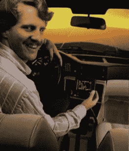
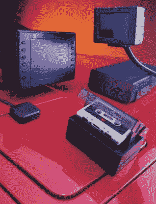

# Etak 如何为个人导航铺平道路

> 原文：<https://hackaday.com/2018/06/29/how-etak-paved-the-way-to-personal-navigation/>

我们最近关于 20 世纪 70 年代早期的航位推算汽车导航系统的“Retrotechtacular”功能唤起了人们对另一个前 GPS 解决方案的记忆，这个问题几十年来一直困扰着驾车前往陌生地区的公众:“我们到底在哪里？”在这个时代，早已过时的纸质路线图的残迹往往是司机最好的导航工具，仪表板滚动地图的梦想似乎是 Q 为詹姆斯·邦德建造的东西。

然而，在 20 世纪 80 年代中期，这样一种装置被设计出来并提供给公众。该系统被称为 Etak，它同时远远领先于其所处的时代，并且注定要失败，因为它被推出时，全球定位卫星星座正在头顶上组装。考虑到其运营的限制，Etak 工作得非常好，甚至设法引入了一些我们认为理所当然的现代 GPS 功能，例如搜索服务和商业。这里有一点关于这个系统是如何形成的以及它是如何工作的。

## 航位推算复活了

Stan Honey showing off his Navigator Model 450 in 1986\. Source: [Honeynav.com](http://honeynav.com/category/etak/)

艾塔克的故事开始于 1983 年加利福尼亚海岸的一艘赛艇上。这艘游艇的主人是硅谷的企业家诺兰·布什内尔，他和泰德·达布尼一起创建了雅达利公司，并向世界介绍了“乒乓”( T2)公司(T3)。斯坦·哈尼也参加了比赛，他是一名工程师和经验丰富的游艇驾驶员，签约成为了领航员。布什内尔和霍尼开始集思广益，如何把霍尼为游艇建造的导航系统变成一个基于陆地的系统。比赛结束时，Honey 有了系统的粗略设计，Bushnell 承诺为其开发提供资金。

根据他的导航经验，Honey 知道航位推算的挑战，这种导航技术依赖于跟踪从已知位置或定位点行进的距离和方向。测量距离或行进方向的小误差会累积，直到无法可靠地确定位置。Honey 认为修正汽车导航中的航位推算误差会很容易，因为司机一般都被限制在道路上；将当前假定位置与最近的道路相关联将提供一系列恒定的定位，并保持系统在轨道上。

The Etak Navigator system.

Honey 为将这一想法商业化而成立的公司被称为 Etak，这是土著波利尼西亚水手用来移动导航参考点的术语。哈尼和他的团队面临的任务是艰巨的。不仅当时的计算机硬件有限，他的“增强型航位推算”系统所需的地图数据库也不存在。电脑问题将会比地图问题更小。

一台运行频率为 4.77 MHz、内存为 128 kB 的基于 8088 的机器被塞进一个鞋盒大小的箱子里，作为汽车的后备箱。该团队发现传统的光栅 CRT 没有显示地图细节所需的分辨率，所以他们建立了一个基于矢量的显示器，就像雅达利的*小行星*视频游戏中使用的显示器一样。

跟踪车辆行驶的方向和距离是一对传感器的工作。安装在汽车后挡风玻璃上的磁通门罗盘记录相对于地磁北极的方向，同时安装在非驱动轮上的一对霍尔效应传感器计算英里数。车轮传感器还通过跟踪车辆转弯时的转速差来提供额外的矢量数据。

地图数据的大容量存储完全是另一回事。当时的硬盘既昂贵又笨重，非常不适合汽车后备箱里的生活。CD-r om 是多年以后的事了，软盘驱动器没有足够的容量来存储大量的地图数据。经过多次试验，Honey 的团队选定了标准盒式音频磁带机的改进版本。使用加固型盒式磁带的高速随机存取驱动器被放置在驾驶员伸手可及的地方，当达到特定地图块的极限时，驾驶员需要交换磁带。每个磁带容量为 3.5 兆字节，这在当时是相当可观的。

## 磁带的拓扑

但是，确切地说，如何在这些磁带上填充地图是一个更棘手的问题。霍尼有一个在美国人口普查局从事数字地图工作的熟人，马文·怀特，并说服他加入这个团队。他们与数字化团队一起，使用扫描仪和定制的数字化软件，将公共领域的纸质地图转化为数字模型。他们从公司硅谷总部周围的区域开始，扩展到美国的主要大都市地区。

在磁带上存储数据被证明是一个重大挑战，也是存储技术的一个突破。White 对数字地图和拓扑数学领域的了解导致了存储地图数据的分层方法，其中下一个转弯或航路点所需数据的物理位置很可能存储在非常接近当前磁带位置的位置。这使得 Etak 的地理编码算法比以前的任何算法都更有效，并将成为该公司在 GPS 革命后长期成功的关键。

Etak 的第一款产品 Navigator 有两种口味。450 型有一个 4.5 英寸的小型矢量显示器，零售价为 1395 美元，而 700 型有一个 7 英寸的大屏幕，价格为 200 美元。每盒地图磁带售价 35 美元。考虑到海湾地区地图需要六盘磁带，Etak 对消费者来说并不方便。尽管如此，它还是有一些财大气粗的早期用户，包括迈克尔·杰克逊和前童星加里·科尔曼。不过，最终消费者市场并没有像公共服务和商业运输市场那样创造出如此大的需求，后者被 Etak 地理编码系统提供的街道级细节所吸引。

随着 80 年代末售出大约 5000 台，Etak 的 Navigator 时日无多了。随着美国政府继续建设 NAVSTAR 全球定位系统，很明显，曾经被严格控制的军事秘密有一天将向公众开放，艾塔克看到了不祥之兆。他们意识到他们公司的真正价值是数字地图数据，这是许多公司都没有勇气采取的行动，他们完全退出了硬件业务，专注于他们的数字地图。

某些读者可能会记得早期的 Mapquest 地图拥有少量的 Etak 版权，随着该公司最终被出售给 TomTom，他们的地图技术延续至今。以今天的标准来看，Etak 导航仪可能看起来很古怪，但 Stan Honey 开发的技术开启了数字地图，并为随后的 GPS 革命奠定了基础。