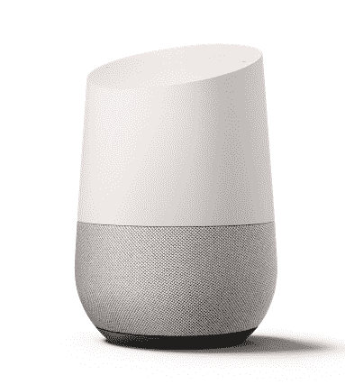

# 亚马逊是如何让黑客爱上 Alexa 的？

> 原文：<https://hackaday.com/2016/12/19/how-has-amazon-managed-to-make-hackers-love-alexa/>

我们的 hackspace 获得了一个 Amazon Dot，这是一位会员提供的。它似乎主要被用作背景音乐的来源，但它也催生了一种似乎永无止境的新娱乐，黑客空间的居民不断向他们的新电子伴侣提出越来越复杂和深奥的要求。从晦涩的早期雷鬼艺术家试图解决音乐争论的无休止的重新措辞和小心翼翼的发音，到我们的硅朋友令人捧腹的误听，乐趣从未停止。“Alexa，***关了！”结果似乎是“对不起，我在这个网络上找不到这个名称的设备”。

这只是一个黑客空间的经历，但它显然不会就此结束。似乎每隔一天，使用 Alexa 的[新项目都会通过 Hackaday timeline](http://hackaday.com/tag/alexa/) ，因此看起来亚马逊的在线个人助理在我们的社区中似乎很受欢迎。

很公平，你可能会说，我们总是任何新技术的早期采用者。但这是一个我想知道的发展。只有我一个人感到惊讶吗？花点时间研究一下这个问题是值得的。

## 大~~哥哥~~妹妹

一个支持 Alexa 的设备不断地监听其范围内的对话，当它检测到它的激活词时，在大多数情况下是“Alexa”，它会点亮并记录下随后的问题，然后将其发送到云托管的语音识别引擎，该引擎会对其响应做出决定。该公司声称，已经做出了很多努力来确保用户的隐私，但仍然有可能对 Alexa 设备范围内的任何人进行重大入侵。

鉴于我们的社区包含许多关注隐私和监控问题的人，我很惊讶这么多人接受了 Alexa。对于一个对黑客空间的安全摄像头心存疑虑的社区来说，全心全意地接受一家全球公司控制下的监听设备提出了一些有趣的问题，即我们与技术的真实关系。

## 你信任谁？

请想一想，你愿意拥有一台由 Hackaday 驱动的设备来监听你的对话吗？姑且称之为*扳手*。毕竟，我们是一群讲道理的人，我们的供应框架统治者不会居住在一个以鲨鱼为特征的邪恶巢穴里，那里有激光束。我们的设备会响应*有用的*命令，比如“扳手，sudo 给我做个三明治”。

Google Home listens to everything, until it hears the magic words.

因此，假设你有一个假想的黑客入侵者而没有问题，你还会让谁监听你的家呢？你*信任哪些公司*？就说软件公司吧，那么从一家 Linux 公司开始怎么样？典范？你们中的很多人使用 Ubuntu Linux，所以你已经将你的很多信息委托给他们的工作，为什么不呢？

当我们通过我们信任的公司走下坡路时，我们最终会到达那些*已经*制造了可以监听你每一句话的互联设备的公司。比如苹果。如果你拥有苹果设备，你会对 Siri 感到很舒服，不是吗？或许是谷歌？如今，安卓手机和谷歌家用电器都回应“好吧谷歌”。亚马逊的 Alexa 我们已经谈过了，但是微软的 Cortana 呢？我个人认为她是这一群人中最有用的，但每个人都有自己的看法。

## 沙地上轮廓不清的线条

在这一点上，我们社区中的许多人正在不舒服地从一只脚换到另一只脚，并喃喃自语着“但是微软，他们是邪恶的，不是吗？”

是吗？的确，在过去，这家总部位于雷德蒙德的软件巨头对开源社区采取了不太好的政策，但是它们比我刚刚提到的其他公司更邪恶吗？谷歌以“不作恶”作为他们的座右铭而闻名，直到他们[更名为 Alphabet 并放弃了这一观点](http://time.com/4060575/alphabet-google-dont-be-evil/)。事实是，无论他们遇到多么敏感的事情，任何组织都有可能做一些不靠谱的事情，这还是在我们开始谈论政府干预之前。

我在英国写这篇文章，那里的立法机构刚刚通过了一项影响极其深远的互联网监控法案。一家运营联网语音助手的公司可能被传唤到幕后，以提供对后来成为简单监听设备的不受约束的访问，这并非完全不可想象。没有必要成为那种戴着锡纸帽子，住在草丘上的人来得出这个结论，我们都知道这是可能的，我们会相信他们不会这样做吗？

## 帮助发展监控基础设施

因此，这些设备引发隐私问题对我们任何人来说都不应该是新闻，但有趣的是，一些公司似乎已经将他们的产品置于我们的自然防御之下，而其他公司却没有。那么回到我们的黑客空间成员，他们对监控大楼入口的闭路电视摄像头感到不安，为什么他们似乎很高兴在他们的空间里有一个来自一家公司的语音助理设备，而他们却开始对另一家极其相似的公司的设备感到害怕？

无论亚马逊发明了什么秘方来获得这种信任，我都想要一瓶。我的邪恶天才有了那东西，道格伯特就什么也拿不到了！