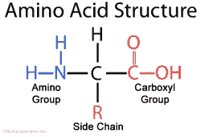
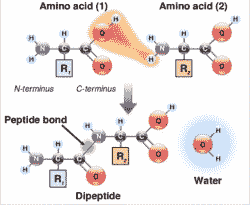

# 肽是如何制造的

> 原文：<https://hackaday.com/2017/08/22/how-peptides-are-made/>

健身、抗衰老霜和博莱霉素(一种抗癌药)有什么共同点？当然是肽类！肽是对生命至关重要的大分子。如果你把一种蛋白质分解成更小的片段，每一个片段都被称为肽。就像蛋白质一样，肽是由氨基酸以链状结构连接在一起组成的。每当你摄入一种蛋白质，你的身体就会把它分解成单独的氨基酸。然后，它将这些氨基酸以不同的顺序重新组合在一起，形成你身体需要的任何肽或蛋白质。例如，胰岛素是一种 51 个氨基酸长的肽。你的身体从你吃的蛋白质中获得的氨基酸合成胰岛素。

肽和小蛋白质也可以在实验室合成。肽合成在制药和护肤行业是一个巨大的市场。它们也被严肃的运动员和健身者用作类固醇的替代品，有点可疑。在这篇文章中，我们将回顾如何将氨基酸连接在一起形成肽的基本步骤。肽合成的化学过程很复杂，远远超出了本文的范围。但是制造肽的基本步骤并没有你想象的那么难。休息之后，请加入我的行列，对世界各地的实验室如何合成肽有一个基本的了解，并为您希望深入研究并自己制造肽奠定良好的基础。

## 氨基酸概述

自然界中有 [20 种氨基酸](http://www.fr33.net/aminoacids.php)。它们都有相同的核心——胺基(NH [2] )通过一个称为α碳的碳原子与羧酸(COOH)相连。给每个氨基酸的东西

Source via [Nutrients Review](http://www.nutrientsreview.com/proteins/amino-acids)

它的独特性是官能团，称为 R 基团或 R 侧链，也连接到α碳上。当构建肽时，一个氨基酸的胺基与另一个氨基酸的羧酸相连。R 官能团决定了肽的整体形状、结构和性质，因为它会形成键并导致肽自身折叠。按照惯例，NH [2] 侧画写在左边，COOH 侧画写在右边。NH [2] 侧称为 N 端，COOH 侧称为 C 端。

为了制造肽，你显然要从氨基酸开始。它们本身具有白色粉末的稠度，通常储存在塑料容器中。肽合成中使用的氨基酸需要对胺基进行某种保护，以防止不必要的反应。这是通过一种分子来完成的——其中最常见的一种叫做 [FMOC](https://en.wikipedia.org/wiki/Fluorenylmethyloxycarbonyl_chloride) 。注意这一点很重要，因为在将两个氨基酸连接在一起之前，我们需要从其中一个氨基酸的胺端去除 FMOC 保护基团，但将其保留在另一个氨基酸上。将 FMOC 留在一边是必要的，以防止相同的氨基酸与自身偶联。例如，如果我想将 A 耦合到 N，如何防止 A-A 耦合的发生？保持 A 在 FMOC 的保护下，确保我们只会得到 A-N 结果。

R 功能组也需要保护，但不包括在本基本介绍中。

## 固相肽合成

[Robert Bruce Merrifield](https://en.wikipedia.org/wiki/Robert_Bruce_Merrifield) won the Nobel Prize in chemistry for SPPS

固相肽合成(SPPS)是由化学家 Bruce Merrifield 于 1963 年发明的。他的技术已经成为制药业生产肽的标准。它的工作原理是将每个肽链连接到微小的聚苯乙烯珠上。这使得你可以将肽放在容器中进行化学反应。容器中的过滤器将保留树脂(附有肽)，同时允许溶液排出。

基本过程从预装树脂开始，这意味着序列中的第一个氨基酸已经连接到树脂上。然后进行连续的 FMOC 去除/偶联循环来制备肽链。整个过程是这样的:

1.  从氨基酸的胺侧除去 FMOC 保护基团。
2.  添加链中的下一个氨基酸和偶联活化试剂。
3.  重复步骤 1 和 2，直到序列完成。
4.  从树脂上切下肽。

记住，每个氨基酸的胺侧都被 FMOC 保护着。回想一下，将氨基酸偶联在一起是通过将一个氨基酸的 NH [2] 侧连接到另一个氨基酸的 COOH 侧来完成的。因此，当你去除 FMOC 基团并添加另一个氨基酸时，新氨基酸的 COOH 侧与你刚刚去保护的氨基酸的 NH [2] 侧偶联。

让我们来看看制作肽序列 NH [2] -HACK-COOH 的步骤。偶联是从 C-末端到 N-末端进行的，所以我们从[赖氨酸](https://www.emdmillipore.com/US/en/product/Fmoc-Ile-OH,MDA_CHEM-852010) (K)开始，然后偶联[胱氨酸](https://www.emdmillipore.com/US/en/product/Fmoc-Cys%28Trt%29-OH,MDA_CHEM-852008) (C，)然后偶联[丙氨酸](https://www.emdmillipore.com/US/en/product/Fmoc-Ala-OH,MDA_CHEM-852003) (A)，最后偶联[组氨酸](https://www.emdmillipore.com/US/en/product/Fmoc-His%28Trt%29-OH,MDA_CHEM-852032) (H)我们想从预先加载到[树脂](https://advancedchemtech.com/shop/fmoc-lys-wang-resin/)上的赖氨酸(K)开始。

## 第一步–去保护

首先要做的是去除序列中第一个氨基酸上的 FMOC 保护基团。这是用去保护溶液完成的。通常使用 20% [哌嗪](http://www.sigmaaldrich.com/catalog/product/sial/104094?lang=en&region=US)的 [DMF](http://www.sigmaaldrich.com/catalog/product/sial/phr1553?lang=en&region=US) 溶液，但是哌嗪越来越难以获得，因为它被用于制造街头毒品。或者，许多实验室现在在 NMP 使用 5%的 T4 哌嗪溶液。DMF 通常是肽合成过程中使用的主要溶剂，因为它比 NMP 便宜得多，但它们都可以互换。

我们需要一个带过滤器的容器，这样我们可以用去保护溶液浸没树脂，然后排出溶液，留下树脂。有很多方法可以做到这一点，但我推荐像这样的。

将测定量的树脂加入容器中，然后加入去保护溶液。你需要做数学计算，因为树脂的数量将决定所需的偶联剂和最终产品的数量。让它静置一会儿，然后沥干。如果你想检查你的脱保护步骤，FMOC 在 302 纳米处有紫外吸收。

一旦你完成了去保护，你需要用 DMF 清洗几次。留在容器中的任何哌嗪都会破坏偶联尝试。

这个过程把我们从 FMOC-K-树脂带到了 NH[2]-K-树脂。

## 第二步–耦合

[Amino Acid Wiki](https://en.wikipedia.org/wiki/Amino_acid)

现在是时候从 NH[2]-K-树脂到 FMOC-CK-树脂了。为此，C 的 COOH 侧必须与 k 的新去保护的 NH [2] 侧偶联。在这发生之前，COOH 必须被活化。有几种方法可以做到这一点，每个化学家都有自己的最爱。为了简单起见，我坚持使用[鎓盐](http://pubs.acs.org/doi/abs/10.1021/jo980807y)方法。你需要两样东西——水合形式的[霍伯特](http://www.sigmaaldrich.com/catalog/product/aldrich/711489?lang=en&region=US)和[DIEA](http://www.sigmaaldrich.com/catalog/product/sial/387649?lang=en&region=US)。

将这些和你的氨基酸溶解在 DMF 中，并加入适量到容器中。同样，你需要做数学计算来知道每一种要加多少。请注意，树脂量的比例需要准确，并使用 3 至 5 倍过量，以确保完全耦合。

耦合需要几个小时。如果你能用一种惰性气体来搅动，会有帮助。

## 第三步——重复并切割

真的就这些了。一旦你有了 FMOC-CK 树脂，下一步就是从 C 上除去 FMOC，并偶联上丙氨酸(A)。这个过程一遍又一遍地重复，直到你的序列完成。一旦完成，你将需要用一个叫做分裂的过程把肽从树脂上去除。

切割过程使用一种叫做 TFA 的强酸将肽从树脂中分离出来。它还会脱去任何 R 官能保护基团。警告–在没有适当保护的情况下，不要操作 TFA。你还需要清道夫来捕捉任何在分裂过程中脱落的 R 保护基团。

## 粗品

一旦肽从树脂上被切割下来，它就会在切割溶液中。你可以用非常冷的乙醚和离心机沉淀肽。之后，你需要使用某种质谱仪来分析你的粗肽，确保它们没有错误。可能会有，然后开始试错过程。很多大学会给你分析一下，收点小钱。

## 你是生物黑客吗？

我知道今天观众中有一些化学家。你如何看待一个生物黑客在他或她的车库里制造肽？可能吗？现实？坏主意？评论是你的，说吧。