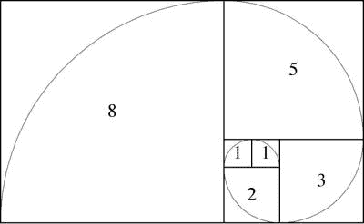
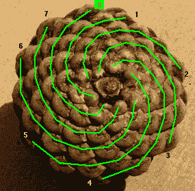

# 人脑如何储存数据

> 原文：<https://hackaday.com/2016/09/01/how-the-human-brain-stores-data/>

进化是一个聪明的家伙。下次你在户外漫步时，拿起一个松果，看看苞片鳞片的布局。你会发现一个明显的几何结构。事实上，这种相同的结构可以在玫瑰花瓣、向日葵种子甚至你内耳的耳蜗骨中看到。仔细观察，你会发现这种螺旋结构无处不在。它基于一系列叫做斐波那契数列的整数。Leonardo Bonacci 在试图计算从两只兔子开始他能制造多少只兔子时发现了这个序列。这很简单——将最右边的整数加到上一个整数上，得到序列中的下一个整数。从零开始，你会得到 0-1-1-2-3-5-8-13-21 等等。如果以几何形状的形式来看这个序列，他们可以创建正方形的瓷砖，其边长是序列中值的长度。如果你用一条无限曲线连接这些瓷砖的对角，你最终会得到你在松果和其他自然物体中看到的螺旋。

[Source](https://www.geocaching.com/geocache/GC44PG8_5-is-the-fifth-fibonacci-number?guid=a24657fc-a98b-411f-a706-e305feef77fe) via Geocaching

那么大自然母亲是如何发现这种几何结构的呢？它肯定不懂数学。那么它是如何形成错综复杂的结构的呢？事实证明，这种斐波那契螺旋是在最小的空间里压缩最多的东西的最有效的方式。如果一个人认真对待自然选择，这是完全有道理的。亿万年的尝试和错误，以尽量复制自己，偶然发现了一个数学原理，渗透在地球上的生命。

[Source](http://jwilson.coe.uga.edu/EMAT6680/Simmons/Essay1/6690ProjectFibonacciF.htm) via John Simmons

智人的大脑是同一进化过程的产物，并且已经进化了大约 700 万年。认为自然选择偶然发现的这种相同类型的效率不会出现在现代智人的大脑中是愚蠢的。我想让你明白效率的概念。自然选择发现斐波那契数列仅仅是因为它是完成特定任务的最有效方式。如果大脑有储存信息的任务，那么数百万年的进化磨砺了它，使它尽可能以最有效的方式储存信息，这是完全合理的。在本文中，我们将探索这种数据存储效率的思想，并让您思考它在计算机科学中的应用。

## 效率

以下是一个思想实验，旨在说明 700 万年的进化可能会使数据存储更加高效。有些人会注意到数据压缩技术和编程策略与资源最少的嵌入式系统的相似之处。然而，这个练习的目的是向所有技能水平的人展示效率背后的思维过程。

让我们右击我们的计算机，创建两个文本文件。我们给它们起什么名字并不重要，但是第一个文件中的内容应该是“这是文件一”，第二个文件中的内容应该是“这是文件二”。现在让我们将它们分别保存到硬盘上的一个位置。这两个文件现在存储在非易失性存储器中，每个文件占用一个单独的存储空间。效率低下是显而易见的。当我们拥有万亿字节的存储时，很容易忽略数据字节；如果我们想认真对待效率这个概念，我们需要把它看清楚。我们必须问自己——我们如何才能使这一过程更有效率？

现在让我们创建一个具有我们语言的完整单词集的查找表。每个单词都有一个标签。在这个思维实验中，让我们保持事物的简单性，并给它们贴上这样的标签:

*   01–这个
*   02–是
*   03–文件
*   04-一
*   05–两个

现在，我们的文本文件的内容将是“01 02 03 04”和“01 02 03 05”。这无疑是效率的提高，但是我们的查找表有一个问题。考虑“这个”和“是”这两个词。“这个”这个词包含了“是”这个词。此外，我们所有的单词似乎都是由 26 个单独的符号组合而成的。因此，我们必须在第一个查找表中制作另一个查找表以提高效率。

*   06–T
*   07–H
*   08–我
*   09–S

单词的标签 01 指向查找表，该表为我们提供了单个字母的标签。现在，单词“这”是“06 07 08 09”，“是”是“08 09。”这样更好。但是在我们的字母表中仍然有更多的低效。字母“T”由一条竖线和一条横线组成，而字母“H”由两条竖线和一条横线组成。为了便于解释，让字母“S”由弧线组成。由于字母“T”和“H”由相同线段的部分组成，我们可以创建另一个查找表来处理这个问题。

*   10—**—**
*   11 – |
*   12–c(“c”代表字母“S”中的弧线)

如果你绘制出我们的小思想实验，你会得到一个清晰的层次结构。这样，所有的单词只存储为线段和圆弧。字母“T”中的数据由字母“H”中的相同数据组成。所以把它们存放在不同的地方是没有意义的。相反，您只需将标签存储到线段中。这个层次化的过程沿着链一直重复，直到到达整个内存(或数据段)。在这种情况下，线段组合在一起形成字母，字母组合在一起形成单词，单词组合在一起形成文本文件中的句子。

同样的过程也适用于图像。人们可以把一辆卡车的图像分解成多边形，然后分解成简单的形状，再分解成线段和弧线。轮子的圆圈与代表餐盘或满月的圆圈的数据相同。沿着门和窗户的直线就是你现在正在阅读的文本中看到的数据。这是一种非常有效的存储信息的方式，也是经过数百万年的自然选择后人们所期望看到的。

## 不变性

许多神经科学家都会同意大脑以不变的形式储存记忆。例如，歌曲被储存为音高不变的记忆。C 调的一首歌和 g 调的一首歌的记忆是一样的，当你听到这首歌的时候，尽管传入频率不同，回忆起来的记忆是一样的。无论歌曲的调、乐器、风格都是如此。事实证明，如上所述以分层形式存储数据与不变性有关。你所要做的就是在层次结构层之间提供一点点[反馈](http://hackaday.com/2014/11/17/ask-hackaday-not-your-mothers-feedback/)，并允许较高层对较低层做出改变，以满足预测。这个过程将创建所谓的[不变表示](http://hackaday.com/2014/10/15/ask-hackaday-what-are-invariant-representations/)。让我们用另一个思维实验来探索这个概念。

想象一下，你面前有一张纸，上面有一个小孩子用蜡笔写的“这是一号文件”。这些字母扭曲变形，形状怪异。你的工作是用我们的层次结构来阅读句子。识别过程从最底部开始，查看各个线段。想象一下，你认出了单词“THIS”的前三个字母，但是字母“S”作为数字“8”出现在层次结构中。这孩子把字母写反了，然后试图改正。所以现在我们有一个问题:本该是“THIS”的地方却变成了“THI8”。

我们的数据存储的层次结构可以通过使用预测来处理这种模糊性，然后向它下面的层提供反馈。负责识别单词的层能够(通过过去的经验)预测字母“T”、“H”和“I”的组合应该后跟“S”，而不是“8”。“单词”层要么告诉下面的层它应该向上传递一个“S”而不是“8”，要么它将向上传递单词“THIS”给上面的层，而不管下面的层传来什么。结合预测的分级反馈方法创建了不变表示。由于这个过程，你可以毫无问题地阅读“THI8 I8 文件一”。你看到“THI8 I8”，但是回忆出来的单词是“THIS IS”，因为单词“THIS”和“IS”是以不变的形式存储的。请注意，如果没有句子的其余部分:“文件一”，回忆正确的单词记忆会更加困难。这是一个预测的例子；大脑利用上下文中的整个句子来提取正确的单词记忆。

我们已经表明，自然选择应该导致效率，不变性和效率是密切相关的。在数据存储领域，这些都是强有力的概念，甚至与现代计算机存储数据的方式相去甚远。

## 你的想法

有可能在计算机中复制自然的记忆存储方法吗？我们还必须考虑目前可用的资源。让我们面对现实吧——内存是丰富而廉价的。我们真的需要如此高效的内存存储吗？我会让你在下面的评论中回答这些发人深省的问题。