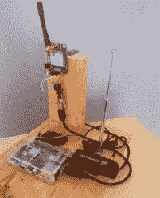

# 如何检测和发现流氓手机信号塔

> 原文：<https://hackaday.com/2016/08/09/how-to-detect-and-find-rogue-cell-towers/>

软件无线电一直在变得越来越好。戴着巴拉克拉法帽的黑客们也知道这一点。从几周前我们在纽约 HOPE 看到的情况来看，再过几个月，我们就能以低于 3000 美元的价格在台式电脑中安装一个毫微微蜂窝基站。在不到一年的时间里，邪恶、不良的黑客可能会窃听你的手机，或者在街对面停着的舒适的货车上阅读你的短信。你应该感到害怕，尽管各地的警察部门和每个政府机构都已经有了这种能力。

这些流氓手机网站有各种各样的功能，从能够跟踪一部手机，收集关于你给谁打电话以及打了多长时间的元数据，到更具侵入性的监控，如拦截短信和你在手机上访问了什么网站。EFF 称之为手机网站模拟器，这是对隐私的极大侵犯。虽然在 DEF CON 上有几个这样的设备，但我只在一个酒店房间里见过一个(你知道我在这里扔什么吗？).

无论威胁来自何方，流氓手机信号塔依然存在。仅仅知道它们的存在是没有帮助的——对政府或戴着巴拉克拉法帽的黑客的适当防御需要某种检测系统..在过去的几个月里,[艾瑞克·埃斯科巴]一直在研究一种简单的装置，当这些黄貂鱼或 IMSI 捕手中的一个开启时，任何人都可以检测到。将几个这样的设备连接在一起，他甚至可以知道这些流氓信号塔在哪里。

A Stingray / cell site simulator detector

黄貂鱼、IMSI 捕鼠器、手机基站模拟器和真实合法的手机信号塔都会广播包含信息的信标。该信息包括无线电信道号、国家代码、网络代码、大区域特有的 ID 号和发射功率。为了使检测流氓基站更加困难，这些信息中的一些可能会改变；例如，如果技术人员在现场工作，发射功率可能会降低。

为了构建他的流氓基站检测器，[Eric]正在将这些信息记录到一个由 Raspberry Pi、SIM900 GSM 模块、Adafruit GPS 模块和电视调谐器软件定义的无线电加密狗组成的设备中。从蜂窝基站接收的数据与 GPS 坐标一起被记录到数据库中。[Eric]在仪表板上放着他的流氓手机站点探测器，开车在附近转了一圈后，他有了大量的数据，包括纬度、经度、从手机信号塔接收的功率以及来自手机信号塔的数据。这些数据被扔在开源地理信息系统包 QGIS 上，显示了一个热点图，用红色突出显示了手机信号塔的可能位置。

这个设备真的不是一个只检测流氓手机信号塔的工具，它可以找到所有的手机信号塔。区分流氓和合法的塔仍然需要一些工作。如果热图显示一个蜂窝基站位于一个有大基站的围栏区域，那么这个基站很有可能是合法的。然而，如果热图显示一个手机信号塔只在你家街道的拐角处出现了一个星期，那可能会引起警惕。

这种手机基站模拟器探测器的未来工作将专注于使其更加自动化——在你的邻居周围散布三四个这样的设备，可以轻松地让你检测和定位任何新的手机信号塔。[Eric]可能还会用一个射频屏蔽圆顶来解决蜂窝基站的三角测量问题，圆顶上有一个围绕 GSM900 天线旋转的狭缝。