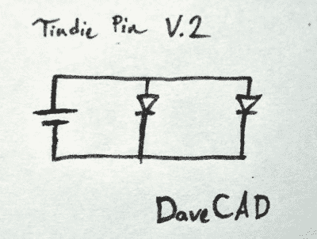
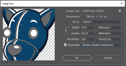
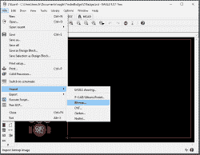
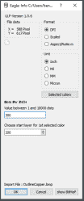
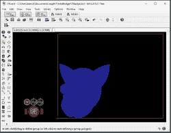
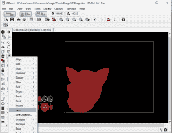
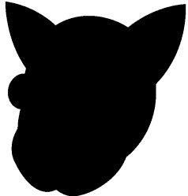
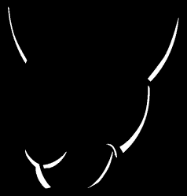
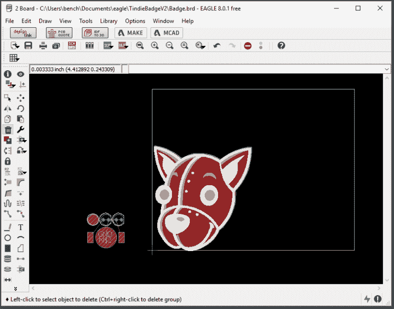

# 如何在 Eagle 做 PCB 美术

> 原文：<https://hackaday.com/2017/08/30/how-to-do-pcb-art-in-eagle/>

上个月，我有幸为 Tindie 设计了一款新的硬件。Tindie 的蜂王[Jasmine]和我在 DEF CON 召开前的十天内设计、开发并配备了 300 枚 Tindie 徽章。这些徽章获得了巨大的成功，它们向许多人介绍了焊接技术，受到了所有人的喜爱。

这个徽章是如此令人振奋的成功，它现在是官方 Tindie 赃物。我们将在即将到来的活动中分发一些这种闪闪发光的徽章。但是现在我们已经发完了所有的存货，这意味着我们需要生产更多。第二轮意味着订购 1000 块印刷电路板。

我们可以再做一次，从我已经设计好的 Gerbers 再订购一些 PCB。不过，我对这个徽章的第一个版本不是很满意，这是一个改进我设计的机会。这也让我有机会展示我在 Eagle 中创建艺术板的工作流程。

实际上，我将在这里展示的是“基准镍”的创造。几个月前，[Andrew Sowa]真实地拍摄了您的肖像，将颜色更改为普通 OSHPark PCB 上可用的颜色，并在 KiCad 中将其转换为不同的图层。这里有一些不同之处。首先，我将使用蓝色阻焊膜，尽管同样的技术可以应用于绿色、红色、黄色、白色或黑色阻焊膜。其次，这是 Eagle，我将用 BMP 导入完成大部分工作。这是做事情又快又容易的方法；如果你想要 KiCad 教程，可以看看[Andrew]的作品，或者我的[为 KiCad](https://hackaday.io/project/18508-mr-robot-badge/log/53901-this-is-how-you-do-art-in-kicad)做的过度复杂的多重丝网印刷过程。如果可以的话，我不推荐这个过于复杂的过程。我在 KiCad 的前一个项目花了 20 个小时做美术，我估计在 Eagle 需要两个小时。

也就是说，这是在 Eagle 中制作艺术板的简单、廉价和快速的方法。

### 该电路

 这个引脚的最初版本精选了一个*极其*简单的电路。这个徽章上唯一的电子元件是一个 1220 大小的 3V 电池，两个 5 毫米的 led，其他什么都没有。发光二极管有点奇怪——它们是低姿态、快速闪烁的红色、绿色和蓝色发光二极管。它们实际上非常便宜[在全球速卖通](https://www.aliexpress.com/item/100pcs-LED-5mm-Superbright-Transparent-Straw-Hat-RGB-Fast-Flash-Automatic-5-mm-DIP-Light-Emitting/32280310015.html)上，它们与设计配合得很好，而且经验告诉我，我不需要 led 的电阻。

在徽章的最初设计中，led 所需的电阻是一个争论点。是的，最佳实践告诉我，这些 led 需要一个限流电阻。然而，电池有内阻，发光二极管本身不仅仅是一个半导体——里面有闪闪发光的电路。我怀疑我是否真的需要限流电阻，但老实说，我不在乎去测量 led，也不知道我是否真的需要。无论如何，电阻器是第一次焊接工具中的另一个组件。没必要把事情弄得更复杂了。

电路将保持不变。

### 将 A 放入蒸汽中

在 Eagle 中创建艺术作品的高级操作方法与在任何其他软件中创建艺术 PCB 非常相似:

1.  做艺术。创造一个你想要的印刷电路板的样子。如果艺术品使用与 PCB 相同的颜色(裸玻璃纤维、铜、阻焊和丝印颜色)会很有帮助。
2.  将图片分成几层，每层只包含一种颜色。我们基本上是在做现场处理。创建棋盘矢量轮廓的加分。
3.  将棋盘的轮廓导入 Eagle。或者，导入整个图像的位图，并用铣削线在电路板周围描摹。
4.  对于棋盘的每一层，将 BMP 导入 Eagle。

基本上，这个过程很大程度上依赖于 Eagle 导入位图文件的能力。有更好的方法可以做到这一点，包括 SVG 导入，但这是快速、简单且万无一失的方法。话虽如此，让我们继续工作的例子。下面是几个样本，显示了从任何随机的中国板房蓝色 PCB 可用的颜色:

The colors available on a standard blue PCB from a random Chinese board house

从这里开始，只需要将 Tindie 头部的矢量艺术进行处理，并改变周围的颜色。接下来，只需将这种矢量艺术带到 Photoshop 或您选择的光栅编辑器中，将艺术的大小调整到最终 PCB 的大小，并将分辨率提高到每英寸 300 像素。

The ‘stock’ Tindie head. This is Joe’s art.

The PCB Tindie head. This uses colors only found on blue PCBs.

Reducing the size of the Tindie head, and bumping up the resolution to 300 ppi

这样，我们就可以开始创建位图导入 Eagle 了。为此，我们需要了解 Eagle 中的层，以及这些层是如何变成 PCB 的。

### Eagle 中的层

本教程假设您对 Eagle 有一定的了解。如果你正在读这篇文章，你可能已经用 Eagle 做了一块板，而且你已经从 OSHPark 或 Seeed 或 Elecrow 订购了这些板。如果没有，[读这个](https://hackaday.com/2016/09/22/making-a-pcb-eagle-part-1/)。你已经知道了铜、阻焊和丝网印刷的工作原理。鹰的层次不止这些；我们还需要和*负*层一起工作。也就是说，告诉 Eagle 我们*不需要*铜或者阻焊膜。

下面是 OSHPark 对 Eagle 中各层如何工作的解释。基本上，我们需要看两层。 ***tStop*** 和 ***bStop*** 是阻焊膜不该去的地方。这意味着最终的颜色将是银色(如果我们使用 HASL 工艺)或金色(如果我们使用 ENIG 工艺)。 ***线*** 和 ***线*** 是铜不该去的地方。这意味着阻焊膜会更暗。如果我们将 ***tStop*** 和 ***tRestrict*** 组合起来，我们会得到黄色或白色——裸露玻璃纤维的颜色。

需要特别注意的是丝网印刷(白色)和阻焊膜(蓝色、紫色或绿色)之间的关系。*丝网印刷必须在阻焊膜上进行。* 丝印不粘裸铜，在裸玻纤上板房大概会去掉。所有的丝网印刷下面必须有阻焊膜。

### 将多个图像导入 Eagle

是时候将我们的艺术分割成一些位图，并导入到 Eagle 中了。您计划导入的每个图像都需要以 300 DPI 的分辨率保存为 1 位 BMP。

第一个将是整个董事会的剪影。这将是顶部的铜层，我们将用它来描绘电路板的轮廓。是的，我们可以采取矢量艺术，并使用 DXF 进口铣削层，但我不信任 DXF 从 Illustrator 进口，这是一个小董事会，无论如何；手动做不会花太多时间。像这样导入剪影:

Import a BMP

Select ‘DPI’ as the format, and enter ‘300’ as the DPI. You saved your art as a bitmap at 300 DPI

Hit OK and the bitmap is imported

You can swap the layer of each import

现在，我们可以继续创建 silkscreen、tRestrict 和 tStop 层。如果你使用的是 Photoshop 或 Gimp，这就像用魔棒选择相关区域，然后创建一个新的位图文件一样简单。花一些时间来研究和理解下面的图像将如何转移到我们想要的 PCB 层上。直观地理解这一点会让你在设计纸板时达到一个新的艺术水平。当一点点努力就能产生一些非常漂亮的东西时，你为什么还要再制作无聊的板呢？

Silkscreen. The white area is where the silkscreen goes

The outline

The no copper area. No copper goes in the white area.

The bare copper mask. No soldermask goes in the white area.

由于所有的图像都是相同的大小，并已保存为 300 DPI 的 1 位 BMP，将它们导入 Eagle 会自动将它们上下对齐。结果是一个 Tindie 徽章，看起来应该像我们在 Photoshop 中设计的一样:

OSHPark is actually a really, really good online Gerber viewer. There are reports this is by design.

从这里开始，它只是一个简单的放置组件和绘制轨迹的问题。像这个徽章的最后一次修订，我用铜填充代替痕迹，但除此之外，这个徽章是相同的。

这是在 Eagle 中进行艺术创作的最简单、最快速、最 T2 的方式。在 Eagle 中有*更好的*做艺术的方式，即导入区域为 DXF，手动描摹为区域多边形。事实上，这基本上就是我在[创建 MrRobotBadge](https://hackaday.io/project/18508) 时所做的。如果你想在 KiCad 中得到一个好的指导，请查看这个教程。它完全依赖于 DXF 进口，但将这件相对简单的艺术品转移到 KiCad 花了大约 20 个小时。DXF 进口是一项巨大的工作，但在某些情况下，结果是值得的——了解他们的东西的人告诉我，MrRobotBadge 上的掩模和丝网印刷工作是他们见过的最干净的，这是用于板房的 seed。

这实际上是 PCB 艺术的当前状态。任何更有趣的设计都完全取决于实现，肯定有比我更有能力的艺术家。如果你想要一些在 PCB 媒介中能做什么的灵感，[有一个脸书集团](https://www.facebook.com/pcbpaintings/)。一些人正在用半色调处理来获得更多的色调，很快我将会尝试比通常的图层叠加更多的颜色。在那些实验开始有结果之前，这是在 Eagle 中制作艺术板的最简单也是最好的方法。