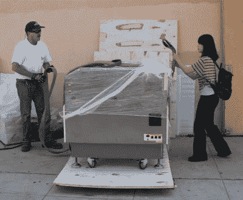
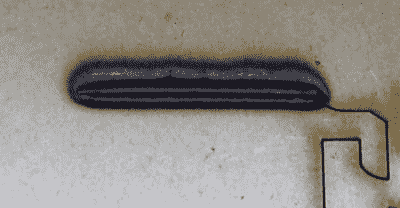
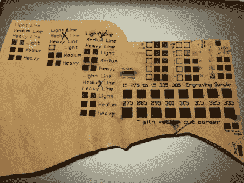
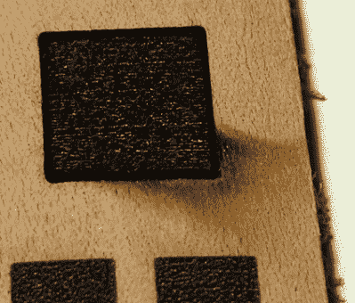
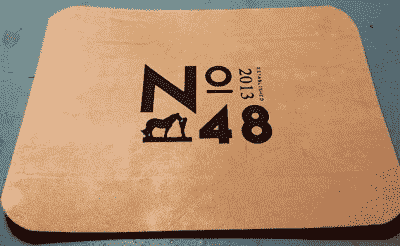
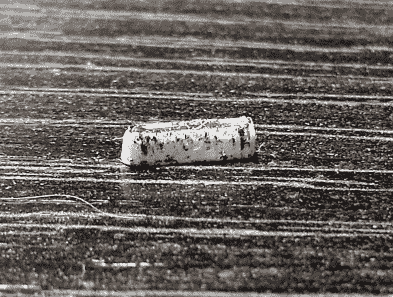

# 如何在激光切割中失败

> 原文：<https://hackaday.com/2016/05/31/how-to-fail-at-laser-cutting/>

激光切割机是数控电动工具，这意味着操作员以数字方式上传作业，然后按下 START，让机器完成所有工作，而他们则躺在吊床上啜饮玛格丽塔酒，偶尔会因为机器发出的声音略有变化而惊慌失措地跳出来。

像其他电动工具一样，激光切割机是围绕做好一件事而制造的，但它们需要操作员的全力关注和支持。操作员需要处理作业之前、之中和之后的所有其他事情。获得足够的结果并不太难，但是要获得真正专业的、可重复的结果需要工作、经验和对细节的关注。

人们经常关注成功的故事，但是从失败中学习更有教育意义。本着探索这个想法的精神，这里是我最喜欢的激光切割和雕刻失败的方法。不是*所有的*这些都是我自己的亲身经历，但都是*某个人的*亲身经历。

## 第一份工作之前失败的方法

[零空间实验室](http://charliex2.wordpress.com/2012/06/18/nsl-gets-a-laser-cutter/)得到一台激光切割机——这东西没有门和楼梯！【来源:零空间实验室】

**未能预料到设备的尺寸、重量以及移动和安装时的一般笨拙。不是所有人都有仓库、大型开放式车间或货运电梯。小的台式电脑很好，但是大的会太重而不能单独移动，并且可能不适合通过门口或楼梯井的拐角。(至少我不用像我们在零空间实验室的朋友一样，想办法把它吊到三楼。)**

**未能为激光切割机的扩展需求制定计划(和预算)。**一台激光切割机不仅需要动力，还需要排气和冷却。排气装置可以是风扇和管道，也可以是排烟装置/过滤系统。一般来说，保持排气管尽可能短和尽可能少的弯曲是一个好习惯。如果激光管是水冷的(这很有可能)，则需要在激光管附近安装一个冷却系统，使蒸馏水循环通过激光管。

**未能安装在噪音和气味不成问题的地方。**排气扇、激光切割机和冷却系统的噪音不如台锯，但仍然很大，激光作业可以持续很长时间，尤其是在雕刻时。如果附近有人，他们可能会反对这种噪音。此外，即使有适当的过滤和排气，激光切割也可能会产生至少*一些*气味——从燃烧木材到熔化塑料，取决于材料。根据环境的不同，即使是飘进来的轻微气味也可能不受其他人的欢迎。

**未能提供足够的气流。**挂一个排气扇从~~打印机~~切割器中吸取空气并将其排放到某个地方是不够的。空气不仅需要**去某个地方**，还需要从某个地方**进来**。一扇开着的窗户应该可以，但并不是每个地方都有窗户。

如果进风不足，排风系统会造成室内负压。如果任何地方有排水管，负压就会通过排水管把难闻的气味带到房间里。

## 作业开始前的失败

This job had run flawlessly dozens of times, then did this. The bits were still glowing when I hit the e-stop. Had I not had an air assist, it would have caught fire.

**未能使用(或拥有)压缩空气辅助。**向激光切割区域吹压缩空气有助于防止闪光，并通过引导蒸发材料向下远离切口，远离机器的透镜和镜子来保持清洁。未能参与(或未能*拥有*)空中协助可能会导致比平时更乱的切割和雕刻，并可能增加爆发的机会。

未能预见专有软件和工具链的问题。来自中国的廉价激光切割机可能会想运行自己的专有软件(尽管有可能[升级到 RAMPS](http://hackaday.com/2014/08/13/upgrade-that-cheap-o-laser-cutter/) 这样的开源控制器，或者直接进入 LaserWeb 这样的[项目)。除了处理专有的驱动程序和接口，每个 CAD 软件似乎都有怪癖，当涉及到绘图时，什么会或不会毫无问题地导入或导出，即使是使用理应标准化的格式。当你发现有一个专有的接口，一个喜爱的 CAD 程序的输出不可靠地兼容，或者你需要更换刚刚安装的机器上的控制器时，这是令人烦恼的。](http://hackaday.com/2016/01/26/stop-driving-laser-cutters-with-3d-printer-software/)

**假设材料的功率和速度设置正确的故障。**我从来没有在互联网上找到过第一次尝试就能得到好结果的设置(即使是和我的机器相似的设置)。有时他们甚至不亲密。把它们当作一个模糊的大方向去测试，不要不先测试就直接切割或雕刻生产材料。

## 作业过程中的故障

![Unattended laser cutter fire [source: Arcbotics]](img/d76063aae8e41868cad0190e55b81c76.png)

无人值守激光切割机火灾【来源:[Arcbotics](http://arcbotics.com/)

**无人值守机器故障。**简称“火”。火灾的风险从来都不是零，即使是以前运行没有问题的工作和材料。这些故障实际上是无法预测的，发生时很少或根本没有警告。

我有一份工作不知何故在激光切割机的内存中被破坏了，这导致了一个红热发光的伤口，那里应该有一个薄的切口。空气辅助使它一开始没有爆炸成火焰，但如果我没有在附近撞上紧急停止，它肯定会点燃，不管空气辅助。很高兴我不需要用我的灭火器。

硬件故障，如步进电机故障或皮带断裂也可能导致火灾风险。激光切割机在操作时需要有人照看，不管这个过程有多无聊。

This is what finding the right mix of settings and handling on a new material looks like. The end result of all this learning is shown at the end of this section.

未能对样品进行测试。要获得好的结果，除了正确的功率和速度设置之外，还有更多。即使激光功率和速度对材料来说在技术上是正确的，只有试运行才能揭示完全消除表面瑕疵所需的任何特殊处理，如烧焦或工件在工作过程中的移动。右边是一块皮革，填充了寻找如何获得最佳和最可重复结果的过程。

没有足够的冷却。一桶水和一个潜水泵可以让激光切割机启动并运行，但除了非常轻微的使用外，它不适合任何其他用途。类似 CW 系列(CW-3000、CW-5000)或同等产品的冷却器通过激光管循环供水并主动冷却。

如果你没有预计到主动冷却器的成本，发现一个桶和一个泵并不能减少它会破坏你的预算。

**开始工作前没有调整好焦距。**为获得最佳效果，镜头必须与工作表面保持固定距离。出于特殊目的(如[更粗的矢量切割线](http://www.instructables.com/id/10-Tips-and-Tricks-for-Laser-Engraving-and-Cutting/step6/Tip-6-Defocus-the-laser-for-thicker-vector-lines/)，或[激光折纸](http://hackaday.com/2013/11/07/laser-origami/))有意使激光散焦是可能的，但忘记聚焦通常意味着工作被毁了。

**机器归零失败。**最糟糕的事情莫过于正确设置好一切，然后在工作开始时发现激光没有在材料上的预定位置。

Edge of masking lifted during engraving, causing scorching. It doesn’t wash off.

**需要时未能应用遮蔽。**在材料上贴上胶带可以防止烧焦损坏表面，并且通常可以使切割和雕刻更干净。许多塑料的一面或两面都有保护膜。应用胶带(在标牌店出售)是大多数材料的良好替代品。

也有可能无法正确应用遮罩*。如果面具抬起或移动，会破坏作品。*

 ***未能在不需要时*移除*屏蔽。**当轻轻雕刻一些东西时，最好是*而不是*应用蒙版，并移除任何存在的东西。通过掩模或保护膜进行的光雕刻只是给人一种熔化的塑料外观。我从来没有发现任何设置或设置的组合可以干净彻底地去除蒙版(和粘合剂)，而只是轻微地雕刻其下的材料。

![Engraving the front of a mirror yields a double image [source: obrary.org]](img/2368813ce0378109394f6939c4d8fe97.png)

在镜子正面雕刻会产生双重影像【来源:obrary.org】

**未能说明材料的独特性质。即使其他一切都是正确的，一种材料本身也可能具有抛出曲线球的特性。比如雕刻镜子。这没什么错，但雕刻正面会导致双重图像(因为表面得到了雕刻，而雕刻从背面反射回来。)**

切割薄而轻的材料时，轻的碎片会在切割过程中抖动，或者在切割完成后完全飞出排气系统。一种解决方案是留下小“标签”将零件固定到材料的其余部分。

**未能清除碎片。**通常情况下，激光在穿透材料后会撞击激光床，但不会做任何事情。如果它击中激光切割机床上的碎片，这些都是火灾和灼伤的危险。

**因切坏某物而失败。**有些材料不属于激光切割机。切割聚氯乙烯会释放出氯，氯会腐蚀激光机内几乎所有它能接触到的东西。一些类型的胶水和材料会散发出污垢，当被激光击中时会粘住镜子和透镜。我和一个曾经试图用激光切割某种磁片材料的人聊过。“我不得不更换每一面镜子和镜头，”他说。他不喜欢谈论它。

令人高兴的是，至少在聚合物方面， [如果你不确定的话，一些简单的测试可以揭示很多关于材料是由什么组成的](http://hackaday.com/2015/03/14/how-to-identify-plastics-before-laser-cutting-them/) 。

## 当没有失败时

This was the result of systematically finding all the things that could go wrong, and then not doing any of them (or preventing them from happening.)

如果一切顺利，你可以得到一些非常好的结果！这是我为一个客户雕刻的一块皮革。上面列出的任何一件事都会彻底毁掉这件作品，所以测试碎片(如上图)是至关重要的。同样重要的是进行试运行，以确保材料在雕刻过程中或雕刻后不会出现任何意想不到的情况。

## 作业后发现的故障

**未能说明副作用。**有些材料会有副作用。工作进行得很顺利，但是更仔细的检查发现了一些不理想的东西，但却是所使用的工艺或材料所固有的。

Magnified to show how “dirty” and rough a cut on some materials can be. This is a 5mm x 1.5mm piece of two-layer acrylic (white with a thin layer of black on top.)

*   非常薄的塑料会因激光的热量而变形。狭窄的线条因受热而弯曲，随着边角翘起，碎片会变成轻微的“碗”形。将塑料在低于材料软化点的温和温度下放置几个小时进行退火有时会有所帮助。
*   一些类型的塑料最终会在切割处出现粘性边缘。用矿油精擦擦就能清理干净。
*   激光切割的木头闻起来像营火。如果放在露天的某个地方(最好是在阳光下)，气味会在几天后消散。)为了加快这个过程，我用箔纸包好新鲜切好的小块，然后把它放在温和的温度下(100-120 华氏度)加热几个小时，结果很有希望。
*   雕刻或切割白色或浅色塑料时，很容易用任何东西污染新切割或雕刻的表面(布满微脊),例如其他雕刻的颗粒，甚至是脏指纹。擦洗没有太大帮助，但是我用超声波清洗的时候效果很好。

**未考虑切口(激光切割的宽度)。**当切割其切割边缘适合其他零件(如手指关节)的零件时，这是一个问题。零件可能会太紧或太松。

未能说明隐性成本。主要对非爱好用例有意义。激光切割机一次只能做一件事，在操作时必须全神贯注。即使是小工作也有不小的成本，因为它不是一个完全自动化的工具——在激光切割机中，一项工作可能需要 1 分钟，但对于操作员来说，从开始到结束可能需要更长的时间。此外，一个意外的错误可能会毁掉一个产品，需要重做。

## 利用失败来改进

为了避免重复错误，培养记录和不断改进的意识。毕竟，如果什么也没学到，失败只是浪费。如果你正在专业地使用激光切割机，任何你可以消除或简化的步骤都会在任何重复的任务中产生回报。不要分心试图改善激光切割机本身，使它做得更多，更快。机器可能看起来像是瓶颈，但它应该是它周围的一切最有资格改进和精简的，因为在工具和操作者之间，操作者是更灵活的一个，能完成最多的任务。与任何其他 CNC 工具一样，这个过程不仅仅是传输一个文件和点击开始。*