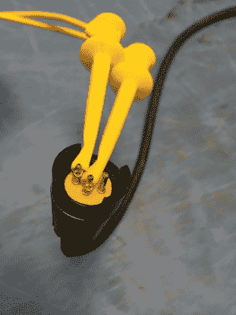
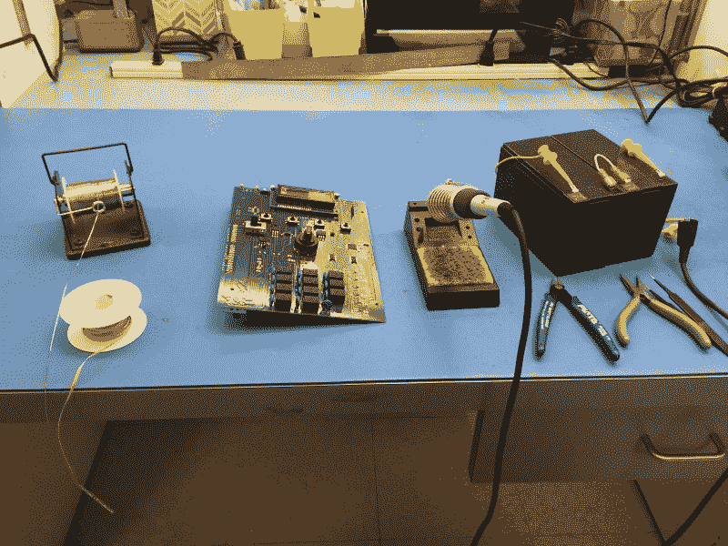

# 如何让你的 Weller 无线

> 原文：<https://hackaday.com/2016/09/01/how-to-make-your-weller-wireless/>

有时我会遇到便携式烙铁，我对它们的印象从几乎可用到完全无用。当我使用一个流行的丁烷动力模型并思考它是否真的比铜线和蜡烛更好时，我有了一个想法。一个常规的老式韦勒站在 24 伏交流电下运行，并以磁激活恒温方式进行所有的温度调节，所有这些优点都发生在手机本身内。有理由相信，使用 DC 信号源，它也能表现得一样好。

在这种情况下，我们忽略了在交流电流上切换 DC 电流对机械触点的负面影响。毕竟，我们在“战壕”里，在任何我们可能需要这样一个设备的地方。我用几节刚从 UPS 上卸下的凝胶电池 12 伏 7 安培小时的电池把它们串起来，就这样，一个完全由电池供电的熨斗，性能与我长凳上的那块相当。

Connecting Power to the Weller Iron

正好在 24 伏时，熨斗的热循环速率与使用台式电源时的速率相同。只是坐在空载下，它大约每十秒循环一次，热容量或性能没有明显的差异。一对充满电的电池可以使用一整天。从完全充电(每个电池上 13.5 伏)开始的导通状态电流消耗产生大约 2 安培的消耗。随着电压开始降低，电流关断周期将变得更短，正如人们所预期的那样，但在电池完全耗尽之前，传热没有下降，这需要一个工作日的大部分时间。

在这种情况下，我使用了古老的韦勒 WTCPT 站的手机。对于正在进行的使用，我不建议这样做，因为在装置内使用机械触点，DC 的开关会缩短大多数机械开关的寿命。目前，我正在等待一些便宜的易贝 Hakko 手机的到来；我肯定它们是山寨的，但用一个简单的 PWM 和一个反馈回路控制器进行实验也很好，因为基本的 Hakko 设计也利用了 24 伏电源。一个自动关闭计时器也将是方便的，以避免由于健忘的操作人员过早滥用电池。

