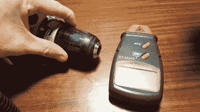
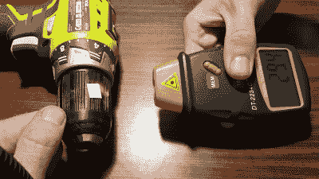

# 如何使用照片转速表

> 原文：<https://hackaday.com/2017/03/17/how-to-use-a-photo-tachometer/>

如果你对任何东西感兴趣，即使是宽泛的黑客光谱中模糊的机械性，你也会接触到旋转的东西。有时候，准确知道它们旋转的速度很重要！当你需要知道角速度时，你需要一个设备来测量它。那个装置是转速计。最有用的转速表是非接触式光电转速表。

 光电转速表的基本工作原理非常简单。该设备包含一个光源——通常是一个激光器，可以产生一束聚焦的相干光束。这束光能够被反射物体反射回来。

Note the marker on the chuck of the drill, which reflects light back to the phototachometer. Credit: Lewin Day

要使用光电转速表，首先要在你想要测量的旋转表面上做一个反射标记。你还必须确保旋转表面的其余部分相对无反射。一个简单的方法是用记号笔在黑色或暗淡的金属轴上画一个白点。然后，将光电转速表发出的光束对准旋转轴上的标记。每当反射点通过光电转速表的光束时，一些光被反射回设备，并被光传感器拾取。通过计算光传感器在给定时间内被触发的次数，可以确定被测机器的转速。

例如，假设我们有一台转速为每分钟 1200 转的电机。我们将光电转速表的光束对准我们在电机轴上标记的白点。让我们假设光电转速表在一秒的单位时间内计数它看到的脉冲数来进行测量。在一秒钟内，白点将通过光束二十次，当它经过时触发我们的光传感器。光电转速表中的微控制器然后进行一些简单的数学运算——每秒 20 个脉冲，乘以 60 秒——我们在显示屏上得到每分钟 1200 转的转速。

很容易想象，如果我们的轴旋转得更慢，大约每分钟 10 转，我们的光电转速表每六秒钟只能看到一个脉冲。如果我们把转速提高到每分钟 12 转，仍然是每五秒一次脉冲。我们的转速表在试图测量如此低的转速时会受到影响，它需要很长时间才能注意到任何变化。在这种情况下，我们能帮上什么忙吗？

为什么是的，有！我们可以在旋转轴上放置额外的反射点。让我们在旋转电机轴上放置十个点。现在转速为 10 RPM 时，我们每 0.6 秒得到一个光脉冲，转速为 12 RPM 时，每 0.5 秒得到一个光脉冲。我们的转速表现在能够更快地响应低范围内的速度变化——我们只需要记住将显示速度除以 10，以说明我们的额外标记。

A more reflective marker works better. Credit: Lewin Day

您还可以使用其他技巧来提高性能。许多照像机的盒子里都有反光带。这是一种特殊的胶带，充满了许多微小的玻璃球，允许胶带从任何角度反射光线。在旋转的机器上用这个代替白漆，可以让我们用光电转速表在不垂直于标记的角度进行测量。我自己用它来测量我汽车的引擎速度。不可能将转速表直接指向曲轴，但通过反光胶带，我能够从上方以一个奇怪的角度将激光指向曲柄滑轮，并仍然获得良好的读数。

照片转速表的真正威力在于，除了一点油漆或胶带之外，无需对机器进行任何重大修改，就能轻松获得准确的转速测量值。这是一种非常棒的非接触式测量方法，在易贝上不到 20 美元就能买到一台可用的摄影仪。我在 YouTube 上总结了一篇关于 DT2234C+转速表的评论，供您参考。这是那种你会发现藏在工具箱后面非常有用的东西。你永远不知道什么时候需要它！

 [https://www.youtube.com/embed/QVSQLfnKytk?version=3&rel=1&showsearch=0&showinfo=1&iv_load_policy=1&fs=1&hl=en-US&autohide=2&wmode=transparent](https://www.youtube.com/embed/QVSQLfnKytk?version=3&rel=1&showsearch=0&showinfo=1&iv_load_policy=1&fs=1&hl=en-US&autohide=2&wmode=transparent)

