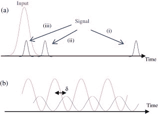
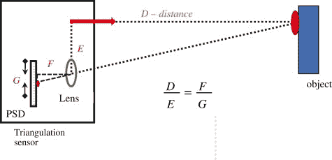
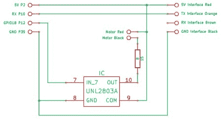

# 如何将激光雷达与 Raspberry Pi 配合使用

> 原文：<https://hackaday.com/2016/01/22/how-to-use-lidar-with-the-raspberry-pi/>

对于黑客来说，廉价而精确地测量自主车辆或机器人与附近物体之间的距离是一个具有挑战性的问题。了解距离是避障的关键。用小型机器人撞上东西可能是一个小问题，但对于像自动驾驶汽车这样的大型机器人来说可能是致命的。

我对用于避障的距离测量[的兴趣源于我参加了 2013 年 NASA 样品返回机器人(SRR)竞赛](http://www.mysticlakesoftware.com/introduction)。我使用网络摄像头进行视觉处理，并尝试了各种视觉技术进行测量，但都没有成功。在比赛中，两名参赛者使用了扫描激光雷达，这激起了我对他们的兴趣。

激光雷达是一种激光测距设备。该名称由术语 *LI* ght 和 ra *DAR* 组合而成，并不像通常所说的那样，是一个以类似于其前身“*RA*dio*D*detection*A*nd*R*anging”的方式衍生而来的首字母缩写词。根据韦氏词典的说法，这个术语第一次使用是在 1963 年。激光雷达的一些早期用途是由阿波罗 13 号测量云和月球表面。随着激光尺寸的减小，人们发现了其他用途，包括作为军事用途的测距仪。

 [](https://hackaday.com/2016/01/22/how-to-use-lidar-with-the-raspberry-pi/urg_04lx_ug01_top/) Commercial Lidar [](https://hackaday.com/2016/01/22/how-to-use-lidar-with-the-raspberry-pi/xv-11_sensor/) Neato Lidar

单个激光束只能提供单个物体的范围。就像飞机控制雷达在空中摆动光束一样，扫描激光雷达扫描激光。用于自主移动设备的激光雷达的应用需要垂直和水平扫描大范围的区域，以提供距离测量的点云。类似的事情可以用[红外线传感器来完成，就像我们之前看到的](http://hackaday.com/2013/12/21/3d-scanner-using-a-sharp-infrared-sensor/)一样，但是精确度不如激光。

距离测量有多种方法，但主要有两种。一种测量激光脉冲的飞行时间，而另一种使用激光束的偏转角度。

## 飞行时间测量

你熟悉基本雷达和声纳的工作原理——发出一个脉冲，然后测量接收到返回信号所需的时间。时间除以光速或声速，得出信号来回传播的距离。除以 2 得到到物体的距离。这是飞行时间(ToF)测量。

正如你可能会怀疑的那样，鉴于光速，事情变得棘手了。计算机的先驱，少将·格雷斯“惊人的格雷斯”霍普会拿出 11.80 英寸的金属丝来演示光在真空中一纳秒内传播的距离。对于机器人来说，这就是我们感兴趣测量的距离大小。很难测量不到一米的距离，只发送一个脉冲并记录返回信号的时间，因为信号大约在 7 纳秒内返回。

围绕这一点的一种技术是通过振幅或频率连续调制信号。发射和接收信号之间的相位差与到物体的距离成正比。使用调制的激光雷达可以测量低至厘米。

有一些 ToF 的扫描激光雷达的商业供应商，但价格比大多数爱好者的花费要高一点。一个相对较新的进入者 PulsedLight 提供了一个[单光束 ToF 激光雷达](http://pulsedlight3d.com/)在黑客的价格范围内，但他们的供应商都是延期交货。

 [](https://hackaday.com/2016/01/22/how-to-use-lidar-with-the-raspberry-pi/tof-2/)  [](https://hackaday.com/2016/01/22/how-to-use-lidar-with-the-raspberry-pi/triangulation/) 

## 三角测量

三角测量激光雷达使用的技术与黑客已经使用多年的[夏普红外测距传感器](http://www.sharp-world.com/products/device/lineup/data/pdf/datasheet/gp2y0a21yk_e.pdf)相同。发射器是单个源，但是接收器是 1 维或 2 维接收器阵列。接收器元件相对于发射器的偏移产生了三角形的基线。发出信号和返回信号是三角形的另外两条边。简单的三角学提供了从基线到物体的距离。

光学协会描述了这些和其他用于测量距离的技术。

# Neato 机器人真空激光雷达

在参加 2013 年美国宇航局 SRR 竞赛时，我不知道的是，Neato Robotics 在 2010 年发布了一款真空吸尘器，它使用扫描激光雷达来感知真空的周围环境。这使得机器人能够避开障碍物，而不是像以前的机器人吸尘器那样撞到障碍物。

Sparkfun 对真空进行了一次[拆卸，并对激光雷达进行了研究。从 2010 年 11 月](https://www.sparkfun.com/news/490)开始的一场[长时间的讨论在 Trossen 机器人论坛上展开，黑客们将注意力集中在激光雷达上剖析真空。甚至还有黑客入侵激光雷达的小奖品。](http://forums.trossenrobotics.com/showthread.php?4528-Hacking-the-Neato-XV-11)

不幸的是，该主题中的许多链接已经不存在了，但仍然值得一读，因为消息中列出了许多细节。论坛上的其他一些帖子有更多的信息。一个特别有趣的发现是在 Neato 激光雷达之前的一篇研究论文，但它是最终设计的基础。它概述了 Neato 创建工程产品所需的细节。

好消息是有一个关于真空和激光雷达的信息汇总的维基。活跃的黑客参与者之一，[Nicolas "Xevel" Saugnier]创造了一个[小型 USB 接口板](http://xevelabs.com/doku.php?id=product:usb2lds:usb2lds)为激光雷达供电并连接到其串行接口。2014 年夏天，当我期待进入 2015 年美国宇航局 SRR 号时，我获得了几个激光雷达单元和电路板。我使用【Xevel 的】 [Python 软件](https://github.com/Xevel/NXV11)和[机器人操作系统](http://wiki.ros.org/)中可用的软件包让激光雷达单元工作。

扫描激光雷达允许 Neato Robotics 使用距离测量数据实现[同步定位和制图](http://ocw.mit.edu/courses/aeronautics-and-astronautics/16-412j-cognitive-robotics-spring-2005/projects/1aslam_blas_repo.pdf) (SLAM)。这使得机器人能够规划清洁路径，而不是使用早期真空吸尘器之前的颠簸和随机移动，即[醉汉走路](https://en.wikipedia.org/wiki/Random_walk)。这使得 Neato 可以更快地完全覆盖整个房间。在这个[Neato 演示视频](https://www.youtube.com/watch?v=hf1zY8vRC2E&feature=related)中，请注意机器人是如何绘制出它去过的地方和遇到的障碍的地图的。特别注意它如何使用激光雷达数据巧妙地绕过一个障碍。

# Pi 2 和激光雷达

尽管我已经放弃了 SRR 竞赛，但我仍然对机器人很感兴趣。激光雷达就像神话中的塞壬一样吸引着我。当我意识到 lidar 串行接口与 Raspberry Pi 完全匹配时，我最终屈服于他们的召唤，因为两者都工作在 3V3 电平。这将消除 USB 接口。一个[类似的努力](http://blog.tkjelectronics.dk/2014/08/handheld-xv-11-lidar-with-stm32f429-and-matlab/)是【Thomas Jesperson】在 2014 年使用 STM32F429 板制作了一个[激光雷达运行视频](https://youtu.be/WkW55b-WQx4)。

## 激光雷达物理

激光雷达是一个密封的装置，一端悬挂着一个马达。马达驱动一个转速约为 300 转/分的转台。转台包含激光和接收传感器，并通过旋转提供周围区域的 360 度扫描。激光和接收传感器在转台外有两个光学端口。有两条带有 JST 连接器的短电缆来自激光雷达。两针连接器为电机供电。四针连接器为控制电路和 3V3 串行接口提供 5V 电源。引脚排列如下:

**Motor Cable**
Red: 3V3 or PWM
Black: Ground**Interface Cable**
Black: Ground
Red: 5V
Brown: RX
Orange: TX

在真空中，电机由 12V 电源供电，使用 PWM，占空比约为 25%。这意味着电机需要大约 3V 才能以正确的速度运行，黑客随后的测试表明这是真的。USB 接口板使用由 a [PID(比例积分微分)](https://en.wikipedia.org/wiki/PID_controller)环路控制的 PWM，从 USB 连接器的 5V 输入运行激光雷达，以保持电机的速度。为什么要用 PWM 和 PID？以在旋转转塔磨损并收集污垢、灰尘和其他碎屑时保持其恒定的 RPM。在我的测试中，我注意到电机会根据正负连接向两个方向转动转台。界面仍然工作良好，但是数据点的顺序将被颠倒。通常情况下，转台逆时针转动。

提醒一句:在一些早期的设备中，接口使用 3V3，因此将它们连接到 5V 可能会损坏接口。

我最初在 Pi 和 lidar 之间的连接又快又脏。我将电机连接到 Pi 的 3V3 输出，它工作了。Pi 3V3 的输出被规格限制在 50 毫安，激光雷达维基说电机将消耗 64 毫安。我量了一下我的，它画得更多。我还将接口的 TX 引脚连接到 Pi 的 RX(引脚 10)。使用 Raspbian Jessie 下的 CuteCom，我可以读取炮塔手动旋转时的数据。随着这些基本测试的完成，是时候认真一点了。

我选择使用我在零件柜里找到的一个 ULN2803A 达林顿晶体管阵列来驱动马达。该 IC 可以轻松处理驱动电机所需的电流，并包括驱动感性负载所需的保护二极管。我不打算做电机的脉宽调制，但想关闭和打开它。我将 Pi 的 5V 引脚 2 连接到马达连接器上的红线。黑色电线通过一个 15 欧姆的电阻连接到 ULN2803A 以降低电压。这为控制电机设置了低端配置。接口电缆连接到 Pi 上的 5V、接地和 RX 引脚。

 [](https://hackaday.com/2016/01/22/how-to-use-lidar-with-the-raspberry-pi/circuit-layout-600-high/)  [](https://hackaday.com/2016/01/22/how-to-use-lidar-with-the-raspberry-pi/pi2-lidar-schmatic-600/) 

为了测试电机控制，我使用了 GPIO 引脚到文件系统目录 */sys/class/gpio* 的映射。一旦管脚被*输出*，每个 GPIO 都可以在这里被控制。然后，命令可以设置引脚的方向，并打开和关闭引脚。我使用的命令控制 GPIO 18(引脚 12):

```

echo 18 &gt; /sys/class/gpio/export
echo out &gt; /sys/class/gpio/gpio18/direction
echo 0 &gt; /sys/class/gpio/gpio18/value
echo 1 &gt; /sys/class/gpio/gpio18/value

```

回显“0”和“1”时，分别关闭和打开引脚。这很有效，我可以使用 CuteCom 查看数据。

如果您连接到串行端口，然后给接口通电，会出现一个有趣的结果。激光雷达生成一条欢迎消息:

> *Piccolo 激光距离扫描仪*
> *版权所有(c) 2009-2011 Neato Robotics，Inc.*
> *版权所有*
> *Loader \ 0x09v 2 . 5 . 15295*
> *CPU \ 0x 09 f 2802 x/c001*
> *序列号\ 0x 09 ksh 34313 aa-0140854*

 *此外，如果您手动旋转转塔，会出现一条“旋转”的消息，并建议通过发送一个*中断*或三个 *esc* 字符来提供命令功能。Wiki 上提供了有关这些命令的信息。

## 激光雷达软件

现在创建一些粗略的软件来看看这一切是如何工作的。当然，我使用 C++，所以我为 Pi 2 安装了工具链，并且发现编译速度对于开发来说已经足够了。我开始使用 Geany 编程编辑器和 makefiles 这是我在使用激光雷达的 Python 代码时了解到的设置。它可以处理多种编程语言，我已经把它作为 Ubuntu 和 Raspian 上的通用文本编辑器。但是我最终放弃了 Geany，并在 Pi 上安装了 Eclipse CDT，因为它在编辑后不能正确地重新格式化 C++代码。Eclipse 在 Pi 上工作得非常好。实际上，我对这种转变有点失望，因为使用 Geany 时，我正在重新学习如何使用 makefiles，这是我在使用 Eclipse 时已经失去的技能。

在寻找用 C++编程 GPIO 的信息时，我找到了[Gordon Henderson]的[wiring pi 库](http://wiringpi.com/)。它不仅支持原始 GPIO 编程，还支持许多 Pi 子板。另一个吸引我的地方是它有一个串行端口接口，所以我不需要在 Linux 上详细介绍，这对我来说是新的。最终，我甚至使用它的简单线程功能来处理一个荒谬的最小用户界面。[Gordon]也有一个[实用程序，你应该看看](http://wiringpi.com/the-gpio-utility/)，它可以从命令行控制引脚，比我上面展示的写到目录中更加完整。

我在 WiringPi 中发现的最后一点是在一个 GPIO 引脚上进行硬件 PWM 的能力。那是 GPIO 18。我最初使用 GPIO 4(引脚 7)来控制电机，但当我发现这个功能时，我就换了。代码目前为 PWM 设置了一个恒定值，但最终我想添加(并写一篇文章)一个 PID(比例积分微分)控制系统环路来保持恒定速度。在 GPIO 18 上设置 WiringPi、线程和 PWM 非常简单:

```

	wiringPiSetup();
	piHiPri(10);  // set program priority to run better
	piThreadCreate(key_read);

	pinMode(turret, PWM_OUTPUT);
	pwmWrite(turret, 950);

```

线程的作用只是在输入任何键并返回 hit 时停止程序。当`run`设置为 false 时，读取串行输入的主线程退出，程序在关闭转塔后退出。实际的线程非常简单:

```

PI_THREAD(key_read) {
	cin.get();
	run = false;
	return 0;
}

```

读取串行输入很简单，只需读取字符，但是数据本身虽然简单，但需要一点敲打。转台每转有 360 个样本，因此每秒 5 转的数据量是巨大的。有 90 个数据包，每个数据包包含四个数据点。每个点由四个字节的数据表示:距离、信号强度、无效距离位和无效强度位。此外，每个数据包都以一个起始字节、一个作为数据包编号的索引字节和两个表示转台转速的字节开始。数据包以两个校验和字节结束。下面是我如何将这些数据映射到结构中的:

```

	struct DataPoint {
		bool invalid_data;
		bool bad_strength;
		float distance;
		unsigned int strength;
	};

	struct Block {
		unsigned int index;
		unsigned int speed;
	};

```

我没有存储数据包，只是报告它们来验证我看到的是好数据，我的计算看起来不错。距离数据是一个以毫米为单位的整数，我将其转换为英寸。校验和的代码在维基上，但是我还没有实现它。

# 包裹

这仅仅是 Neato 激光雷达工作的开始，但是一个很好的开始。硬件运行良好，软件的基础已经掌握。我可以得到数据，并看到它是有效的。WiringPi 库是我继续研究 Pi 的一个很好的发现。

接下来的步骤是让校验和例行工作，扩大所谓的用户界面，以允许控制转台的操作，并增加一个 PID 回路，以保持恒定的转速。由于 UNL2803A 芯片在那里，我将用它来控制接口的电源。我还想看看从我的桌面交叉编译代码，并进行远程调试。当我做这些改变的时候，我会把代码组织成类，看看如何在机器人上使用它。*