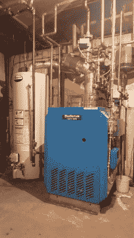
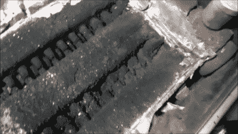
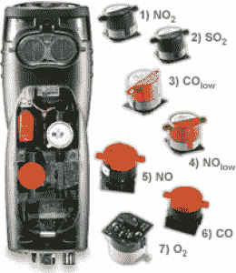
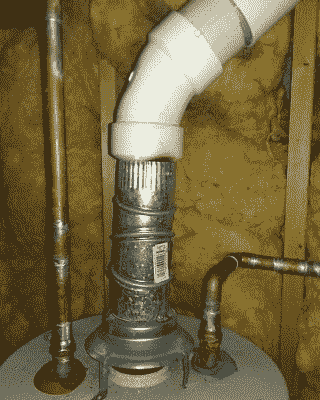

# 暖通空调技术人员——上门服务的黑客

> 原文：<https://hackaday.com/2016/03/28/hvac-techs-hackers-who-make-house-calls/>

据说黑客迷恋复杂的网络。在 60 年代和 70 年代，电话网络是世界上最大的，为整整一代蓝拳手机用户唱着警笛。我开始靠近房子一点。小时候，我对我们家地下室的供暖系统很着迷:一个管道网，中间有一个巨大的锅炉。它知道什么时候开始供热，什么时候开始供应热水。我花了几个小时绘制管道和电气输入输出图，试图理解一切是如何运作的。我的父母仍然讲述着我如何要求检查邻居的供暖系统的故事。我甚至缠着我幼儿园的维护人员，直到他们最终带我下来看那个让大楼保持温暖的巨大蒸汽锅炉。

我的家人确信我长大后会成为一名暖通空调技术人员。事实证明，电子和嵌入式系统是我的职业。不过，他们可能离真相不远，因为这些天我发现自己在为一家大型锅炉控制器和恒温器制造商设计系统。

最近一次找房子让我在网上做了一些暖通空调的研究。我发现暖通空调技术人员在互联网上创建了一个很棒的社区。来自世界各地的商人和妇女在诸如 [HVAC-Talk](http://hvac-talk.com/) 和 [HeatingHelp](https://heatinghelp.com/) 等网站上分享故事、图片和视频。

暖通空调是机械行业之一。做一名暖通空调服务技术人员并不是一个迷人的职位。然而，如果你在一个没有暖气的寒冷的冬天早晨醒来，他或她可以成为你的救命恩人。对于生活在寒冷气候下的人们来说，这通常是字面上的意思。一氧化碳、冰冻温度和火灾只是故障热电厂毁灭一个家庭的几种方式。

暖通空调维修技术人员最有趣的工作之一是服务电话。这是他们解决问题的地方。可能是家里的燃油锅炉没有热量，或者是屋顶的商用空调没有制冷。他们的任务是让系统运行，并且安全地运行。不过有些系统已经无法修复了。没有技术人员希望让一个家庭没有暖气，但如果一个系统正在创造一个危险的条件，比如一氧化碳泄漏到家里，那就真的没有选择了。对于那些可以修复的系统，技术人员已经想出了一系列惊人的方法来让系统安全运行。了解这些技巧和黑客的最好方法是观察一些工作中的技术人员。

由于科技的奇迹，我们现在可以做到这一点，而不用爬上炎热的屋顶或爬过布满灰尘的地下室。YouTube 上已经形成了一个优秀的技术人员社区。像[[史蒂文·拉维莫尼耶](https://www.youtube.com/channel/UC4mZGMmJ1kOaOG1oRACZDbQ)]、[[哈利根 142](https://www.youtube.com/channel/UCG0Oeg2KLMmgFzcsoCUYdeQ)]和[[斯蒂芬·拉登](https://www.youtube.com/user/jewvenile77)]这样的技术人员带着他们的相机、扳手和手电筒，这样我们就可以跟随他们的召唤。

Soot-clogged oil fired boiler

录制和发布他们工作的视频需要一种特殊的技术。任何错误、不安全的做法或“半修半补”都会在评论中被挑出来。YouTube 的评论者是无情的，所以制作视频的人非常优秀或非常勇敢，或者两者兼而有之。

这些频道还概述了不同工作之间的差异。[Halligan142]在小型商业系统方面做了很多工作。他经常在屋顶上工作，操作燃气供暖系统和空调设备。一定要看看[哈利根 142]的加工系列，以及为捉鬼敢死队角色扮演制作质子包。

在北卡罗来纳州从事住宅和商业工作。他的大部分时间都在为热泵系统服务。Steven 还展示了许多业界可用的新工具。[没有使用旧的压力计来测量制冷剂压力，他使用了一个名为 iManifold](https://www.youtube.com/watch?v=V-6Fz-prskU) 的系统。蓝牙传感器连接到制冷剂管路以及空气供给和回流。然后可以在 Android 或 iOS 手机或平板电脑上查看整个系统的性能。

Testo 320 and its various gas sensors

来自马萨诸塞州北达特茅斯。他所在的地理区域使用了大量燃油热水供暖系统。这意味着他必须是一个熟练的水管工和暖通空调技术人员。他的视频展示了机油维修有多糟糕，尤其是那些几年没有维修的系统。[史蒂文]还使用新的电子测试设备。[他的 Testo 燃烧分析仪](https://www.youtube.com/watch?v=pkJldGZAHVM)显示油气系统效率，甚至允许他打印结果的永久记录。这比 Fyrite 之类的老系统要好得多。旧系统通过测量吸收每种气体的液体的体积变化来确定二氧化碳和氧气的水平。然后根据液体体积和排气温度的变化，用计算尺进行效率计算。这些液体由一些令人讨厌的化学物质组成，如氯化汞(HgCl2)和六水合氯化铬(III)，我相信像[Steven]这样的技术人员不会错过。

你也必须喜欢史蒂文的口音。我是看着《老房子》的剧集长大的，所以波士顿口音和在老房子和它们的系统上工作是一对完美的搭档。

Don’t do this!

观看这些频道的评论者更像鹰派，而不是普通的 YouTube 巨魔。他们中的许多人本身就是暖通空调技术人员。这些人经常用经验的声音说话。正如电气工程师不得不处理糟糕的硬件设计，或者软件工程师不得不处理混乱的遗留代码，HVAC 技术人员经常不得不处理安装不良的系统、糟糕的服务以及多年来对加热和冷却系统的忽视。技术人员已经为他们遇到的问题类型想出了自己的词汇。“运行电容强盗”是指在压缩机出现故障的系统上投掷新的启动/运行电容器的人。

HVAC-talk 是一个受技术人员欢迎的网站，它有一整块区域专门展示现场技术人员遇到的各种问题的照片，被恰当地称为[耻辱墙](http://hvac-talk.com/vbb/forumdisplay.php?21-Wall-of-Shame-Pictures)。在里面你会发现像这样的场景——一个带有 PVC 废管排气管的热水器。通过塑料排放华氏 300 度以上的气体从来都不是一个好主意。

经常出现的一个问题是“我可以自己设计供暖或制冷系统吗？”在 Hackaday，我们都是自己动手，但即使我们尝试，也有限度。在写这篇文章的时候，我对写作和编辑人员进行了一次非正式的调查。我们中的许多人都修理过自己的系统，比如在蒸发器盘管上钎焊接头，或者更换燃气系统上的热电偶。我自己修理过我的循环系统的破裂管道，也更换过像堵塞的滤油器这样简单的东西。

不过，对于大修，最好还是请专业人士来修理，尤其是对于石油和天然气系统。是的，即使是烧油的人也会做出令人讨厌的事情，比如被不当对待时会爆炸。(他们说不要按那个红色按钮超过两次不是开玩笑！)专业人员拥有工具和经验来确保系统安全、干净地运行，并将将来的问题降至最低。这钱花得值，你甚至可以从他们的肩膀上看一眼，然后学一个我们俩的技巧。